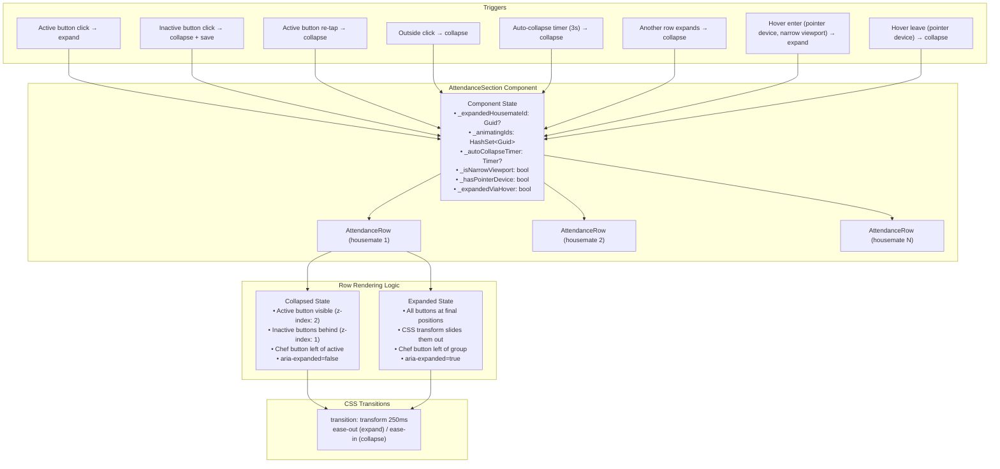
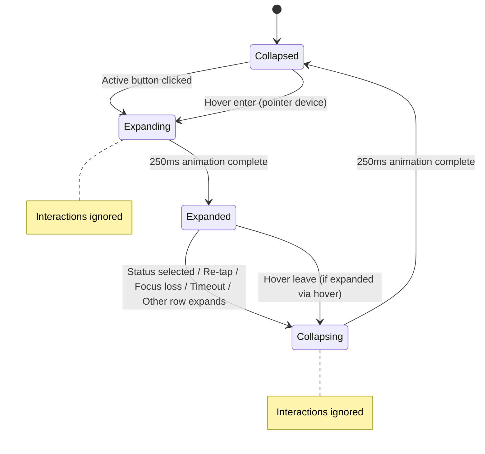
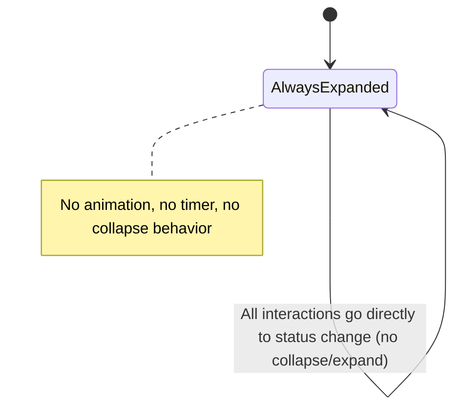

# Design Document: Attendance Slide-In Buttons

## Overview

This feature transforms the `AttendanceSection` component so that each housemate row displays only the currently active attendance button in a compact "collapsed" state on mobile viewports. The chef button slides to fill the freed space. Tapping the active button triggers a 250ms slide animation that reveals all three attendance options. The row collapses back after a status selection, focus loss, re-tap of the active button, or a 3-second auto-collapse timeout.

The collapse/expand behavior is **responsive**: on narrow viewports (below 480px — the `Mobile_Breakpoint`), the full slide-in interaction applies. On wider viewports (≥480px), all three buttons are always visible in their standard expanded layout without any collapse behavior. Additionally, on devices with a pointer (mouse/trackpad), hovering over the active button in mobile viewport expands the row, and moving the pointer away collapses it — providing a frictionless alternative to the tap interaction.

The implementation is purely frontend — no API changes, no new endpoints, no data model changes. All state management (expanded row tracking, animation locking, auto-collapse timers, viewport mode, hover state) lives in the `AttendanceSection` component. CSS transitions handle the slide animations, CSS media queries control the responsive breakpoint, and Blazor manages the DOM state and aria attributes.

**Key design decisions:**

1. **Single component ownership** — `AttendanceSection` owns the expand/collapse state for all rows. This naturally enforces the single-row-expansion policy without cross-component communication.

2. **CSS `transition` for animations** — Using `transition: transform 250ms ease-out` on button wrappers rather than CSS `@keyframes` or JS-driven animation. This gives smooth hardware-accelerated slides with simple state-driven class toggling.

3. **Stacking + transform approach** — In collapsed state, all three attendance buttons are positioned at the same location (stacked via `position: absolute` within a relative container). The active button sits at `z-index: 2` so inactive buttons are hidden behind it. On expand, CSS transforms slide the inactive buttons to their target positions. This creates the "slide out from behind" visual effect.

4. **Chef button always left** — The chef button always remains to the left of the attendance buttons. In collapsed state it sits adjacent to the active button; on expand it slides further left to accommodate the full button group. The animation is a horizontal translation, not a reordering.

5. **Animation lock via `_isAnimating` flag** — A per-row boolean prevents interaction during the 250ms transition. This is set on expand/collapse trigger and cleared after a `Task.Delay(250)`.

6. **`System.Timers.Timer` for auto-collapse** — A single timer instance tracks the 3-second auto-collapse for the currently expanded row. It resets when a new row expands and cancels on any button click or collapse.

7. **Name truncation via CSS `max-width` calculation** — When expanded, the name element gets a CSS class that constrains its `max-width` based on available space. The `text-overflow: ellipsis` rule (already present) handles the visual truncation.

8. **480px responsive breakpoint (CSS-only)** — The `Mobile_Breakpoint` is 480px, derived from ensuring at least 140px of horizontal space for the housemate name when all buttons are visible. The collapse behavior is scoped inside `@media (max-width: 479.98px)` so it only applies on narrow viewports. Above that width, the standard expanded layout renders via normal CSS flow — no JS viewport detection needed.

9. **`@media (hover: hover)` for pointer detection (CSS + minimal JS)** — Hover expand/collapse uses the `@media (hover: hover)` CSS media query to scope hover styles to pointer devices only. A small JS interop call (`matchMedia('(hover: hover)')`) sets a component-level `_hasPointerDevice` flag so Blazor can register `mouseenter`/`mouseleave` event handlers conditionally. This prevents hover events from firing on touch devices where "hover" is simulated by long-press.

10. **Hover does not interfere with touch** — On touch-only devices, `_hasPointerDevice` is `false`, so no `mouseenter`/`mouseleave` handlers are registered. On hybrid devices (touch + mouse), the CSS media query `(hover: hover)` evaluates based on the primary input. If the primary input is touch (e.g., tablet in tablet mode), hover behavior is disabled. This prevents the "sticky hover" problem on touch screens.

## Architecture



**State machine per row (narrow viewport / mobile):**



**Wide viewport mode (≥480px):**



## Components and Interfaces

### Modified Components

| Component | Changes |
|---|---|
| `AttendanceSection.razor` | Add expand/collapse state management, animation locking, auto-collapse timer, outside-click detection, single-row expansion policy, viewport mode detection, hover event handlers |
| `AttendanceSection.razor.css` | Add CSS transition rules, stacking layout for buttons, collapsed/expanded positioning, name truncation class, responsive media queries (`@media max-width: 479.98px`), hover media query (`@media (hover: hover)`) |
| `index.html` (JS interop) | Add `happie.registerViewportListener`, `happie.unregisterViewportListener`, `happie.hasPointerDevice` functions |

### No New Components

The feature modifies only `AttendanceSection` — no new `.razor` files are needed. The existing component already renders all attendance rows inline (no child `AttendanceRow` component), so the expand/collapse logic integrates directly into the existing `@foreach` loop.

### State Fields (added to `@code` block)

```csharp
// The housemate ID of the currently expanded row, or null if all collapsed.
private Guid? _expandedHousemateId;

// Housemate IDs currently in a transition animation (clicks ignored).
private readonly HashSet<Guid> _animatingIds = new();

// Timer for the 3-second auto-collapse.
private System.Timers.Timer? _autoCollapseTimer;

// Reference to the component's root element for outside-click detection.
private ElementReference _sectionRef;

// Whether the viewport is currently in narrow (mobile) mode.
// Set via JS interop matchMedia listener on component init.
private bool _isNarrowViewport = true;
// Whether the primary input device supports hover (pointer device).
// Set via JS interop matchMedia('(hover: hover)') on component init.
private bool _hasPointerDevice;

// Whether the currently expanded row was expanded via hover (vs. click).
// Used to determine whether mouse-leave should collapse the row.
private bool _expandedViaHover;
```

### Key Methods (added/modified)

```csharp
/// <summary>Handles the active button click — expands the row if collapsed.</summary>
private async Task HandleActiveButtonClickAsync(Guid housemateId)

/// <summary>Handles an attendance button click in expanded state.</summary>
private async Task HandleExpandedButtonClickAsync(Guid housemateId, AttendanceStatus newStatus)

/// <summary>Collapses the currently expanded row with animation.</summary>
private async Task CollapseAsync(Guid housemateId)

/// <summary>Expands a row, collapsing any other expanded row first.</summary>
private async Task ExpandAsync(Guid housemateId)

/// <summary>Starts the 3-second auto-collapse timer for the expanded row.</summary>
private void StartAutoCollapseTimer()

/// <summary>Cancels the auto-collapse timer if active.</summary>
private void CancelAutoCollapseTimer()

/// <summary>Determines if a housemate row is in expanded state.</summary>
private bool IsExpanded(Guid housemateId) => _expandedHousemateId == housemateId;

/// <summary>Determines if a housemate row is animating (clicks locked).</summary>
private bool IsAnimating(Guid housemateId) => _animatingIds.Contains(housemateId);

/// <summary>Handles pointer entering the active button area — expands via hover.</summary>
private async Task HandleMouseEnterAsync(Guid housemateId)

/// <summary>Handles pointer leaving the row boundary — collapses if expanded via hover.</summary>
private async Task HandleMouseLeaveAsync(Guid housemateId)

/// <summary>Called when the viewport media query changes (crosses 480px threshold).</summary>
[JSInvokable]
public async Task HandleViewportChangeAsync(bool isNarrow)

/// <summary>Whether the collapse/expand behavior is active (narrow viewport only).</summary>
private bool IsCollapseEnabled => _isNarrowViewport;
```

### Outside-Click Detection

Blazor WASM does not have a built-in "click outside" mechanism. The component uses a JS interop call to register a document-level click listener that invokes a .NET callback when a click occurs outside the expanded row:

```csharp
[JSInvokable]
public async Task HandleOutsideClickAsync()
{
    if (_expandedHousemateId is not null && !_animatingIds.Contains(_expandedHousemateId.Value))
        await CollapseAsync(_expandedHousemateId.Value);
}
```

A small JS function in `index.html` registers/unregisters the listener when a row expands/collapses:

```javascript
window.happie = window.happie || {};
happie.registerOutsideClick = (dotNetRef, elementId) => { ... };
happie.unregisterOutsideClick = () => { ... };
```

### Viewport and Hover Detection (JS Interop)

On component initialization, two `matchMedia` listeners are registered via JS interop:

```javascript
// In index.html — viewport width detection.
happie.registerViewportListener = (dotNetRef) => {
    const mql = window.matchMedia('(max-width: 479.98px)');
    happie._viewportMql = mql;
    const handler = (e) => dotNetRef.invokeMethodAsync('HandleViewportChangeAsync', e.matches);
    mql.addEventListener('change', handler);
    happie._viewportHandler = handler;
    // Return initial state.
    return mql.matches;
};

happie.unregisterViewportListener = () => {
    if (happie._viewportMql && happie._viewportHandler)
        happie._viewportMql.removeEventListener('change', happie._viewportHandler);
};

// Pointer device detection — one-time check.
happie.hasPointerDevice = () => window.matchMedia('(hover: hover)').matches;
```

The component calls these in `OnAfterRenderAsync(firstRender: true)`:
1. `_isNarrowViewport = await JS.InvokeAsync<bool>("happie.registerViewportListener", _dotNetRef)` — registers the listener and gets initial state.
2. `_hasPointerDevice = await JS.InvokeAsync<bool>("happie.hasPointerDevice")` — checks if the primary input supports hover.

When `HandleViewportChangeAsync` fires:
- Crossing **below** 480px (`isNarrow = true`): set `_isNarrowViewport = true`, collapse all rows (set `_expandedHousemateId = null`), cancel any timer.
- Crossing **above** 480px (`isNarrow = false`): set `_isNarrowViewport = false`, clear `_expandedHousemateId` (irrelevant in wide mode), cancel any timer.

### Hover Interaction Logic

Hover expand/collapse is only active when BOTH conditions are met:
- `_hasPointerDevice == true`
- `_isNarrowViewport == true`

**`HandleMouseEnterAsync(housemateId)`:**
1. Guard: if `!_hasPointerDevice || !_isNarrowViewport` → return (no-op).
2. Guard: if row is already expanded or animating → return.
3. Call `ExpandAsync(housemateId)`.
4. Set `_expandedViaHover = true`.
5. Do NOT start the auto-collapse timer (deferred until mouse-leave).

**`HandleMouseLeaveAsync(housemateId)`:**
1. Guard: if `!_expandedViaHover` → return (row was expanded via click, not hover).
2. Guard: if `_expandedHousemateId != housemateId` or animating → return.
3. Start the auto-collapse timer (3-second countdown begins on leave).
4. Optionally collapse immediately (design choice: collapse on leave for responsiveness). Given the requirement says "WHEN the pointer leaves the Attendance_Row boundary, THE Attendance_Row SHALL transition to Collapsed_State", we collapse immediately on leave rather than waiting for the timer.
5. Set `_expandedViaHover = false`.

**Click during hover-expansion:**
When a button is clicked while the row is hover-expanded, the click handler (`HandleExpandedButtonClickAsync`) processes the status change and collapses the row. It also sets `_expandedViaHover = false` so the subsequent `mouseleave` event (which will fire when the row collapses and the pointer is "outside" the now-collapsed row) doesn't attempt a double-collapse.

### CSS Architecture

The button group uses a wrapper div with `position: relative` that constrains the stacked buttons. Each button gets `position: absolute` in collapsed state and transitions to its natural flow position on expand via CSS classes.

**Responsive strategy:** The collapse/expand CSS rules are wrapped inside `@media (max-width: 479.98px)` so they only apply on narrow viewports. On wider viewports, the buttons render in their natural expanded flow layout with no stacking or transitions.

```css
/* Button container — relative positioning context. */
.attendance-section__btn-group {
    position: relative;
    display: flex;
    align-items: center;
    gap: 8px;
}

/* === Mobile-only collapse/expand behavior (< 480px) === */
@media (max-width: 479.98px) {
    /* Collapsed: all buttons stacked at same position. */
    .attendance-section__btn-group--collapsed .attendance-section__btn {
        position: absolute;
        right: 0;
        transition: transform 250ms ease-in, opacity 150ms ease-in;
        transform: translateX(0);
    }

    /* Active button stays on top in collapsed state. */
    .attendance-section__btn-group--collapsed .attendance-section__btn--active {
        position: relative;
        z-index: 2;
    }

    /* Inactive buttons hidden behind active. */
    .attendance-section__btn-group--collapsed .attendance-section__btn:not(.attendance-section__btn--active) {
        z-index: 1;
        opacity: 0;
        pointer-events: none;
    }

    /* Expanded: buttons slide to natural positions. */
    .attendance-section__btn-group--expanded .attendance-section__btn {
        position: relative;
        transition: transform 250ms ease-out, opacity 150ms ease-out;
        transform: translateX(0);
        opacity: 1;
        pointer-events: auto;
    }

    /* Chef button positioning — always on the left via natural DOM order. */
    /* In collapsed state, chef is adjacent left of the active button. */
    .attendance-section__chef-btn--collapsed {
        transition: transform 250ms ease-in;
    }

    /* In expanded state, chef slides further left to make room for all buttons. */
    .attendance-section__chef-btn--expanded {
        transition: transform 250ms ease-out;
    }
}

/* === Wide viewport (≥ 480px) — always show all buttons in standard layout === */
@media (min-width: 480px) {
    .attendance-section__btn-group {
        /* Normal flex flow — no stacking, no transitions needed. */
    }

    .attendance-section__chef-btn {
        order: -1;
        /* Chef button always on the left in expanded layout. */
    }
}
```

**Hover-specific CSS (pointer devices in mobile viewport):**

```css
/* Only apply hover cursor/visual cues on pointer devices at mobile viewport. */
@media (max-width: 479.98px) and (hover: hover) {
    .attendance-section__btn-group--collapsed .attendance-section__btn--active {
        cursor: pointer;
    }
}
```

The `mouseenter`/`mouseleave` events are registered conditionally in Blazor markup based on `_hasPointerDevice && _isNarrowViewport`, so no CSS-only hover expansion is needed — the expansion logic is JS-driven via Blazor event handlers.

### Accessibility Attributes

The component dynamically sets aria attributes based on row state:

| State | Active Button | Inactive Buttons |
|---|---|---|
| Collapsed | `aria-expanded="false"` | `aria-hidden="true"`, `tabindex="-1"` |
| Expanded | `aria-expanded="true"` | `aria-hidden` removed, `tabindex` removed |

### Name Truncation

When a row is expanded, the name element receives an additional CSS class:

```css
.attendance-section__name--truncated {
    max-width: calc(100% - 180px);
    /* 180px = chef btn (32) + 3 attendance btns (3×32) + gaps (4×8) = 160px + 20px buffer. */
}
```

The existing `text-overflow: ellipsis` and `overflow: hidden` rules on `.attendance-section__name` handle the visual truncation. When collapsed, the class is removed and the name returns to its full width.

## Data Models

No data model changes are required. This feature is purely a frontend UI behavior change. The existing `AttendanceDto` contract, `AttendanceStatus` enum, and API endpoints remain unchanged.

**Existing data flowing through the component:**

| Field | Type | Usage |
|---|---|---|
| `AttendanceDto.HousemateId` | `Guid` | Row identity, expansion tracking key |
| `AttendanceDto.HousemateName` | `string` | Display name, subject to truncation |
| `AttendanceDto.Color` | `string` | Active button styling |
| `AttendanceDto.Status` | `AttendanceStatus` | Determines which button is "active" |
| `AttendanceDto.IsChef` | `bool` | Chef button state |

**Component-internal state (not persisted):**

| Field | Type | Purpose |
|---|---|---|
| `_expandedHousemateId` | `Guid?` | Tracks which row is expanded (null = all collapsed) |
| `_animatingIds` | `HashSet<Guid>` | Rows currently in animation transition (clicks locked) |
| `_autoCollapseTimer` | `System.Timers.Timer?` | 3-second auto-collapse countdown |
| `_isNarrowViewport` | `bool` | Whether the viewport is below 480px (collapse behavior active) |
| `_hasPointerDevice` | `bool` | Whether the primary input supports hover (pointer device) |
| `_expandedViaHover` | `bool` | Whether the currently expanded row was triggered by hover (vs. click) |


## Correctness Properties

*A property is a characteristic or behavior that should hold true across all valid executions of a system — essentially, a formal statement about what the system should do. Properties serve as the bridge between human-readable specifications and machine-verifiable correctness guarantees.*

### Property 1: Active button matches current attendance status

*For any* `AttendanceStatus` value and any housemate row in collapsed state, the button treated as the Active_Button SHALL be the one whose status matches the housemate's current `AttendanceStatus`.

**Validates: Requirements 1.1, 1.4**

### Property 2: Expand on active button click when collapsed

*For any* housemate row in collapsed state (not animating), clicking the active button SHALL transition that row to expanded state (setting `_expandedHousemateId` to that housemate's ID).

**Validates: Requirements 2.1**

### Property 3: Animation lock prevents all interaction

*For any* housemate row whose ID is in `_animatingIds`, clicking any button (active, inactive, or chef) SHALL not change the component's expand/collapse state or trigger an API call.

**Validates: Requirements 2.6, 5.3, 7.4**

### Property 4: Status change collapses and applies new status optimistically

*For any* expanded row with current status A and any different status B (where A ≠ B), clicking the button for status B SHALL collapse the row and apply B as the optimistic override so the new Active_Button shows status B.

**Validates: Requirements 3.1, 3.2**

### Property 5: API failure reverts to previous status

*For any* status change from A to B where the API call fails, the displayed status SHALL revert to A and the row SHALL be in collapsed state showing A as the Active_Button.

**Validates: Requirements 3.5**

### Property 6: Collapse without status change preserves status and sends no API request

*For any* expanded row with current status S, collapsing via re-tap of the active button (status S) or via outside click SHALL retain S as the Active_Button and SHALL NOT send an attendance update request to the backend.

**Validates: Requirements 4.2, 5.1, 5.2**

### Property 7: Single row expansion policy

*For any* two distinct housemate IDs A and B where A is currently expanded, expanding B SHALL result in only B being expanded (`_expandedHousemateId == B`) and A being collapsed.

**Validates: Requirements 6.2, 6.3**

### Property 8: Accessibility attributes reflect expand/collapse state

*For any* `AttendanceStatus` value: when a row is collapsed, the active button SHALL have `aria-expanded="false"` and the two inactive buttons SHALL have `aria-hidden="true"` and `tabindex="-1"`. When a row is expanded, the active button SHALL have `aria-expanded="true"` and all buttons SHALL NOT have `aria-hidden="true"` or `tabindex="-1"`.

**Validates: Requirements 8.1, 8.2, 8.3, 8.4**

### Property 9: Auto-collapse timer lifecycle matches row state

*For any* housemate row: expanding SHALL start a 3-second timer; any attendance button click while expanded SHALL cancel the timer; collapsing for any reason SHALL cancel the timer; timer expiry without interaction SHALL collapse the row.

**Validates: Requirements 10.1, 10.2, 10.3, 10.4**

### Property 10: Wide viewport disables all collapse behavior

*For any* housemate row and any interaction (click, hover, timer), when `_isNarrowViewport` is `false` (viewport ≥ 480px), the state manager SHALL not change `_expandedHousemateId`, SHALL not add entries to `_animatingIds`, and SHALL not start the auto-collapse timer. All rows effectively display in expanded layout.

**Validates: Requirements 11.1, 11.2, 11.5**

### Property 11: Viewport narrowing collapses all rows

*For any* component state where `_isNarrowViewport` transitions from `false` to `true`, the state manager SHALL set `_expandedHousemateId` to `null` (all rows collapsed) and cancel any active auto-collapse timer.

**Validates: Requirements 11.4**

### Property 12: Hover expands row on pointer devices in narrow viewport

*For any* housemate row in collapsed state (not animating), when `_hasPointerDevice` is `true` and `_isNarrowViewport` is `true`, a mouse-enter event on the active button SHALL transition that row to expanded state and set `_expandedViaHover` to `true`.

**Validates: Requirements 12.1**

### Property 13: Mouse-leave collapses hover-expanded row

*For any* housemate row that is in expanded state with `_expandedViaHover == true`, when a mouse-leave event fires on the row boundary, the row SHALL transition to collapsed state.

**Validates: Requirements 12.2**

### Property 14: Hover expansion defers auto-collapse timer

*For any* housemate row expanded via hover (`_expandedViaHover == true`), the auto-collapse timer SHALL NOT be started while the pointer remains within the row. The timer starts only after the pointer leaves (or the row is collapsed by other means).

**Validates: Requirements 12.3**

### Property 15: Click during hover-expansion processes status change and collapses

*For any* housemate row expanded via hover with current status A and any different status B (where A ≠ B), clicking the button for status B SHALL collapse the row and apply B as the new status, regardless of the current pointer position within the row.

**Validates: Requirements 12.4**

## Error Handling

| Scenario | Behavior |
|---|---|
| Attendance status API call fails | Optimistic rollback: revert Active_Button to previous status, show error toast (existing behavior) |
| Chef toggle API call fails | Existing rollback behavior unchanged — not affected by this feature |
| Timer callback fires after component disposal | Guard with null check on `_expandedHousemateId`; call `InvokeAsync` for thread safety |
| Outside-click JS interop fails | Graceful degradation: row stays expanded until auto-collapse timer fires or user interacts directly |
| Multiple rapid clicks during animation | Ignored by animation lock (`_animatingIds` check) |
| Component re-renders during animation | CSS transitions continue uninterrupted; `_animatingIds` prevents state changes until delay completes |
| Viewport matchMedia JS interop fails | Graceful degradation: `_isNarrowViewport` defaults to `true` (mobile-first), collapse behavior always active |
| Hover detection JS interop fails | Graceful degradation: `_hasPointerDevice` defaults to `false`, hover expansion disabled — tap still works |
| Mouse-leave fires after row collapsed by click | Guard: `HandleMouseLeaveAsync` checks `_expandedViaHover` and `_expandedHousemateId`; no-ops if row already collapsed |
| Rapid hover-in/hover-out during animation | Ignored by animation lock (`_animatingIds` check) |

## Testing Strategy

### Unit Tests (xUnit)

Since this feature is purely UI state management within a Blazor component, unit tests focus on the **state logic** extracted into testable methods:

- **State determination tests**: Verify `IsExpanded`, `IsAnimating`, and active button determination for each `AttendanceStatus` value
- **Expand logic**: Verify that calling expand sets `_expandedHousemateId` correctly, respects animation lock
- **Collapse logic**: Verify collapse clears `_expandedHousemateId`, doesn't trigger API for re-tap/outside-click
- **Single expansion policy**: Verify expanding row B when A is expanded results in only B expanded
- **Optimistic rollback**: Verify API failure reverts the optimistic override
- **Timer management**: Verify timer starts on expand, cancels on click/collapse
- **Viewport mode switching**: Verify that setting `_isNarrowViewport = false` disables all collapse operations; setting it to `true` collapses any expanded row
- **Hover expand/collapse**: Verify `HandleMouseEnterAsync` expands only when `_hasPointerDevice && _isNarrowViewport`; verify `HandleMouseLeaveAsync` collapses only when `_expandedViaHover`
- **Hover + click coexistence**: Verify that clicking a status button during hover-expansion collapses and processes the status change, and clears `_expandedViaHover`

### Property-Based Tests (FsCheck)

- **Library**: FsCheck 3.1+ (already in use)
- **Minimum iterations**: 100 per property
- **Tag format**: `// Feature: attendance-slide-in-buttons, Property {N}: {property_text}`

To enable property-based testing of the state logic, the expand/collapse state management should be extracted into a testable service class (`AttendanceRowStateManager`) that can be instantiated without Blazor rendering infrastructure. This class encapsulates:
- `_expandedHousemateId` tracking
- `_animatingIds` management
- Timer lifecycle
- Decision logic for whether to send API calls

Each correctness property maps to a single FsCheck property test:

1. **Property 1** — Generate random `AttendanceStatus` values. Verify `GetActiveStatus` returns the same status.
2. **Property 2** — Generate random `Guid` values (housemateIds) with `_expandedHousemateId == null` and `_animatingIds` empty. Call expand logic. Assert `_expandedHousemateId == housemateId`.
3. **Property 3** — Generate random `Guid` values, add them to `_animatingIds`. Attempt expand/collapse operations. Assert state unchanged.
4. **Property 4** — Generate random `(AttendanceStatus current, AttendanceStatus new)` pairs where current ≠ new. Expand a row, then call status change. Assert row collapsed and optimistic override == new status.
5. **Property 5** — Generate random `(AttendanceStatus original, AttendanceStatus attempted)` pairs. Simulate failed API call. Assert displayed status == original.
6. **Property 6** — Generate random `AttendanceStatus` values and expand a row. Trigger collapse via re-tap. Assert status unchanged and no API call recorded.
7. **Property 7** — Generate pairs of distinct random `Guid` values. Expand first, then expand second. Assert only second is expanded.
8. **Property 8** — Generate random `AttendanceStatus` values and both collapsed/expanded states. Verify the correct aria attributes are determined for each button.
9. **Property 9** — Generate random `Guid` values. Expand a row (assert timer started). Click a button (assert timer cancelled). Expand again, let timer fire (assert collapsed).
10. **Property 10** — Generate random `Guid` values and random interactions (expand, collapse, hover-enter). Set `_isNarrowViewport = false`. Assert that no operation changes `_expandedHousemateId` or starts a timer.
11. **Property 11** — Generate random states where a row is expanded in wide viewport. Switch `_isNarrowViewport` from `false` to `true`. Assert `_expandedHousemateId == null` and timer cancelled.
12. **Property 12** — Generate random `Guid` values with `_hasPointerDevice = true` and `_isNarrowViewport = true`. Call `HandleMouseEnterAsync`. Assert row expanded and `_expandedViaHover == true`. Also test with `_hasPointerDevice = false` — assert no-op.
13. **Property 13** — Generate random `Guid` values. Expand via hover. Call `HandleMouseLeaveAsync`. Assert row collapsed and `_expandedViaHover == false`.
14. **Property 14** — Generate random `Guid` values. Expand via hover. Assert timer NOT started. Call `HandleMouseLeaveAsync`. Assert appropriate collapse/timer behavior.
15. **Property 15** — Generate random `(AttendanceStatus current, AttendanceStatus new)` pairs where current ≠ new. Expand via hover. Call status change click handler. Assert row collapsed, status changed, and `_expandedViaHover == false`.

### Integration / Manual Tests

- Visual verification of 250ms slide animations with ease-in/ease-out curves
- Touch device testing for tap interactions
- Screen reader testing for aria-expanded and aria-hidden announcements
- Responsive layout verification: name truncation at various viewport widths
- Interaction with existing optimistic UI and error toast behavior
- **Responsive breakpoint**: Verify all buttons display in standard expanded layout on viewports ≥ 480px; verify collapse behavior activates below 480px
- **Live resize**: Resize browser window across the 480px boundary — verify rows collapse/expand appropriately on threshold crossing
- **Hover on desktop at narrow viewport**: Resize browser below 480px with a mouse, hover over active button — verify row expands; move pointer away — verify row collapses
- **Hover on wide viewport**: At ≥ 480px, hover over buttons — verify NO expand/collapse animation occurs (buttons are always visible)
- **Touch device (no pointer)**: On a phone or tablet in touch mode, verify hovering (long-press) does NOT trigger expansion — only tap works
- **Hybrid device (Surface, iPad with trackpad)**: Verify hover detection uses `(hover: hover)` primary input and behaves correctly based on current input mode

