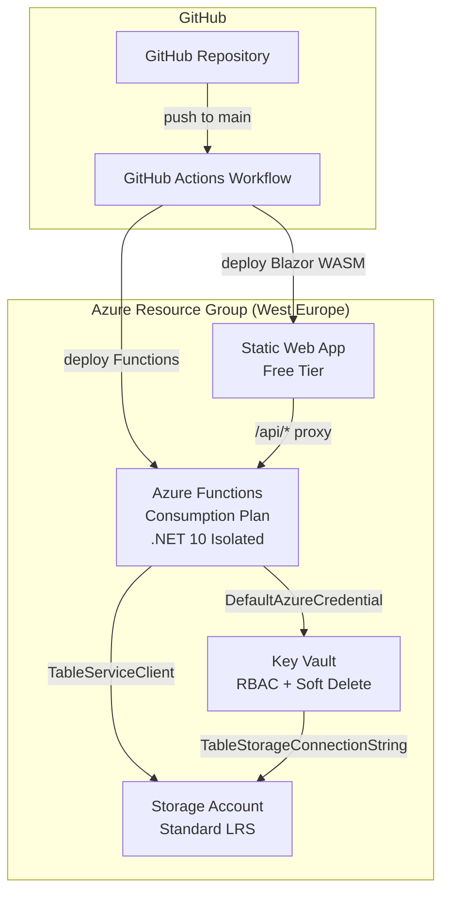
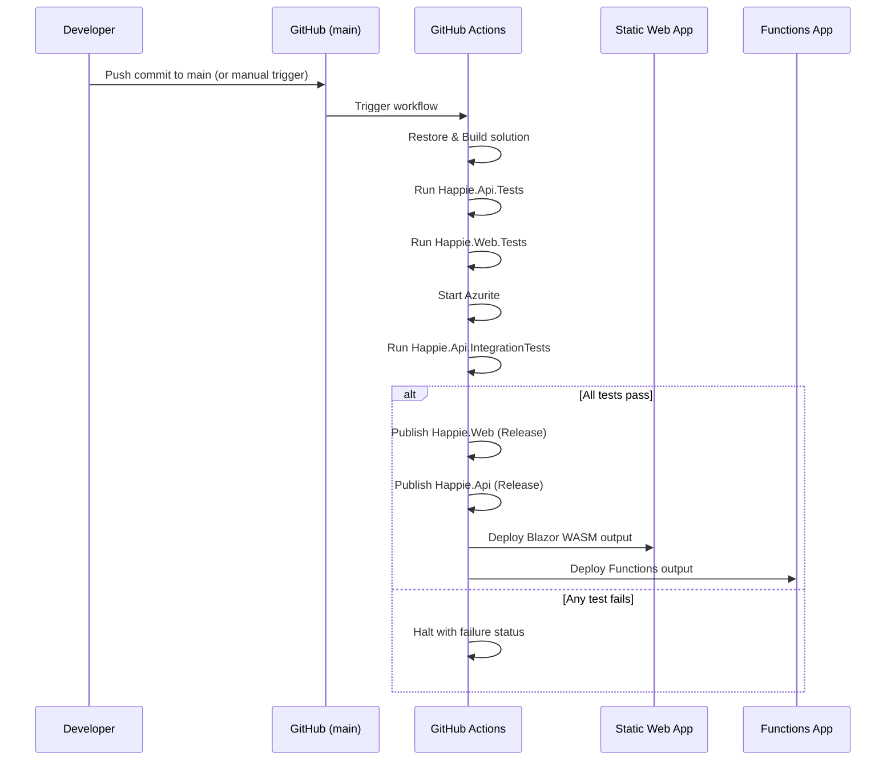

# Design Document: Azure Deployment

## Overview

This design describes the infrastructure and CI/CD pipeline for deploying the Happie application to Azure. The solution uses Azure Bicep as the Infrastructure as Code (IaC) language to define all Azure resources declaratively, and a GitHub Actions workflow to build, test, and deploy the application on every commit to the `main` branch.

The architecture follows a serverless model: Azure Static Web Apps hosts the Blazor WebAssembly PWA, Azure Functions (isolated worker, Consumption plan) runs the API, Azure Table Storage provides the database, and Azure Key Vault stores secrets accessed via Managed Identity.

### Design Decisions

1. **Bicep over Azure CLI scripts**: Bicep provides declarative, idempotent deployments with built-in dependency resolution, type safety, and What-If previews. It satisfies the idempotency requirement (7.4) natively.
2. **Single Bicep file**: The infrastructure is small enough (5 resources + role assignment) to fit in a single `main.bicep` file without modules, keeping the setup simple and reviewable.
3. **Separate build and deploy jobs**: The GitHub Actions workflow uses separate jobs for build/test and deploy. This ensures tests gate deployment and artifacts are produced once then deployed to multiple targets.
4. **Static Web Apps deployment token + Functions publish profile**: These are the simplest authentication mechanisms for their respective services, requiring only repository secrets and no Azure AD service principal setup.

## Architecture



### Deployment Flow



## Components and Interfaces

### 1. Bicep Template (`infra/main.bicep`)

The single Bicep template defines all Azure resources and their relationships.

| Resource | Bicep Type | Key Configuration |
|---|---|---|
| Resource Group | Deployed at subscription scope via `az deployment sub create` | Location: `westeurope` |
| Storage Account | `Microsoft.Storage/storageAccounts` | Standard_LRS, HTTPS-only, TLS 1.2 |
| Key Vault | `Microsoft.KeyVault/vaults` | RBAC permission model, soft-delete 90 days, purge protection |
| Functions App | `Microsoft.Web/sites` (kind: `functionapp`) | .NET 10 isolated, Consumption plan, system-assigned MI |
| Static Web App | `Microsoft.Web/staticSites` | Free tier |
| Role Assignment | `Microsoft.Authorization/roleAssignments` | Key Vault Secrets User → Functions MI |
| Backend Link | `Microsoft.Web/staticSites/linkedBackends` | Links SWA to Functions App |

**Parameters:**

| Parameter | Type | Description |
|---|---|---|
| `location` | string | Azure region (default: `westeurope`) |
| `appName` | string | Base name for resources (default: `happie`) |
| `tableStorageConnectionString` | securestring | Connection string to store in Key Vault |

**Outputs:**

| Output | Description |
|---|---|
| `staticWebAppDefaultHostname` | The default hostname of the Static Web App |
| `functionAppName` | The name of the Functions App (for publish profile retrieval) |
| `staticWebAppName` | The name of the Static Web App (for deployment token retrieval) |

### 2. Table Initialization Script (`infra/create-tables.sh`)

A post-deployment Azure CLI script that creates the required Table Storage tables. Bicep cannot create tables directly (it provisions the Storage Account, not individual tables).

Tables created: `Households`, `Housemates`, `AttendanceRecords`, `DishRecords`, `Comments`, `DayHistory`, `PushSubscriptions`.

The script is idempotent — `az storage table create` returns success if the table already exists.

### 3. GitHub Actions Workflow (`.github/workflows/deploy.yml`)

The workflow file defines the CI/CD pipeline.

**Triggers:**

| Trigger | Condition | Use Case |
|---|---|---|
| `push` | `main` branch only | Automatic deployment on merge |
| `workflow_dispatch` | Manual, any branch | Ad-hoc deployment for testing from PRs or feature branches |

The `workflow_dispatch` trigger accepts an optional `environment` input (default: production) to allow future multi-environment support. When triggered manually, the workflow deploys whatever branch/ref the user selects in the GitHub Actions UI.

**Secrets required:**

| Secret Name | Source |
|---|---|
| `AZURE_STATIC_WEB_APPS_API_TOKEN` | Static Web App deployment token |
| `AZURE_FUNCTIONAPP_PUBLISH_PROFILE` | Functions App publish profile XML |

**Jobs:**

| Job | Steps | Depends On |
|---|---|---|
| `build-and-test` | Checkout, Setup .NET 10, Restore, Build (Release), Start Azurite, Run `Happie.Api.Tests`, Run `Happie.Web.Tests`, Run `Happie.Api.IntegrationTests`, Publish `Happie.Web`, Publish `Happie.Api`, Upload artifacts | — |
| `deploy-swa` | Download artifact, Deploy to Static Web App | `build-and-test` |
| `deploy-functions` | Download artifact, Deploy to Functions App | `build-and-test` |

**Azurite for Integration Tests:**

The `build-and-test` job installs and starts Azurite as a background process before running integration tests. This provides a local Table Storage emulator in the CI environment.

```yaml
- name: Install Azurite
  run: npm install -g azurite

- name: Start Azurite
  run: azurite --silent &
  shell: bash

- name: Run Integration tests
  run: dotnet test Happie.Api.IntegrationTests --configuration Release --no-build --verbosity normal
```

Integration tests use the default `UseDevelopmentStorage=true` connection string, which points to the Azurite instance running on localhost.

### 4. Static Web App Configuration (`Happie.Web/staticwebapp.config.json`)

Configures routing for the Static Web App to support Blazor client-side routing.

```json
{
  "navigationFallback": {
    "rewrite": "/index.html",
    "exclude": ["/css/*", "/js/*", "/_framework/*", "/api/*"]
  },
  "routes": [
    {
      "route": "/api/*",
      "allowedRoles": ["anonymous"]
    }
  ]
}
```

This ensures:
- All navigation routes (`/day/{date}`, `/calendar`, `/housemates`) fall back to `index.html` for Blazor routing
- Static assets and API routes are excluded from the fallback
- The `/api/*` proxy passes through to the linked Functions backend

## Data Models

This feature does not introduce new application data models. The infrastructure resources are defined declaratively in Bicep and configured via parameters.

### Configuration Data

**GitHub Repository Secrets:**

| Secret | Value Source | Used By |
|---|---|---|
| `AZURE_STATIC_WEB_APPS_API_TOKEN` | Azure Portal → Static Web App → Manage deployment token | `deploy-swa` job |
| `AZURE_FUNCTIONAPP_PUBLISH_PROFILE` | Azure Portal → Functions App → Get publish profile | `deploy-functions` job |

**Functions App Settings (set by Bicep):**

| Setting | Value |
|---|---|
| `KeyVaultUri` | `https://{vault-name}.vault.azure.net/` |
| `FUNCTIONS_WORKER_RUNTIME` | `dotnet-isolated` |
| `FUNCTIONS_EXTENSION_VERSION` | `~4` |
| `AzureWebJobsStorage` | Storage Account connection string |
| `WEBSITE_CONTENTAZUREFILECONNECTIONSTRING` | Storage Account connection string |
| `WEBSITE_CONTENTSHARE` | Functions App name |

**Key Vault Secrets (stored manually or via script):**

| Secret Name | Description |
|---|---|
| `JwtSigningKey` | HMAC key for JWT signing |
| `TableStorageConnectionString` | Azure Table Storage connection string |
| `VapidPublicKey` | VAPID public key for Web Push |
| `VapidPrivateKey` | VAPID private key for Web Push |

## Error Handling

### Infrastructure Deployment Errors

| Scenario | Handling |
|---|---|
| Bicep deployment fails (invalid template) | `az deployment` exits non-zero; CI pipeline halts |
| Resource already exists (re-run) | Bicep is idempotent; existing resources are updated in-place |
| Insufficient permissions | Azure CLI returns authorization error; deployment halts |
| Key Vault soft-delete conflict (name reuse) | Purge protection prevents accidental deletion; use `az keyvault purge` if needed |

### CI/CD Pipeline Errors

| Scenario | Handling |
|---|---|
| Build failure | Job fails immediately; no deployment occurs |
| Test failure | `dotnet test` exits non-zero; workflow halts before deployment |
| SWA deployment token invalid/expired | `Azure/static-web-apps-deploy` action fails; job reports error |
| Functions publish profile invalid | `Azure/functions-action` fails; job reports error |
| Artifact upload/download failure | GitHub Actions reports error; dependent jobs are skipped |

### Runtime Errors (Functions App Startup)

| Scenario | Handling |
|---|---|
| Key Vault unreachable | `AddAzureKeyVault` throws; Functions App fails to start; Azure logs the error |
| Required secret missing | Options validation (`AddOptionsWithValidateOnStart`) fails at startup; app does not serve requests |
| Managed Identity not configured | `DefaultAzureCredential` throws `CredentialUnavailableException`; startup fails |

## Testing Strategy

### Why Property-Based Testing Does Not Apply

This feature is entirely Infrastructure as Code (Bicep templates), CI/CD pipeline configuration (GitHub Actions YAML), and resource provisioning. There are no pure functions, data transformations, or business logic with varying inputs. The requirements describe declarative resource configurations and workflow steps — not behavior that varies meaningfully across an input space.

PBT is not appropriate because:
- Bicep templates are declarative configuration, not functions with inputs/outputs
- GitHub Actions workflows are sequential step definitions, not algorithms
- The "correctness" of infrastructure is verified by deployment success and integration checks, not by property assertions over random inputs

### Recommended Testing Approach

**1. Bicep Template Validation (Static Analysis)**

- `az bicep build` — validates syntax and type correctness
- `az deployment sub what-if` — previews changes without applying them
- Manual review of Bicep template in pull requests

**2. Integration Smoke Tests (Post-Deployment)**

After deployment, verify the infrastructure is correctly configured:

| Check | Method |
|---|---|
| Static Web App responds on HTTPS | `curl` the default hostname |
| `/api/*` proxy reaches Functions | Call a health endpoint through SWA |
| Functions App starts successfully | Check Azure Portal / Application Insights for startup logs |
| Key Vault secrets accessible | Functions App loads configuration without errors |
| Table Storage tables exist | `az storage table list` against the Storage Account |

**3. CI/CD Pipeline Testing**

- **Dry run**: Push to a feature branch with a modified workflow that skips actual deployment (using `if: false` on deploy steps) to verify build and test steps work
- **Manual trigger**: Use the `workflow_dispatch` trigger to deploy from any branch or PR for ad-hoc testing without merging to main

**4. Existing Unit Tests as Gate**

The workflow runs `Happie.Api.Tests` and `Happie.Web.Tests` before deployment. These existing test suites (xUnit + FsCheck) validate application correctness and serve as the quality gate.

### Test Execution in CI

```yaml
- name: Run API tests
  run: dotnet test Happie.Api.Tests --configuration Release --no-build --verbosity normal

- name: Run Web tests
  run: dotnet test Happie.Web.Tests --configuration Release --no-build --verbosity normal

- name: Install Azurite
  run: npm install -g azurite

- name: Start Azurite
  run: azurite --silent &
  shell: bash

- name: Run Integration tests
  run: dotnet test Happie.Api.IntegrationTests --configuration Release --no-build --verbosity normal
```

All three test projects must pass for deployment to proceed. Any test failure halts the workflow with a non-zero exit code.
