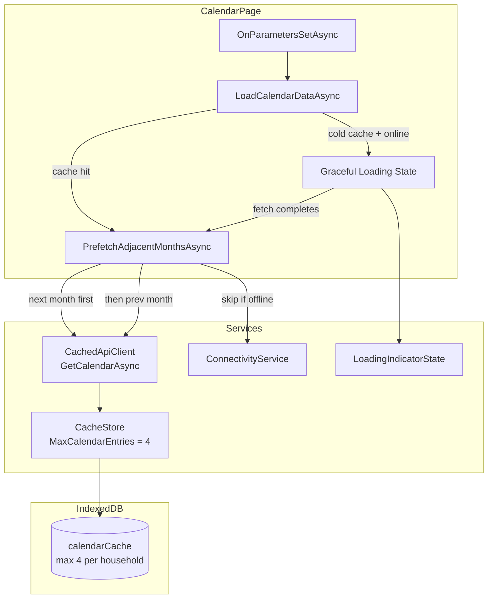

# Design Document: Calendar Prefetch

## Overview

The calendar-prefetch feature adds adjacent-month preloading to the CalendarPage, mirroring the existing adjacent-day prefetch pattern on DayPlanPage. After the active month loads and renders, the page fires background fetches for the next and previous months via `CachedApiClient.GetCalendarAsync`. The calendar cache limit is increased from 2 to 4 entries per household so that prefetched data is not immediately evicted.

When the user navigates to a month whose data has not yet been fetched (cold cache), a graceful loading state replaces the current full-page "Loading..." text: the CalendarGrid renders the correct day structure (numbers and week rows) but without attendance color dots, and the `LoadingIndicatorState` spinner activates to signal background activity.

This is a client-side-only change. No server-side modifications are needed.

## Architecture



### Key Design Decisions

1. **Awaitable background refresh via `CalendarFetchResult`** — Currently `GetCalendarAsync` fires the background refresh as fire-and-forget (`_ = BackgroundRefreshCalendarAsync(...)`), so the caller cannot know when it completes. To support the loading indicator for the active month, `GetCalendarAsync` now returns a `CalendarFetchResult` record containing the cached `CalendarResponse?` and an optional `Task? BackgroundRefreshTask`. When a stale-while-revalidate refresh is started, the task is exposed so the page can await it and show/hide the loader accordingly. The same pattern applies to `GetDayPlanAsync` via `DayPlanFetchResult`. Prefetches simply discard the task (fire-and-forget), so only the active content awaits it.

2. **Sequential next-then-previous ordering** — The next month is prefetched first because users more commonly navigate forward. The previous month prefetch starts only after the next month completes or fails. This limits concurrent network requests and avoids overwhelming the connection.

3. **`CancellationTokenSource` pattern from DayPlanPage** — The same pattern used by `DayPlanPage.PreFetchAdjacentDaysAsync` is adopted: a `CancellationTokenSource` is created per navigation, cancelled on re-navigation or dispose. This provides clean lifecycle management.

4. **`Task.Yield()` deferral** — After the active month renders, `Task.Yield()` gives the browser a frame to paint before prefetch network requests start. This prevents the prefetch from blocking the render of the active month's content.

5. **Cache limit of 6 with two protected clusters** — The cache holds up to 6 calendar entries per household. Two sets of months are protected from eviction:
   - **Today cluster**: today's month, the month before today, and the month after today. These are always preserved because the user is likely to return to them.
   - **Viewed cluster**: the currently viewed month, the month before it, and the month after it (i.e., the prefetched months).
   
   When these clusters overlap (user is viewing this month or an adjacent one), fewer distinct entries exist and the limit is rarely reached. When the user navigates far from today (e.g., 3+ months away), all 6 slots may be used. Eviction only triggers when inserting a 7th entry: the entry that belongs to neither cluster is evicted. If multiple entries are outside both clusters, the one farthest from the viewed month is evicted first.

6. **Graceful loading replaces full-page text** — Rather than showing "Loading..." text for cold cache navigations, the CalendarGrid renders with an empty `Days` list. Since `CalendarGridService.GetVisibleDates(month)` is a pure function that needs no API data, the grid structure (day numbers, week rows) can be shown immediately. Buttons remain clickable for navigation to DayPlanPage.

7. **Loading indicator scoped to active content only** — The `LoadingIndicatorState` spinner only activates when the actively viewed date/month is being refreshed. Prefetches of adjacent months/days run silently without activating the indicator. This is enabled by the `CalendarFetchResult.BackgroundRefreshTask` / `DayPlanFetchResult.BackgroundRefreshTask` pattern: the page awaits the task with the indicator active for the current content, while prefetches discard the task. The existing `IncrementAsync`/`DecrementAsync` calls are removed from `CachedApiClient`'s background refresh methods — pages manage the indicator themselves.

## Components and Interfaces

### Modified Components

| Component | Change |
|---|---|
| `CalendarPage.razor` | Add `PrefetchAdjacentMonthsAsync`, `CancellationTokenSource`, graceful loading state logic, await `BackgroundRefreshTask` with loader for active month |
| `DayPlanPage.razor` | Await `BackgroundRefreshTask` with loader for active date only (not adjacent days) |
| `CachedApiClient.cs` | Change `GetCalendarAsync` return to `CalendarFetchResult`, change `GetDayPlanAsync` return to `DayPlanFetchResult`, remove `LoadingIndicatorState` calls from background refresh methods |
| `ICachedApiClient.cs` | Update interface signatures to return `CalendarFetchResult` / `DayPlanFetchResult` |
| `CacheStore.cs` | Change `MaxCalendarEntries` from `2` to `6`, update eviction to use cluster-based protection |
| `cacheDb.js` | Add `getOldestCalendarKey` method with cluster exclusion |
| `CalendarGrid.razor` | No code changes needed — already renders correctly with empty `Days` list |

### New Types

```csharp
/// <summary>Result of a calendar fetch: cached data (if available) plus an optional background refresh task.</summary>
public record CalendarFetchResult(
    CalendarResponse? Data,
    bool IsColdCacheFetch,
    Task? BackgroundRefreshTask);

/// <summary>Result of a day plan fetch: cached data (if available) plus an optional background refresh task.</summary>
public record DayPlanFetchResult(
    DayPlanResponse? Data,
    bool IsColdCacheFetch,
    Task? BackgroundRefreshTask);
```

Pages use these as follows:
- For the **active** content: await `BackgroundRefreshTask` while showing the loading indicator.
- For **prefetches**: discard the task (fire-and-forget) — no indicator.

### ICachedApiClient Interface Changes

```csharp
Task<CalendarFetchResult> GetCalendarAsync(DateOnly viewedMonth);
Task<DayPlanFetchResult> GetDayPlanAsync(string date);
```

The `HasLoadError` and `IsColdCacheFetch` properties are removed from the interface since that state is now carried in the result record.

### CalendarPage Changes

New fields:
```csharp
private CancellationTokenSource? _prefetchCts;
private bool _isGracefulLoading;
```

New method signature:
```csharp
private async Task PrefetchAdjacentMonthsAsync()
```

Modified `LoadCalendarDataAsync` behavior:
- Call `CachedApi.GetCalendarAsync(_viewedMonth)` which returns a `CalendarFetchResult`.
- If `result.Data` is non-null (cache hit): render immediately, then show the loader and await `result.BackgroundRefreshTask` (if non-null). When the task completes, hide the loader. Fire `PrefetchAdjacentMonthsAsync` as fire-and-forget.
- If `result.IsColdCacheFetch` and online: set `_isGracefulLoading = true`, activate `LoadingIndicatorState`, render grid skeleton (empty `Days`), await `result.BackgroundRefreshTask` (which represents the cold fetch in this case), then transition to full data or error state, deactivate indicator, then fire prefetch.
- If offline with no cache: show offline message.

Modified `DisposeAsync`:
- Cancel `_prefetchCts` to abort any in-flight prefetch.

### Loading Indicator Refactor (CachedApiClient)

**Remove** all `_loadingIndicatorState.IncrementAsync()` / `DecrementAsync()` calls from `BackgroundRefreshDayPlanAsync` and `BackgroundRefreshCalendarAsync`. The `LoadingIndicatorState` dependency can be removed from `CachedApiClient` entirely.

Pages now control the indicator:
- **CalendarPage**: `IncrementAsync()` when starting a fetch for the active month (graceful loading or stale-while-revalidate). `DecrementAsync()` when the `BackgroundRefreshTask` completes. Prefetches get their tasks discarded — no indicator.
- **DayPlanPage**: Same pattern — `IncrementAsync()` when `GetDayPlanAsync` returns with a `BackgroundRefreshTask` for the active date. `DecrementAsync()` on completion. Adjacent-day prefetches discard the task.

### CacheStore Eviction Change

The eviction logic in `PutCalendarAsync` changes from:
- Max 2 entries, evict first non-current-month entry found

To:
- Max 6 entries, cluster-based protection with distance-based eviction.

**Protected clusters (never evicted):**
1. **Today cluster**: today's month ± 1 (3 months centered on today).
2. **Viewed cluster**: the viewed month ± 1 (3 months centered on what's being viewed). The viewed month is passed as a parameter to `PutCalendarAsync`.

When both clusters overlap (user is near today), as few as 3 unique months are protected. When far apart, up to 6 months are protected.

**Eviction rule**: When inserting a new month that is not already cached and the cache has 6+ entries, find all entries not in either protected cluster and evict the one whose month is **farthest** from the viewed month. This ensures navigation in any direction keeps nearby data and sheds distant data.

If no evictable entry exists (all entries are in a protected cluster), allow the cache to temporarily exceed the limit.

The `PutCalendarAsync` signature changes to accept the viewed month:
```csharp
Task PutCalendarAsync(string householdId, string month, string responseJson, string viewedMonth);
```

The `ICacheStore` interface is updated accordingly. `CachedApiClient` passes the viewed month when calling `PutCalendarAsync`.

### JS Interop Addition

Add to `window.happieCache` in `cacheDb.js`:

```javascript
// Returns the key of the calendar entry farthest from viewedMonth
// that is NOT in the today cluster or viewed cluster.
// Returns null if no eligible entry exists.
getEvictableCalendarKey(householdId, todayMonth, viewedMonth)
```

This method reads all calendar entries for the household, filters out those in either cluster, and returns the key of the entry whose month is farthest from `viewedMonth`.

### ICacheStore Interface Change

The `PutCalendarAsync` signature changes to accept the viewed month for cluster-based eviction:

```csharp
/// <summary>Stores a Calendar entry, enforcing the 6-entry limit per household with cluster-based protection.</summary>
Task PutCalendarAsync(string householdId, string month, string responseJson, string viewedMonth);
```

## Data Models

No new IndexedDB schema changes are introduced. The existing `CachedCalendar` record and IndexedDB `calendarCache` object store remain unchanged in structure. The eviction threshold and strategy change:

| Aspect | Before | After |
|---|---|---|
| `MaxCalendarEntries` | 2 | 6 |
| Eviction strategy | First non-current-month key found | Farthest-from-viewed among entries outside both clusters |
| Protected entries | Current month (today's month) | Today cluster (today ± 1) + Viewed cluster (viewed ± 1) |

### New C# Types

```csharp
/// <summary>Result of a calendar fetch: cached data (if available) plus an optional background refresh task.</summary>
public record CalendarFetchResult(
    CalendarResponse? Data,
    bool IsColdCacheFetch,
    bool HasLoadError,
    Task? BackgroundRefreshTask);

/// <summary>Result of a day plan fetch: cached data (if available) plus an optional background refresh task.</summary>
public record DayPlanFetchResult(
    DayPlanResponse? Data,
    bool IsColdCacheFetch,
    bool HasLoadError,
    Task? BackgroundRefreshTask);
```

### Graceful Loading State Data Flow

When in graceful loading state, the CalendarGrid receives:

```csharp
// Days is an empty list — grid renders structure from CalendarGridService but no dots.
<CalendarGrid Days="@_days"
              ViewedMonth="@_viewedMonth"
              SelectedDate="@_selectedDate"
              OnDayClicked="OnDayClicked" />
```

`_days` is set to `[]` (empty list) during graceful loading, and `CalendarGridService.GetVisibleDates(_viewedMonth)` still produces the correct grid layout since it's a pure function of the viewed month.

## Correctness Properties

*A property is a characteristic or behavior that should hold true across all valid executions of a system — essentially, a formal statement about what the system should do. Properties serve as the bridge between human-readable specifications and machine-verifiable correctness guarantees.*

### Property 1: Calendar cache enforces 6-entry limit with cluster-based protection

*For any* sequence of calendar cache insertions (random months, random viewed months, random order) for a single household, the total number of stored calendar entries should never exceed 6 (except temporarily when all entries are in protected clusters). When eviction occurs: (a) entries in the today cluster (today's month ± 1) are never evicted, (b) entries in the viewed cluster (viewed month ± 1) are never evicted, (c) among remaining entries, the one farthest from the viewed month is evicted.

**Validates: Requirements 2.1, 2.2, 2.3, 2.4**

### Property 2: Graceful loading grid produces correct day structure for any month

*For any* valid month (any `DateOnly` representing the first of a month between years 2000–2100), the set of visible dates produced by `CalendarGridService.GetVisibleDates(month)` should: (a) start on a Monday, (b) end on a Sunday, (c) contain all days of the target month, (d) have a total count that is a multiple of 7 (complete weeks), and (e) be in strictly ascending order with no gaps.

**Validates: Requirements 3.1, 3.5**

## Error Handling

| Scenario | Behavior |
|---|---|
| Prefetch network failure | Silently discard — no error toast, no retry, no state change on CalendarPage |
| Prefetch returns HTTP 401 | `CachedApiClient` handles this internally (clears session, redirects to login) — same as any other calendar fetch |
| Prefetch cancelled (navigation/dispose) | `OperationCanceledException` caught and swallowed in `PrefetchAdjacentMonthsAsync` |
| Graceful loading fetch failure | Transition to existing error state with retry button; deactivate `LoadingIndicatorState` |
| Graceful loading fetch 401 | `CachedApiClient` handles internally (redirect to login) |
| Device goes offline during prefetch | The `GetCalendarAsync` method returns null for cold cache when offline; prefetch silently does nothing |
| IndexedDB unavailable | `CacheStore` operations no-op gracefully; prefetch still runs but doesn't persist (no visible effect) |

## Testing Strategy

### Unit Tests (xUnit)

Unit tests cover specific examples, edge cases, and component integration:

**CalendarPage prefetch behavior:**
- After successful load, `GetCalendarAsync` is called for month+1 and month-1
- When offline, no prefetch calls are made
- When adjacent month is already cached, prefetch is skipped for that month
- When navigation occurs during prefetch, cancellation token is triggered
- On dispose, cancellation token is triggered
- Next month is prefetched before previous month (sequential ordering)
- If next-month prefetch fails, previous-month prefetch still executes
- Prefetch failure does not set `_loadError` or show error UI

**Graceful loading state:**
- Cold cache + online: renders CalendarGrid with empty Days and activates LoadingIndicatorState
- Cold cache + offline: shows offline message (not graceful loading)
- Fetch completes: transitions from graceful loading to full data, deactivates indicator
- Fetch fails: transitions from graceful loading to error state with retry button
- During graceful loading: day buttons are clickable and fire OnDayClicked

**CacheStore eviction (6-entry limit with cluster-based protection):**
- With fewer than 6 entries: no eviction occurs
- With exactly 6 entries: inserting a new month evicts the entry farthest from the viewed month that is not in either protected cluster
- Entries in the today cluster (today ± 1 month) are never evicted
- Entries in the viewed cluster (viewed ± 1 month) are never evicted
- When all entries are in a protected cluster: cache temporarily exceeds the limit
- When inserting a month that already exists: no eviction (update in place)

### Property-Based Tests (FsCheck, minimum 100 iterations)

The feature uses FsCheck for property-based testing. Each property test is tagged with:
`// Feature: calendar-prefetch, Property {N}: {property_text}`

**Property 1: Calendar cache 6-entry limit with cluster-based eviction**
- Generate random sequences of (month, viewedMonth) insertions for a household
- After each insertion, verify: count ≤ 6 (except when all entries are in protected clusters), today cluster entries are never evicted, viewed cluster entries are never evicted, farthest-from-viewed entry outside both clusters is evicted when limit is reached

**Property 2: Graceful loading grid produces correct day structure for any month**
- Generate random valid months (year 2000–2100, month 1–12)
- Call `CalendarGridService.GetVisibleDates(month)`
- Verify: starts on Monday, ends on Sunday, contains all target month days, count is multiple of 7, strictly ascending with no gaps
