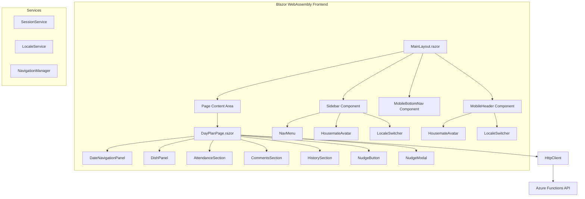

# Design Document: Day Plan Redesign

## Overview

This design covers the visual and structural redesign of the Happie PWA's main layout and Day Plan page. The redesign replaces the current Blazor template-style layout (top header bar + collapsible sidebar with placeholder nav items) with a purpose-built responsive layout featuring:

- A **desktop sidebar** (≥641px) with branding, navigation, avatar, locale switcher, tagline, and logout
- A **mobile header** (<641px) with branding, avatar, and locale switcher
- A **mobile bottom navigation bar** (<641px) for thumb-friendly page switching
- A completely restructured **Day Plan page** with date navigation, dish panel, attendance section, comments section, history section, and nudge functionality

The existing API contracts (`DayPlanResponse`, `AttendanceDto`, `CommentDto`, `HistoryEntryDto`) remain largely unchanged. The `DishDto` contract will be extended to include last-edited metadata needed by the new dish panel display.

## Architecture

The redesign is primarily a frontend concern. The backend changes are minimal: extending `DishDto` with `LastChangedByHousemateId` and `LastChangedAt`, extending `CommentDto` with `LastEditedAt`, and adding `ChangedByHousemateId` to `HistoryEntryDto`. The frontend resolves display names and colors by joining against the attendance list already present in `DayPlanResponse`.



### Responsive Breakpoint Strategy

| Viewport | Layout |
|---|---|
| ≥641px (desktop) | Sidebar visible, mobile header hidden, bottom nav hidden, top header bar removed |
| <641px (mobile) | Sidebar hidden, mobile header visible, bottom nav visible |

The breakpoint at 641px aligns with the existing CSS media queries in the project.

### Component Hierarchy

```
App.razor
└── MainLayout.razor
    ├── Sidebar (desktop only, ≥641px)
    │   ├── Logo + "Happie" text
    │   ├── NavMenu (On the menu, Calendar, Housemates)
    │   ├── Log Out link
    │   ├── Tagline
    │   ├── LocaleSwitcher
    │   └── HousemateAvatar (active housemate)
    ├── MobileHeader (mobile only, <641px)
    │   ├── "Happie" text
    │   ├── LocaleSwitcher
    │   └── HousemateAvatar (active housemate)
    ├── Page Content (@Body)
    │   └── DayPlanPage
    │       ├── DateNavigationPanel
    │       ├── DishPanel
    │       ├── AttendanceSection (header + NudgeButton)
    │       ├── CommentsSection
    │       └── HistorySection
    ├── MobileBottomNav (mobile only, <641px)
    └── NudgeModal (overlay, triggered from NudgeButton)
```

## Components and Interfaces

### New Components

| Component | File | Responsibility |
|---|---|---|
| `Sidebar` | `Layout/Sidebar.razor` | Desktop sidebar with branding, nav, avatar, locale, tagline, logout |
| `MobileHeader` | `Layout/MobileHeader.razor` | Mobile top header with branding, avatar, locale switcher |
| `MobileBottomNav` | `Layout/MobileBottomNav.razor` | Mobile bottom navigation bar with page icons |
| `HousemateAvatar` | `Components/HousemateAvatar.razor` | Reusable 36×36px colored rounded square with initial |
| `DateNavigationPanel` | `Components/DateNavigationPanel.razor` | Floating panel with prev/next arrows and contextual date label |
| `DishPanel` | `Components/DishPanel.razor` | Dish display with relative time, inline editing (replaces `DishEditor`) |
| `AttendanceSection` | `Components/AttendanceSection.razor` | Attendance list with three-state toggles and nudge button |
| `CommentsSection` | `Components/CommentsSection.razor` | Comments display with inline editing for active housemate |
| `HistorySection` | `Components/HistorySection.razor` | History log with formatted timestamps (replaces `DayHistoryLog`) |
| `NudgeModal` | `Components/NudgeModal.razor` | Nudge modal overlay (replaces `NudgeDialog`) |

### Modified Components

| Component | Changes |
|---|---|
| `MainLayout.razor` | Remove top header bar, integrate Sidebar/MobileHeader/MobileBottomNav, responsive layout |
| `NavMenu.razor` | Remove entirely — navigation moves into `Sidebar` and `MobileBottomNav` |
| `DayPlanPage.razor` | Restructure to use new sub-components, add content centering |

### Removed Components

| Component | Reason |
|---|---|
| `NavMenu.razor` + `.css` | Replaced by `Sidebar` and `MobileBottomNav` |
| `DishEditor.razor` | Replaced by `DishPanel` with richer display |
| `DayHistoryLog.razor` | Replaced by `HistorySection` with new formatting |
| `NudgeDialog.razor` | Replaced by `NudgeModal` with new design |

### Component Interfaces

#### HousemateAvatar

```csharp
[Parameter, EditorRequired] public string Name { get; set; }
[Parameter, EditorRequired] public string Color { get; set; }
[Parameter] public EventCallback OnClick { get; set; }
[Parameter] public bool ShowHoverEffect { get; set; } = false;
```

#### DateNavigationPanel

```csharp
[Parameter, EditorRequired] public DateOnly ViewedDate { get; set; }
[Parameter] public EventCallback OnPreviousDay { get; set; }
[Parameter] public EventCallback OnNextDay { get; set; }
```

#### DishPanel

```csharp
[Parameter, EditorRequired] public string Date { get; set; }
[Parameter] public DishDto? Dish { get; set; }
[Parameter, EditorRequired] public IReadOnlyList<AttendanceDto> Attendance { get; set; }
[Parameter] public EventCallback<string?> OnDishChanged { get; set; }
```

#### AttendanceSection

```csharp
[Parameter, EditorRequired] public string Date { get; set; }
[Parameter, EditorRequired] public IReadOnlyList<AttendanceDto> Attendance { get; set; }
[Parameter] public EventCallback OnNudgeClicked { get; set; }
[Parameter] public EventCallback<(Guid HousemateId, AttendanceStatus Status)> OnStatusChanged { get; set; }
```

#### CommentsSection

```csharp
[Parameter, EditorRequired] public string Date { get; set; }
[Parameter, EditorRequired] public IReadOnlyList<CommentDto> Comments { get; set; }
[Parameter, EditorRequired] public IReadOnlyList<AttendanceDto> Attendance { get; set; }
[Parameter, EditorRequired] public Guid ActiveHousemateId { get; set; }
[Parameter] public EventCallback<(Guid HousemateId, string? Text)> OnCommentChanged { get; set; }
```

#### HistorySection

```csharp
[Parameter, EditorRequired] public IReadOnlyList<HistoryEntryDto> History { get; set; }
[Parameter, EditorRequired] public IReadOnlyList<AttendanceDto> Attendance { get; set; }
```

#### NudgeModal

```csharp
[Parameter, EditorRequired] public IReadOnlyList<AttendanceDto> Attendance { get; set; }
[Parameter, EditorRequired] public Guid ActiveHousemateId { get; set; }
[Parameter, EditorRequired] public string Date { get; set; }
public void Open() // public method to open the modal
```

### Utility Classes

#### DateLabelService

A static utility class for computing contextual date labels. Extracted as a pure function for testability.

```csharp
namespace Happie.Web.Services;

public static class DateLabelService
{
    public record DateLabel(string? Title, string FormattedDate, bool TitleIsBold, bool DateIsBold);

    public static DateLabel GetLabel(DateOnly viewedDate, DateOnly today, CultureInfo culture);
}
```

**Logic:**
- Offset 0 → Title: "Today", Date: formatted
- Offset -1 → Title: "Yesterday", Date: formatted
- Offset +1 → Title: "Tomorrow", Date: formatted
- Offset ±2 to ±6 → Title: day name (e.g. "Wednesday"), Date: formatted
- Offset ≥7 or ≤-7 → Title: null, Date: formatted (bold)

Date format: `d MMM yyyy` using the provided `CultureInfo` for locale-aware month abbreviation.

#### TimeFormatter

A static utility class for formatting timestamps. This is a small custom implementation (~20 lines per method) rather than pulling in a library like Humanizer, because the requirements specify a hybrid format (relative text for recent times, then switching to absolute HH:mm) that doesn't map cleanly to any existing library's output.

```csharp
namespace Happie.Web.Services;

public static class TimeFormatter
{
    public static string FormatDishTime(DateTimeOffset editedAt, DateTimeOffset now);
    public static string FormatHistoryTime(DateTimeOffset changedAt, DateTimeOffset now);
}
```

**FormatDishTime rules:**
- <60 seconds → "just now"
- <60 minutes → "{N} min ago"
- <3 hours → "{N} hours ago"
- ≥3 hours, same calendar day → HH:mm
- Previous calendar day → "d MMM HH:mm"

**FormatHistoryTime rules:**
- Same calendar day as now → HH:mm
- Different day, same calendar year → "d MMM HH:mm"
- Previous calendar year → "d MMM yyyy HH:mm"

## Data Models

### Extended DishDto

The current `DishDto` only contains `Description`. The redesigned dish panel needs to show who last edited and when. The DTO will be extended with the housemate ID and timestamp — the frontend resolves the housemate name from the attendance list (which is already part of `DayPlanResponse`):

```csharp
public record DishDto(
    [property: JsonPropertyName("description")] string Description,
    [property: JsonPropertyName("lastChangedByHousemateId")] Guid? LastChangedByHousemateId,
    [property: JsonPropertyName("lastChangedAt")] DateTimeOffset? LastChangedAt);
```

The frontend joins `LastChangedByHousemateId` against `DayPlanResponse.Attendance` to resolve the display name and color. This avoids redundant data on the wire and keeps the API response lean.

### Extended CommentDto

The comments section needs to order by last edited. The DTO will be extended:

```csharp
public record CommentDto(
    [property: JsonPropertyName("housemateId")] Guid HousemateId,
    [property: JsonPropertyName("housemateName")] string HousemateName,
    [property: JsonPropertyName("color")] string Color,
    [property: JsonPropertyName("text")] string Text,
    [property: JsonPropertyName("lastEditedAt")] DateTimeOffset? LastEditedAt);
```

### Extended HistoryEntryDto

The history section needs the housemate's ID so the frontend can resolve the color from the attendance list for the avatar display. The existing `ChangedByHousemateName` is kept because history entries may reference soft-deleted housemates who are not in the attendance list:

```csharp
public record HistoryEntryDto(
    [property: JsonPropertyName("changedAt")] DateTimeOffset ChangedAt,
    [property: JsonPropertyName("changedByHousemateId")] Guid ChangedByHousemateId,
    [property: JsonPropertyName("changedByHousemateName")] string ChangedByHousemateName,
    [property: JsonPropertyName("changeType")] ChangeType ChangeType,
    [property: JsonPropertyName("description")] string Description);
```

The frontend resolves the housemate color by looking up `ChangedByHousemateId` in the attendance list. If the housemate is not found (soft-deleted), a neutral fallback color is used.

### DishRecordEntity Extension

The `DishRecordEntity` needs a `LastChangedAt` timestamp field:

```csharp
public DateTimeOffset? LastChangedAt { get; set; }
```

### CommentEntity Extension

The `CommentEntity` needs a `LastEditedAt` timestamp field:

```csharp
public DateTimeOffset? LastEditedAt { get; set; }
```

### Active Housemate State

The `MainLayout` needs access to the active housemate's name and color for the avatar. This will be loaded from localStorage (`activeHousemateId`) and resolved via a lightweight API call or cached housemate data from the login response.

A new `ActiveHousemateService` will be introduced:

```csharp
namespace Happie.Web.Services;

public class ActiveHousemateService
{
    public Guid? Id { get; private set; }
    public string? Name { get; private set; }
    public string? Color { get; private set; }

    public async Task InitializeAsync(); // reads from localStorage + sessionStorage
}
```

The login flow already stores housemate data in `sessionStorage` (as `pendingHousemates`). We'll additionally persist the active housemate's name and color in `localStorage` at selection time so the layout can render the avatar without an API call.

## Correctness Properties

*A property is a characteristic or behavior that should hold true across all valid executions of a system — essentially, a formal statement about what the system should do. Properties serve as the bridge between human-readable specifications and machine-verifiable correctness guarantees.*

### Property 1: Date label contextual title correctness

*For any* viewed date and reference "today" date, the `DateLabelService.GetLabel` function SHALL produce:
- Title "Today" when offset is 0
- Title "Yesterday" when offset is -1
- Title "Tomorrow" when offset is +1
- Title equal to the localized day name when offset is ±2 to ±6
- No title (null) when absolute offset is ≥7

**Validates: Requirements 10.4, 10.5, 10.6, 10.7, 10.8**

### Property 2: Date label formatted date uses locale-aware month abbreviation

*For any* viewed date and locale (en or nl), the formatted date string produced by `DateLabelService.GetLabel` SHALL contain the locale-aware abbreviated month name as produced by `DateOnly.ToString("MMM", cultureInfo)` for the given locale.

**Validates: Requirements 10.9**

### Property 3: Dish relative time formatting

*For any* timestamp `editedAt` and reference time `now` where `editedAt <= now`, the `TimeFormatter.FormatDishTime` function SHALL produce:
- "just now" when the difference is less than 60 seconds
- "{N} min ago" (where N = floor of minutes) when the difference is ≥60 seconds and <60 minutes
- "{N} hours ago" (where N = floor of hours) when the difference is ≥60 minutes and <3 hours
- HH:mm format when the difference is ≥3 hours and both timestamps fall on the same calendar day
- "d MMM HH:mm" format when `editedAt` is on a previous calendar day

**Validates: Requirements 11.5**

### Property 4: History timestamp formatting

*For any* timestamp `changedAt` and reference time `now`, the `TimeFormatter.FormatHistoryTime` function SHALL produce:
- HH:mm format when `changedAt` is on the same calendar day as `now`
- "d MMM HH:mm" format when `changedAt` is on a different day but within the same calendar year
- "d MMM yyyy HH:mm" format when `changedAt` is in a previous calendar year

**Validates: Requirements 15.4, 15.5, 15.6**

### Property 5: Attendance status button highlight mapping

*For any* `AttendanceStatus` value, the attendance toggle SHALL highlight exactly one button with the correct color:
- `EatingIn` → V button highlighted in green (#4CAF50)
- `NotEatingIn` → X button highlighted in red (#F44336)
- `Unknown` → ? button in neutral style (no color highlight)

**Validates: Requirements 13.4, 13.5, 13.6**

### Property 6: Nudge recipient filtering

*For any* set of attendance records and active housemate ID, the nudge modal recipient list SHALL contain exactly those housemates whose status is `Unknown` AND whose ID is not equal to the active housemate ID, with all pre-selected by default.

**Validates: Requirements 17.3**

### Property 7: Nudge send button disabled state

*For any* selection state of recipients in the nudge modal, the "Send Nudge" button SHALL be disabled if and only if the set of selected recipients is empty.

**Validates: Requirements 17.8**

## Error Handling

### Optimistic UI with Rollback

All mutation operations (dish save, attendance toggle, comment save) follow the existing optimistic UI pattern:

1. Apply the change to the local state immediately
2. Send the API request
3. On success: keep the local state
4. On failure: revert to the previous state and display a toast error notification

### Locale Switch Atomicity

Per Requirement 6.2, the locale switch must be atomic:
1. Persist the new locale to `localStorage`
2. Call `NavigationManager.NavigateTo(uri, forceLoad: true)` to reload

If `localStorage.setItem` throws (e.g., storage quota exceeded), the operation is rolled back by not proceeding to the reload. The existing `LocaleSwitcher` component already implements this pattern via `LocaleService.SetLocaleAsync` followed by `NavigateTo`.

### No-op for Active Locale Click

Per Requirement 6.3, clicking the already-active locale button must not trigger a reload. The `LocaleSwitcher` will check `LocaleService.CurrentLocale` before proceeding.

### Network Failure

If the `DayPlanPage` fails to load data, it displays an error message (existing behavior). Individual section save failures show toast notifications without disrupting other sections.

## Testing Strategy

### Unit Tests (xUnit)

Unit tests cover specific examples and edge cases:

- **DateLabelService**: Specific date examples (today, yesterday, tomorrow, 3 days ago, 7 days ago, 30 days ago)
- **TimeFormatter**: Boundary cases (exactly 60 seconds, exactly 60 minutes, exactly 3 hours, midnight crossover)
- **Component rendering**: Verify correct elements are rendered for given inputs (sidebar items, mobile header, bottom nav)
- **Locale switch no-op**: Verify clicking active locale does not trigger reload
- **Nudge modal**: Verify empty recipient list disables send button
- **Attendance toggle**: Verify optimistic update and rollback on failure

### Property-Based Tests (FsCheck)

Property-based tests verify universal properties across all inputs. The project uses **FsCheck 3.1+** with xUnit integration.

**Configuration:**
- Minimum 100 iterations per property test
- Each test tagged with: `// Feature: day-plan-redesign, Property {N}: {property_text}`

**Properties to implement:**

1. `DateLabelService_ContextualTitle_MatchesOffsetRules` — Property 1
2. `DateLabelService_FormattedDate_ContainsLocaleAwareMonth` — Property 2
3. `TimeFormatter_FormatDishTime_MatchesTimeRangeRules` — Property 3
4. `TimeFormatter_FormatHistoryTime_MatchesCalendarRules` — Property 4
5. `AttendanceToggle_StatusHighlight_MapsCorrectly` — Property 5
6. `NudgeModal_RecipientFiltering_ShowsOnlyUnknownExcludingActive` — Property 6
7. `NudgeModal_SendButton_DisabledWhenNoRecipients` — Property 7

### Test File Organization

```
Happie.Web.Tests/
├── Services/
│   ├── DateLabelServiceTests.cs          (unit + property tests)
│   └── TimeFormatterTests.cs             (unit + property tests)
├── Components/
│   ├── AttendanceToggleTests.cs          (unit + property tests)
│   ├── NudgeModalTests.cs               (unit + property tests)
│   ├── DateNavigationPanelTests.cs       (unit tests)
│   ├── DishPanelTests.cs                (unit tests)
│   ├── CommentsSectionTests.cs          (unit tests)
│   └── HistorySectionTests.cs           (unit tests)
└── Layout/
    ├── SidebarTests.cs                   (unit tests)
    ├── MobileHeaderTests.cs              (unit tests)
    └── MobileBottomNavTests.cs           (unit tests)
```

### Integration Tests

No new integration tests are needed for this redesign since the backend changes are minimal (extending DTOs). The existing API integration tests for `DaysFunction` will be updated to verify the new `DishDto` fields are populated correctly.
