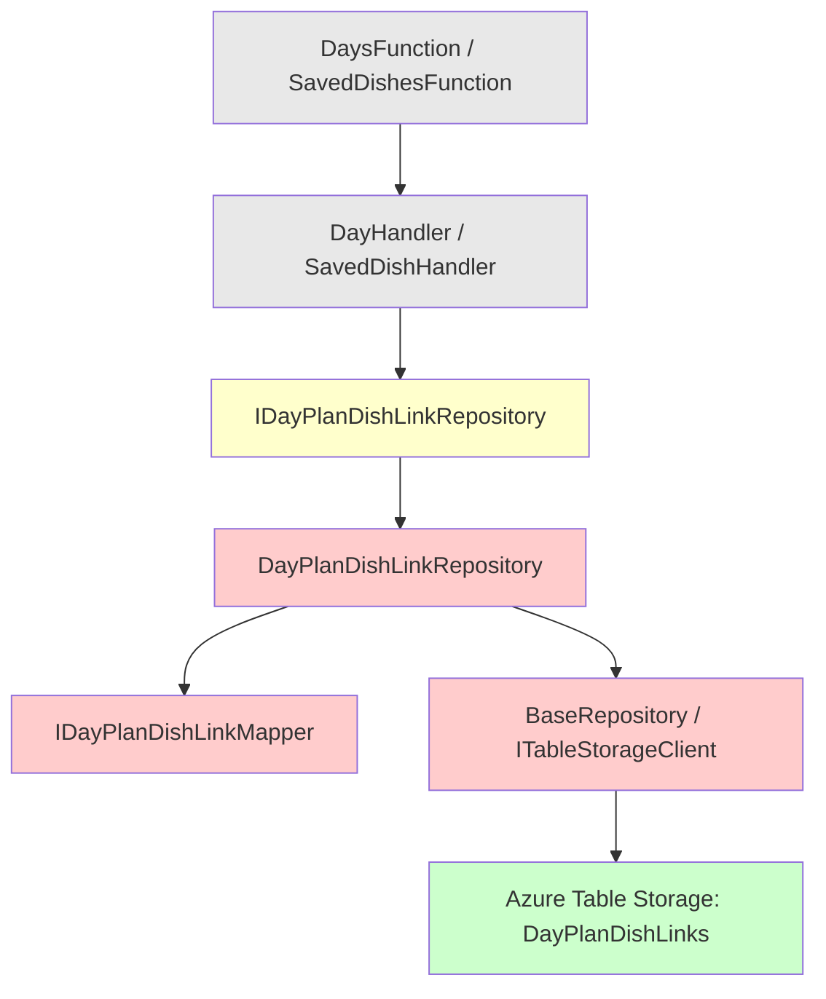

# Design Document: DayPlanDishLink Repartition

## Overview

This feature repartitions the `DayPlanDishLinkEntity` in Azure Table Storage from a composite partition key (`{HouseholdId}_{YYYY-MM-DD}`) to a single-value partition key (`{HouseholdId}`), moving the date into the RowKey as a prefix (`{YYYY-MM-DD}_{SavedDishId}`). This change consolidates all dish links for a household into a single partition, enabling efficient single-partition queries for day-specific lookups (via RowKey prefix), household-wide queries (via partition scan), and future date-range queries (via RowKey range filters) — all without cross-partition scans.

The change touches four layers:
1. **Entity** — new key format in constructors
2. **Mapper** — encode/decode date from RowKey instead of PartitionKey
3. **Repository** — use RowKey prefix queries instead of partition queries for date filtering; use single-partition query for household-wide retrieval
4. **Infrastructure** — add RowKey range query support to `TableStorageClient` and `BaseRepository`

A one-time migration script rewrites existing records. All public API contracts and repository interfaces remain unchanged.

## Architecture

The repartitioning affects the data access layer only. The handler and function layers are unaffected because the repository interface (`IDayPlanDishLinkRepository`) retains its existing method signatures and return types.



Legend:
- Grey = unchanged (functions, handlers)
- Yellow = interface unchanged, implementation updated
- Red = modified (entity, mapper, repository internals, table client)
- Green = storage layer (table with new key scheme)

### Key Format Comparison

| Aspect | Old Format | New Format |
|--------|-----------|------------|
| PartitionKey | `{HouseholdId}_{YYYY-MM-DD}` | `{HouseholdId}` |
| RowKey | `{SavedDishId}` | `{YYYY-MM-DD}_{SavedDishId}` |
| Date query | Full partition scan | RowKey prefix `{YYYY-MM-DD}_` |
| Household query | Cross-partition prefix scan | Single-partition scan |
| Date-range query | Not supported efficiently | RowKey range filter |

### Query Patterns After Repartitioning

| Operation | Query Strategy |
|-----------|---------------|
| `GetByDateAsync(householdId, date)` | Partition = `{HouseholdId}`, RowKey prefix = `{YYYY-MM-DD}_` |
| `GetAllByHouseholdAsync(householdId)` | Partition = `{HouseholdId}` (full partition scan) |
| `DeleteAllAsync(householdId, date)` | Same as `GetByDateAsync`, then delete each entity |
| `ReplaceAllAsync(householdId, date, links)` | Delete all for date, then upsert each link |
| `CreateAsync(link)` | Upsert with PK = `{HouseholdId}`, RK = `{YYYY-MM-DD}_{SavedDishId}` |
| Future: date-range query | Partition = `{HouseholdId}`, RowKey range `[startDate_, endDate_)` |

## Components and Interfaces

### DayPlanDishLinkEntity (Modified)

```csharp
public class DayPlanDishLinkEntity : MyTableEntity
{
    public DayPlanDishLinkEntity() { }

    public DayPlanDishLinkEntity(Guid householdId, DateOnly date, Guid savedDishId)
    {
        PartitionKey = householdId.ToString();
        RowKey = $"{date:yyyy-MM-dd}_{savedDishId}";
    }

    public int SortOrder { get; set; }
}
```

### IDayPlanDishLinkMapper (Unchanged interface)

The interface remains identical. The implementation changes how it parses/constructs keys:

```csharp
public class DayPlanDishLinkMapper : IDayPlanDishLinkMapper
{
    public DayPlanDishLink ToModel(DayPlanDishLinkEntity entity)
    {
        var householdId = Guid.Parse(entity.PartitionKey);
        var date = DateOnly.ParseExact(entity.RowKey[..10], "yyyy-MM-dd");
        var savedDishId = Guid.Parse(entity.RowKey[11..]);
        return new DayPlanDishLink(householdId, date, savedDishId, entity.SortOrder);
    }

    public DayPlanDishLinkEntity ToEntity(DayPlanDishLink link)
    {
        var entity = new DayPlanDishLinkEntity(link.HouseholdId, link.Date, link.SavedDishId);
        entity.SortOrder = link.SortOrder;
        return entity;
    }
}
```

### IDayPlanDishLinkRepository (Unchanged interface)

The public interface remains exactly as-is. Internal implementation changes:

- `GetByDateAsync`: uses `QueryByRowKeyPrefixAsync(householdId.ToString(), $"{date:yyyy-MM-dd}_")` instead of `QueryByPartitionAsync($"{householdId}_{date:yyyy-MM-dd}")`
- `GetAllByHouseholdAsync`: uses `QueryByPartitionAsync(householdId.ToString())` instead of `QueryByPartitionPrefixAsync($"{householdId}_")`
- `DeleteAllAsync`: same RowKey prefix query as `GetByDateAsync`, then delete each
- `ReplaceAllAsync`: calls `DeleteAllAsync` then upserts each new link
- `CreateAsync`: upserts the entity (key construction handled by mapper/entity constructor)

### ITableStorageClient (Extended)

New method added:

```csharp
Task<IReadOnlyList<T>> QueryByRowKeyRangeAsync<T>(
    string tableName,
    string partitionKey,
    string rowKeyStart,
    string rowKeyEnd,
    CancellationToken cancellationToken = default) where T : MyTableEntity;
```

Returns all entities where RowKey >= `rowKeyStart` and RowKey < `rowKeyEnd` within the given partition. Returns empty list if `rowKeyStart` >= `rowKeyEnd` or no matches.

### BaseRepository (Extended)

New protected method:

```csharp
protected Task<IReadOnlyList<TEntity>> QueryByRowKeyRangeAsync(
    string partitionKey,
    string rowKeyStart,
    string rowKeyEnd,
    CancellationToken ct = default)
    => _client.QueryByRowKeyRangeAsync<TEntity>(_tableName, partitionKey, rowKeyStart, rowKeyEnd, ct);
```

### Migration Script

A standalone console script (or C# script) that:
1. Scans the `DayPlanDishLinks` table for all entities
2. Identifies old-format records by detecting underscore-containing PartitionKeys that match `{Guid}_{YYYY-MM-DD}`
3. For each old-format record: creates a new-format record, then deletes the old one
4. Skips creation if the target record already exists
5. Reports totals (migrated, skipped, failed)

## Data Models

### Domain Model (Unchanged)

```csharp
public record DayPlanDishLink(
    Guid HouseholdId,
    DateOnly Date,
    Guid SavedDishId,
    int SortOrder);
```

### Entity Key Encoding

| Field | Old Encoding | New Encoding |
|-------|-------------|--------------|
| HouseholdId | First segment of PK (before `_`) | Entire PK |
| Date | Second segment of PK (after `_`) | First 10 chars of RK |
| SavedDishId | Entire RK | Chars 11+ of RK (after underscore at position 10) |
| SortOrder | Entity property | Entity property (unchanged) |

### RowKey Lexicographic Ordering

The new RowKey format `{YYYY-MM-DD}_{SavedDishId}` has a useful lexicographic property: all records for the same date share a common 11-character prefix (`YYYY-MM-DD_`). This enables:
- **Prefix queries**: filter with `RowKey >= "2025-03-15_"` and `RowKey < "2025-03-15_\uffff"`
- **Range queries**: filter with `RowKey >= "2025-03-01_"` and `RowKey < "2025-03-31_\uffff"` for a month range


## Correctness Properties

*A property is a characteristic or behavior that should hold true across all valid executions of a system — essentially, a formal statement about what the system should do. Properties serve as the bridge between human-readable specifications and machine-verifiable correctness guarantees.*

### Property 1: Mapper round-trip preserves all fields

*For any* valid `DayPlanDishLink` domain record (non-empty `HouseholdId`, non-empty `SavedDishId`, any `DateOnly` value, and any non-negative `SortOrder`), mapping to entity via `ToEntity` and then back to domain model via `ToModel` SHALL produce a record where all four fields (`HouseholdId`, `Date`, `SavedDishId`, `SortOrder`) are equal to the original.

**Validates: Requirements 1.1, 1.2, 1.3, 1.5, 2.1, 2.2, 2.3, 2.4, 2.5, 5.1**

### Property 2: RowKey range query returns exactly the entities within range

*For any* set of entities in a single partition with arbitrary RowKey values, and *for any* pair of strings (`rowKeyStart`, `rowKeyEnd`), the `QueryByRowKeyRangeAsync` method SHALL return exactly those entities whose RowKey is lexicographically >= `rowKeyStart` and < `rowKeyEnd`. When `rowKeyStart` >= `rowKeyEnd`, the result SHALL be an empty list.

**Validates: Requirements 8.1, 8.2, 8.3, 8.5**

## Error Handling

### Entity Construction

- The parameterized constructor does not validate input GUIDs or dates — it trusts the caller. Invalid GUIDs (e.g., `Guid.Empty`) are handled at the handler/validation layer, not the entity layer.

### Mapper Parsing

- `ToModel` uses `Guid.Parse` and `DateOnly.ParseExact` which throw `FormatException` on malformed keys. This should never occur with properly constructed entities but would surface corruption immediately.
- No silent fallback or default values — fail fast on corrupted data.

### Repository Operations

- `DeleteAllAsync` and `ReplaceAllAsync` iterate sequentially. If a single delete/upsert fails (e.g., transient Table Storage error), the exception propagates and the operation is incomplete. This matches the existing behavior and is acceptable for this application's consistency requirements.
- `GetByDateAsync` returns an empty list when no entities match the RowKey prefix (no exception).

### RowKey Range Query

- Returns an empty list (not null, not an exception) when:
  - No entities match the range
  - `rowKeyStart` >= `rowKeyEnd` (invalid/empty range)

### Migration Script

- Logs individual record failures to stdout and continues processing remaining records.
- Does not throw on single-record failure — accumulates error count.
- Reports final totals regardless of individual failures.

## Testing Strategy

### Property-Based Tests (FsCheck, minimum 100 iterations)

| Test | Property | Description |
|------|----------|-------------|
| `DayPlanDishLinkMapperPropertyTests` | Property 1 | Generate random `DayPlanDishLink` records, verify `ToEntity` → `ToModel` round-trip equality |
| `TableStorageClientRowKeyRangePropertyTests` | Property 2 | Generate random entities and range boundaries, verify filter correctness |

**Configuration:**
- Library: FsCheck 3.1+ with `FsCheck.Xunit`
- Minimum iterations: 100 per property (`[Property(MaxTest = 100)]`)
- Tag format: `// Feature: dayplan-dishlink-repartition, Property {N}: {property_text}`

**Property 1 Generator Strategy:**
- Generate random `Guid` for `HouseholdId` and `SavedDishId`
- Generate random `DateOnly` values within a reasonable range (e.g., 2020-01-01 to 2030-12-31)
- Generate random non-negative `int` for `SortOrder` (0–999)
- No mocks needed — pure mapper logic

**Property 2 Generator Strategy:**
- Generate a random partition key
- Generate 0–20 entities with random RowKey strings (alphanumeric, 10–50 chars)
- Generate random `rowKeyStart` and `rowKeyEnd` strings
- Insert entities into Azurite, execute range query, verify result matches expected filter
- Include cases where `rowKeyStart` >= `rowKeyEnd` to verify empty-list behavior

### Unit Tests (xUnit)

| Test Class | Focus |
|------------|-------|
| `DayPlanDishLinkEntityTests` | Constructor sets PK/RK in correct format; parameterless constructor exists |
| `DayPlanDishLinkMapperTests` | Specific examples: known date/GUID combinations, edge dates (leap year, year boundaries) |
| `MigrationScriptTests` | Mock-based: old-format detection regex, skip logic, error accumulation, output counts |

### Integration Tests (xUnit + Azurite)

| Test Class | Focus |
|------------|-------|
| `DayPlanDishLinkRepositoryIntegrationTests` | All repository methods with real Table Storage: GetByDateAsync returns sorted results, ReplaceAllAsync deletes+inserts, DeleteAllAsync removes all for date, GetAllByHouseholdAsync uses single partition, CreateAsync upserts correctly, ReplaceAllAsync with empty list |
| `TableStorageClientRowKeyRangeIntegrationTests` | RowKey range query with real Table Storage: correct filtering, ordering, empty results, boundary conditions |
| `MigrationIntegrationTests` | End-to-end migration: old records converted, new records created, old records deleted, idempotency (existing new-format records skipped) |

### What is NOT property-tested

- Repository methods (integration concern, not pure logic)
- Migration script end-to-end behavior (integration, run once)
- Steering documentation updates (not runtime behavior)
- API backwards compatibility (verified by existing tests continuing to pass)
