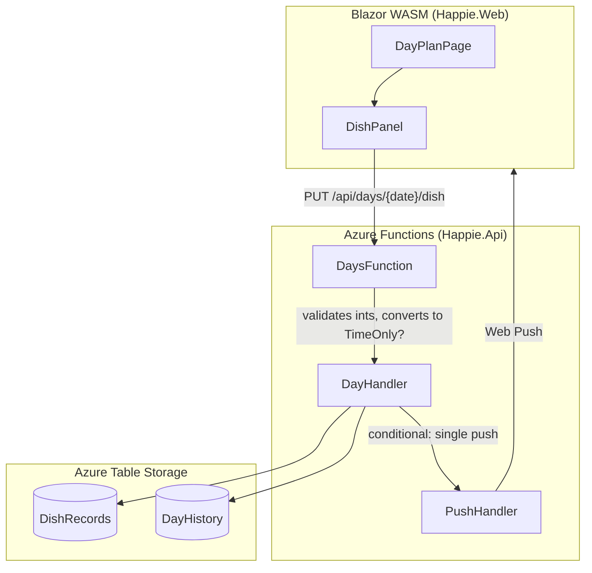

# Design Document: Dinner Time

## Overview

This feature adds an optional dinner time (hour + minute) to each day's dish record. The time is displayed alongside the dish description in read mode, editable inline in edit mode, persisted as part of the existing `DishRecord` entity, and triggers push notifications when changed within a 6-hour window before the configured time.

The design extends existing infrastructure (entity, mapper, repository, handler, DTO, API endpoint) rather than introducing new tables or endpoints. The dinner time is a naive, timezone-agnostic value representing "what time dinner is at the house" — stored as two integer fields (`DinnerTimeHour`, `DinnerTimeMinute`) on `DishRecordEntity` (with `-1` sentinel for "not set"), represented as `TimeOnly?` in the domain model and handler layer, sent as two nullable ints on the wire (`UpdateDishRequest` / `DishDto`), and returned in the existing `DishDto` response. No timezone conversion happens for storage or display. The 6-hour notification window uses the client-provided timezone offset to derive the setter's local time for comparison against the naive dinner time.

**Key design decisions:**

1. **No new table or endpoint** — dinner time is co-located with the dish record and uses the same save flow.
2. **`TimeOnly?` in the domain/handler layer, ints at the boundaries** — the domain model (`DishRecord`) and handler signature (`IDayHandler.UpsertDishAsync`) use `TimeOnly?` for type safety and expressiveness. Conversion to/from two ints happens at exactly two boundaries: the storage mapper (because Azure Table Storage doesn't support `TimeOnly`) and the API function (because the wire format uses ints to avoid string parsing and make the "both-or-neither" constraint obvious).
3. **Naive time with client timezone offset for notifications** — the dinner time represents "what time dinner is at the house". It's stored and displayed as-is with no timezone conversion. For the 6-hour notification window, the client sends its timezone offset (`timezoneOffsetMinutes`, minutes ahead of UTC) in the `UpdateDishRequest`. The server computes the setter's local time as `DateTimeOffset.UtcNow.AddMinutes(timezoneOffsetMinutes)` and compares it against the naive dinner time (on the same day). This works because the setter is typically at the household, so their timezone is the correct reference for comparing against the naive household time. The offset is not stored — it's used transiently for the notification decision only.
4. **Combined history entries** — when both dish description and dinner time change in the same save, a single combined `DayHistoryEntry` is written rather than two separate entries.
5. **Consolidated push notifications** — when both dish description and dinner time change in the same save, only ONE push notification is sent (not two). The existing dish-change notification is enhanced with a combined translation key that includes dinner time info.

## Architecture



The change flows through the same path as the existing dish save:

1. **DishPanel** collects dish description + dinner time (as `HH:mm` string from `<input type="time">`), validates client-side, includes the client timezone offset, and sends `UpdateDishRequest` with int fields directly (no timezone conversion on the time value itself).
2. **DaysFunction.PutDishAsync** validates the request body (both-or-neither constraint, range checks), then converts the two ints to `TimeOnly?` before calling the handler. Passes the `timezoneOffsetMinutes` through to the handler.
3. **DayHandler.UpsertDishAsync** (accepts `TimeOnly?` and `int timezoneOffsetMinutes`) compares old vs new values, writes the record, writes the appropriate history entry, and conditionally sends a single push notification (using the offset to evaluate the 6-hour window).
4. **PushHandler.SendAutoNotificationsAsync** delivers a single notification to other housemates (called once per save, regardless of what changed).

### Data Flow: Naive Time (No Conversion for Storage/Display)

```mermaid
flowchart LR
    UI["Frontend<br/>(HH:mm string from input<br/>+ timezoneOffsetMinutes)"]
    Wire["Wire Format<br/>(int? hour, int? minute,<br/>int timezoneOffsetMinutes)"]
    Func["DaysFunction<br/>(validates + converts)"]
    Domain["Handler/Domain<br/>(TimeOnly?, int offset)"]
    Mapper["DishRecordMapper<br/>(converts)"]
    Entity["Entity<br/>(int hour, int minute)<br/>-1 sentinel"]

    UI -->|"parse HH:mm → ints + offset"| Wire
    Wire --> Func
    Func -->|"new TimeOnly(h, m) or null + offset"| Domain
    Domain --> Mapper
    Mapper -->|"TimeOnly→ints or -1"| Entity
    Entity --> Mapper
    Mapper -->|"-1→null, else new TimeOnly"| Domain
    Domain --> Func
    Func -->|"TimeOnly→ints or null"| Wire
    Wire -->|"format ints as HH:mm"| UI
```



Note: The `timezoneOffsetMinutes` flows from frontend → wire → function → handler for the notification window check, but is NOT stored in the entity.

## Components and Interfaces

### Modified Contracts (Happie.Shared/Contracts/)

**UpdateDishRequest** — extended with optional dinner time fields and required timezone offset:

```csharp
public record UpdateDishRequest(
    [property: JsonPropertyName("description")]
    [property: MaxLength(100, ErrorMessage = "Dish description must be at most 100 characters.")]
    string Description,
    [property: JsonPropertyName("dinnerTimeHour")]
    int? DinnerTimeHour,
    [property: JsonPropertyName("dinnerTimeMinute")]
    int? DinnerTimeMinute,
    [property: JsonPropertyName("timezoneOffsetMinutes")]
    int TimezoneOffsetMinutes);
```

**DishDto** — extended with optional dinner time fields:

```csharp
public record DishDto(
    [property: JsonPropertyName("description")] string Description,
    [property: JsonPropertyName("lastChangedByHousemateId")] Guid? LastChangedByHousemateId,
    [property: JsonPropertyName("lastChangedAt")] DateTimeOffset? LastChangedAt,
    [property: JsonPropertyName("dinnerTimeHour")] int? DinnerTimeHour,
    [property: JsonPropertyName("dinnerTimeMinute")] int? DinnerTimeMinute);
```

### Modified Domain (Happie.Api/Domain/)

**DishRecord** — extended with `TimeOnly?`:

```csharp
public record DishRecord(
    Guid HouseholdId,
    DateOnly Date,
    string Description,
    Guid? LastChangedByHousemateId,
    DateTimeOffset? LastChangedAt,
    TimeOnly? DinnerTime
);
```

### Modified Entity (Happie.Api/Infrastructure/Entities/)

**DishRecordEntity** — new properties:

```csharp
// -1 sentinel means "not set" (Azure Table Storage cannot store nullable int or TimeOnly).
public int DinnerTimeHour { get; set; } = -1;
public int DinnerTimeMinute { get; set; } = -1;
```

Uses `-1` as the "not set" sentinel because valid hours are 0–23 and valid minutes are 0–59. The mapper converts between `TimeOnly?` and the two int fields.

### Modified Mapper (Happie.Api/Infrastructure/Mappers/)

**DishRecordMapper.ToModel** — maps two ints → `TimeOnly?`:

```csharp
DinnerTime: entity.DinnerTimeHour == -1 || entity.DinnerTimeMinute == -1
    ? null
    : new TimeOnly(entity.DinnerTimeHour, entity.DinnerTimeMinute)
```

**DishRecordMapper.ToEntity** — maps `TimeOnly?` → two ints:

```csharp
entity.DinnerTimeHour = record.DinnerTime?.Hour ?? -1;
entity.DinnerTimeMinute = record.DinnerTime?.Minute ?? -1;
```

### Modified Handler (Happie.Api/Handlers/)

**IDayHandler.UpsertDishAsync** — signature uses `TimeOnly?` and `int timezoneOffsetMinutes`:

```csharp
Task UpsertDishAsync(Guid householdId, DateOnly date, string description,
    TimeOnly? dinnerTime, int timezoneOffsetMinutes,
    Guid actingHousemateId, CancellationToken ct = default);
```

**DayHandler.UpsertDishAsync** — new logic:

1. Fetch existing `DishRecord` to compare old values.
2. Determine what changed: dish only, dinner time only, both, or neither.
3. Write the updated `DishRecord` (with `TimeOnly?`).
4. Write the appropriate `DayHistoryEntry` based on what changed (see Data Models).
5. Evaluate notification: determine combined translation key and parameters based on what changed. Call `SendAutoNotificationsAsync` **once** with the appropriate combined key. The notification is sent if:
   - The date is today or tomorrow (existing `IsTodayOrTomorrow` check), OR
   - The dinner time changed AND the new dinner time is less than 6 hours away from the setter's current local time (computed as `DateTimeOffset.UtcNow.AddMinutes(timezoneOffsetMinutes)`).

### Push Notification Consolidation Logic

When `UpsertDishAsync` is called:
- Determine `dishChanged` (description differs from stored).
- Determine `dinnerTimeChanged` (new `TimeOnly?` differs from stored).
- Choose translation key based on combination:
  - Dish only changed → `HistoryDishSet` (existing behavior)
  - Dinner time only set/changed → `NotificationDinnerTimeChanged`
  - Both changed → `NotificationDishAndDinnerTimeChanged`
  - Dinner time only cleared → no push
- Call `SendAutoNotificationsAsync` **once** with the chosen key and combined parameters.
- This ensures exactly one push notification per save, regardless of how many fields changed.

### Modified Function (Happie.Api/Functions/)

**DaysFunction.PutDishAsync** — extended validation and conversion:

- Validate `DinnerTimeHour` and `DinnerTimeMinute` as a pair: both null or both provided.
- If provided, validate hour ∈ [0, 23] and minute ∈ [0, 59].
- Return HTTP 422 with `VALIDATION_ERROR` on failure.
- **Convert validated ints to `TimeOnly?`**: `new TimeOnly(hour, minute)` or `null`.
- Pass `TimeOnly?` to `DayHandler.UpsertDishAsync`.

```csharp
// In DaysFunction.PutDishAsync, after validation:
TimeOnly? dinnerTime = readResult.Body.DinnerTimeHour.HasValue
    ? new TimeOnly(readResult.Body.DinnerTimeHour.Value, readResult.Body.DinnerTimeMinute!.Value)
    : null;

await _dayHandler.UpsertDishAsync(householdId, parsedDate, readResult.Body.Description.Trim(),
    dinnerTime, readResult.Body.TimezoneOffsetMinutes, actingHousemateId, cancellationToken);
```

### Modified Shared Domain (Happie.Shared/Domain/)

**ChangeType** — extended:

```csharp
public enum ChangeType
{
    Attendance,
    Dish,
    Comment,
    ChefStatusChanged,
    DinnerTime,
    DishAndDinnerTime,
}
```

**TranslationKeys** — new constants:

```csharp
public const string HistoryDinnerTimeSet = "history_dinner_time_set";
public const string HistoryDinnerTimeCleared = "history_dinner_time_cleared";
public const string HistoryDishAndDinnerTimeSet = "history_dish_and_dinner_time_set";
public const string HistoryDishSetDinnerTimeCleared = "history_dish_set_dinner_time_cleared";
public const string NotificationDinnerTimeChanged = "notification_dinner_time_changed";
public const string NotificationDishAndDinnerTimeChanged = "notification_dish_and_dinner_time_changed";
```

### Modified UI Component (Happie.Web/Components/)

**DishPanel.razor** — extended:

- **Read mode**: displays dinner time on the right side of `.dish-panel__body` using a two-column flex layout when dinner time is set. The time is displayed as-is from the API response (formatted as `HH:mm`).
- **Edit mode**: adds `<input type="time" step="60">` below the dish text input with a header label, clear button, and validation message. The input value is an `HH:mm` string. On save, the component parses the hour and minute ints directly from the input and sends them in the API request (no timezone conversion).
- **Animation**: the `.dish-panel` element uses `max-height` with CSS `transition: max-height 300ms ease` and `overflow: hidden` to animate height changes. A `prefers-reduced-motion` media query disables the transition (low-priority enhancement, trivial to implement with a single CSS `@media` rule: `transition: none`).

**Frontend time handling (no conversion):**

```csharp
// On save: parse HH:mm input directly to ints for the API request.
var timeParts = _editTimeValue.Split(':');
var hour = int.Parse(timeParts[0]);
var minute = int.Parse(timeParts[1]);

// Include the client's timezone offset (minutes ahead of UTC).
var timezoneOffsetMinutes = (int)DateTimeOffset.Now.Offset.TotalMinutes;

// On load: format ints from API response directly as HH:mm for display.
var displayTime = $"{dish.DinnerTimeHour:D2}:{dish.DinnerTimeMinute:D2}";
```

**DishPanel.razor.css** — new classes:

- `.dish-panel__body--has-time`: switches body to `flex-direction: row` with the time column taking `max-width: 30%`.
- `.dish-panel__time-column`: right-aligned column for the time display.
- `.dish-panel__time-value`: same style as `.dish-panel__dish-text` (20px, 700, #ffffff).
- `.dish-panel__time-label`: same style as `.dish-panel__meta` (12px, #718096), right-aligned.
- `.dish-panel__time-input-group`: edit mode container for time input + clear button.
- `.dish-panel__time-header`: localized "Dinner time" label above the input.
- `.dish-panel__clear-btn`: small icon button to clear the time value.
- `.dish-panel__validation-error`: error message text below the time input.
- `.dish-panel--animating`: applies `overflow: hidden` and `transition: max-height 300ms ease`.
- `@media (prefers-reduced-motion: reduce)`: sets `transition: none` on `.dish-panel--animating`.

## Data Models

### DishRecordEntity (Azure Table Storage)

| Property | Type | Storage default | Notes |
|---|---|---|---|
| `PartitionKey` | string | — | `{HouseholdId}` |
| `RowKey` | string | — | `{YYYY-MM-DD}` |
| `Description` | string | `""` | Max 100 chars |
| `LastChangedByHousemateId` | Guid | `Guid.Empty` | Sentinel for null |
| `LastChangedAt` | DateTimeOffset | `default` | Sentinel for null |
| `DinnerTimeHour` | int | `-1` | **NEW** — sentinel for null; valid: 0–23 |
| `DinnerTimeMinute` | int | `-1` | **NEW** — sentinel for null; valid: 0–59 |

### DishRecord (Domain)

| Property | Type | Notes |
|---|---|---|
| `HouseholdId` | `Guid` | |
| `Date` | `DateOnly` | |
| `Description` | `string` | Max 100 chars |
| `LastChangedByHousemateId` | `Guid?` | |
| `LastChangedAt` | `DateTimeOffset?` | |
| `DinnerTime` | `TimeOnly?` | **NEW** — null = not set; naive household time |

### UpdateDishRequest (Wire format)

| Field | Type | Validation |
|---|---|---|
| `description` | `string` | Required, max 100 chars |
| `dinnerTimeHour` | `int?` | **NEW** — if provided: 0–23 |
| `dinnerTimeMinute` | `int?` | **NEW** — if provided: 0–59 |
| `timezoneOffsetMinutes` | `int` | **NEW** — required; minutes ahead of UTC (e.g., 120 for UTC+2) |

Constraint: both `dinnerTimeHour` and `dinnerTimeMinute` must be null or both must be provided. A mismatch returns HTTP 422. The `timezoneOffsetMinutes` field is always required (not nullable) — the frontend always has access to this value.

### DishDto (Wire format)

| Field | Type | Notes |
|---|---|---|
| `description` | `string` | |
| `lastChangedByHousemateId` | `Guid?` | |
| `lastChangedAt` | `DateTimeOffset?` | |
| `dinnerTimeHour` | `int?` | **NEW** — null when not set |
| `dinnerTimeMinute` | `int?` | **NEW** — null when not set |

### DayHistoryEntry Change Types

| Scenario | ChangeType | TranslationKey | Parameters |
|---|---|---|---|
| Only dinner time set/changed | `DinnerTime` | `history_dinner_time_set` | `{"time": "HH:mm"}` |
| Only dinner time cleared | `DinnerTime` | `history_dinner_time_cleared` | `{}` |
| Both dish + dinner time changed | `DishAndDinnerTime` | `history_dish_and_dinner_time_set` | `{"description": "...", "time": "HH:mm"}` |
| Dish changed + dinner time cleared | `DishAndDinnerTime` | `history_dish_set_dinner_time_cleared` | `{"description": "..."}` |
| Only dish changed (time unchanged) | `Dish` | `history_dish_set` | `{"description": "..."}` (existing) |

### Push Notification Consolidation

| Scenario | Push sent? | Translation key | Parameters |
|---|---|---|---|
| Only dish changed (today/tomorrow) | Yes (1 push) | `history_dish_set` | `{"description": "..."}` |
| Only dinner time set/changed (within 6h window) | Yes (1 push) | `notification_dinner_time_changed` | `{"time": "HH:mm"}` |
| Both dish + dinner time changed (today/tomorrow OR within 6h) | Yes (1 push) | `notification_dish_and_dinner_time_changed` | `{"description": "...", "time": "HH:mm"}` |
| Only dinner time cleared | No push | — | — |
| Nothing changed | No push | — | — |

Key rule: **at most one `SendAutoNotificationsAsync` call per save operation**, with a combined translation key when multiple fields changed.

### Push Notification Window Logic

```
let timezoneOffsetMinutes = request.TimezoneOffsetMinutes  // e.g., 120 for UTC+2
let setterLocalNow = DateTimeOffset.UtcNow.AddMinutes(timezoneOffsetMinutes)
let setterLocalTimeNow = TimeOnly.FromDateTime(setterLocalNow.DateTime)
let todayAtDinnerTime = new DateTime(date.Year, date.Month, date.Day, DinnerTime.Hour, DinnerTime.Minute, 0)
let difference = todayAtDinnerTime - setterLocalNow.DateTime

if difference > 0 AND difference < 6 hours:
    dinner time change triggers push notification
```

**Rationale:** The dinner time is naive (household-local) and we need to compare it against "now" in the same timezone. The setter is typically at the household, so their local time is the correct reference. By using the server's UTC clock (`DateTimeOffset.UtcNow`) and adjusting with the client-provided offset, we avoid relying on the client's potentially-incorrect clock while still getting an accurate local time comparison.

**Frontend offset source:** In Blazor WASM, `(int)DateTimeOffset.Now.Offset.TotalMinutes` returns the browser's timezone offset in minutes ahead of UTC (positive for east, e.g., 120 for UTC+2; negative for west, e.g., -300 for UTC-5). This is sent as `timezoneOffsetMinutes` in the request. On the server: `DateTimeOffset.UtcNow.AddMinutes(timezoneOffsetMinutes)` gives the setter's local time.

The notification is NOT sent for dinner time changes when:
- Dinner time is cleared (set to null).
- Dinner time is identical to the previously stored value.
- The new dinner time is more than 6 hours away from the setter's local time.
- The new dinner time has already passed (negative difference).

The notification IS sent for dish description changes when:
- The date is today or tomorrow (existing `IsTodayOrTomorrow` logic).

When both trigger conditions are met simultaneously, only one push is sent with the combined key.

## Correctness Properties

*A property is a characteristic or behavior that should hold true across all valid executions of a system — essentially, a formal statement about what the system should do. Properties serve as the bridge between human-readable specifications and machine-verifiable correctness guarantees.*

### Property 1: Dinner time validation correctness

*For any* pair of nullable integers `(hour, minute)`, the validation function SHALL accept the pair if and only if: (a) both are null, OR (b) both are provided with hour ∈ [0, 23] and minute ∈ [0, 59]. All other combinations (one null, out-of-range values) SHALL be rejected.

**Validates: Requirements 2.7, 5.4, 5.5, 5.9**

### Property 2: DishRecord mapper round-trip

*For any* valid `DishRecord` with an optional `TimeOnly?` dinner time field, mapping to a `DishRecordEntity` (via `ToEntity`) and back to a `DishRecord` (via `ToModel`) SHALL produce an equivalent `DinnerTime` value — null preserved as null, and any valid `TimeOnly` preserved with identical Hour and Minute.

**Validates: Requirements 5.3, 5.7, 5.8**

### Property 3: Notification window decision

*For any* combination of (previousDinnerTime: `TimeOnly?`, newDinnerTime: `TimeOnly?`, currentUtcTime: `DateTimeOffset`, timezoneOffsetMinutes: `int`, date: `DateOnly`), the dinner-time notification decision function SHALL return "send notification" if and only if: (a) newDinnerTime is not null, AND (b) newDinnerTime differs from previousDinnerTime, AND (c) the naive dinner DateTime (date + newDinnerTime) minus the setter's local time (currentUtcTime + timezoneOffsetMinutes) is in the range (0, 6 hours exclusive).

**Validates: Requirements 6.1, 6.2, 6.3, 6.4**

### Property 4: History entry change detection

*For any* combination of (oldDescription: `string`, newDescription: `string`, oldDinnerTime: `TimeOnly?`, newDinnerTime: `TimeOnly?`), the history entry logic SHALL produce: (a) no entry when neither changed, (b) a `Dish` entry when only description changed, (c) a `DinnerTime` entry (set or cleared) when only dinner time changed, (d) a `DishAndDinnerTime` entry when both changed — and SHALL never produce more than one history entry per save operation.

**Validates: Requirements 8.1, 8.2, 8.3, 8.6, 8.7**

## Error Handling

| Error scenario | Handling |
|---|---|
| Client-side validation failure (invalid HH:mm) | Save button disabled, localized error message shown below time input. Request not sent. |
| Server-side validation failure (hour/minute out of range or one null) | HTTP 422 `VALIDATION_ERROR` returned. Client shows toast error, rolls back to previous value. |
| Dish save API failure (network or server error) | Optimistic UI rolls back dish description and dinner time to previous values. Toast error displayed. |
| History entry write failure | Logged server-side. Dinner time save NOT rolled back. No error returned to client. |
| Push notification delivery failure (per recipient) | Logged server-side. Delivery continues to remaining recipients. Save NOT rolled back. |
| Azure Table Storage unavailable | API returns 500. Client shows generic error toast and rolls back optimistic changes. |

## Testing Strategy

### Unit Tests (xUnit + Moq)

| Area | What to test |
|---|---|
| `DayHandler.UpsertDishAsync` | Change detection logic (dish only, time only, both, neither); history entry creation; notification window evaluation with timezone offset; push handler invocation (single call per save); consolidated translation key selection |
| `DaysFunction.PutDishAsync` | Validation of dinner time pair constraint; hour/minute range validation; conversion from ints to `TimeOnly?`; passing timezoneOffsetMinutes to handler |
| `DishRecordMapper` | Mapping of `-1` sentinel ↔ `null` ↔ `TimeOnly`; valid hour/minute preservation |
| `DishPanel` (component test) | Edit mode renders time input; clear button visibility; validation message display; discard reverts state; direct int parsing on save and HH:mm formatting on load |

### Property-Based Tests (FsCheck, minimum 100 iterations)

| Property | Test location | Tag |
|---|---|---|
| Property 1: Dinner time validation correctness | `Happie.Api.Tests/Functions` | `// Feature: dinner-time, Property 1: Dinner time validation correctness` |
| Property 2: DishRecord mapper round-trip | `Happie.Api.Tests/Infrastructure` | `// Feature: dinner-time, Property 2: DishRecord mapper round-trip` |
| Property 3: Notification window decision | `Happie.Api.Tests/Handlers` | `// Feature: dinner-time, Property 3: Notification window decision` |
| Property 4: History entry change detection | `Happie.Api.Tests/Handlers` | `// Feature: dinner-time, Property 4: History entry change detection` |

### Integration Tests (xUnit, Azurite)

| Area | What to test |
|---|---|
| `DishRepository` round-trip | Upsert with dinner time, retrieve, verify TimeOnly? values (covered by Property 3 at mapper level; integration test covers full storage path) |
| `PUT /api/days/{date}/dish` end-to-end | Valid request with dinner time → 204; invalid pair → 422; out-of-range → 422 |

### Manual / Visual Tests

| Area | What to verify |
|---|---|
| iOS native time picker | `<input type="time">` renders native scroll-wheel picker on iOS Safari |
| Height animation | Smooth 300ms expand/collapse on edit mode toggle |
| `prefers-reduced-motion` | Animation skipped when system setting enabled (low-priority enhancement — single CSS `@media` rule with `transition: none`) |
| Right-aligned time column layout | Time column takes ≤30% width, dish text truncates cleanly |
| Consolidated push notification | Verify only one notification received when both dish and time change |
