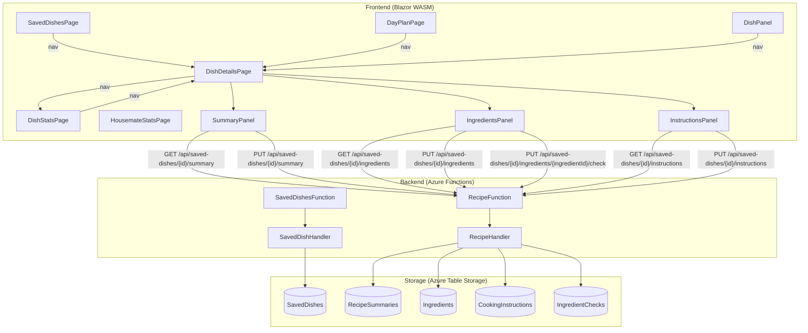

# Design Document: Dish Recipes

## Overview

This feature extends the existing SavedDish model with optional structured recipe data (summary, ingredients, cooking instructions) and introduces a new DishDetails page for viewing and editing this data. It also renames existing "Details" pages to "Stats" pages and makes saved dish names clickable throughout the app.

The design follows the established patterns in the Happie codebase: Blazor WebAssembly components on the frontend, Azure Functions handlers on the backend, and Azure Table Storage for persistence. Recipe data is stored in dedicated tables to keep it isolated from existing dish metadata.

### Key Design Decisions

1. **Separate tables for recipe data** — Ingredients, CookingInstructions, IngredientChecks, and RecipeSummaries each get their own Azure Table Storage table rather than embedding JSON in the SavedDish entity. This enables efficient per-item CRUD operations (e.g., toggling a single checkbox) without rewriting the entire recipe.

2. **Separate RecipeSummaries table** — Summary text, cooking duration, and servings are stored in a dedicated `RecipeSummaries` table (PartitionKey = HouseholdId, RowKey = SavedDishId) rather than on the SavedDishEntity. This keeps the SavedDish entity focused on dish identity and avoids coupling recipe metadata to the core entity.

3. **Separate GET endpoints per panel** — Instead of a single endpoint returning all recipe data, each panel fetches its own data independently (`/summary`, `/ingredients`, `/instructions`). This enables lazy loading, reduces initial payload size, and allows panels to refresh independently.

4. **Individual PUT for checkbox toggles** — Each checkbox toggle fires a single `PUT /api/saved-dishes/{id}/ingredients/{ingredientId}/check` request rather than batching all check states. This minimizes payload size, supports optimistic UI with fine-grained rollback, and avoids race conditions when multiple toggles happen in quick succession.

5. **UnitOfMeasurement as a strongly-typed enum** — The domain layer uses a `UnitOfMeasurement` enum (defined in `Happie.Shared/Domain/`) instead of raw strings. The entity layer stores it as the enum type directly (serialized as its integer value by Azure Table Storage), consistent with how `AttendanceStatus`, `ChangeType`, and `Locale` are stored in existing entities. This provides compile-time safety and eliminates invalid unit values. New values must be appended at the end of the enum to preserve backwards compatibility with stored integer values.

6. **Soft-delete isolation** — When a SavedDish is soft-deleted, its recipe data is deliberately preserved for potential future restoration.

7. **Non-persisted portion scaling** — The adjusted serving count (Portion_Multiplier) is a client-only transient value, reset on each page visit, avoiding unnecessary backend writes.

## Architecture



### Navigation Flow

```mermaid
graph LR
    DayPlan[DayPlanPage<br>/day/{date}] -->|click dish name| DD[DishDetailsPage<br>/saved-dishes/{Id}]
    SavedDishes[SavedDishesPage<br>/saved-dishes] -->|click dish name| DD
    DD -->|stats icon| DS[DishStatsPage<br>/saved-dishes/{Id}/stats]
    DS -->|recipe icon| DD
    DS -->|timeline row| HS[HousemateStatsPage<br>/housemates/{Id}/stats]
```

## Components and Interfaces

### Frontend Components

| Component | Location | Responsibility |
|---|---|---|
| `DishDetailsPage` | `Pages/DishDetailsPage.razor` | New page at `/saved-dishes/{Id}` — orchestrates recipe panels, dish name editing |
| `DishStatsPage` | `Pages/DishStatsPage.razor` | Renamed from `DishDetailsPage` — statistics at `/saved-dishes/{Id}/stats` |
| `HousemateStatsPage` | `Pages/HousemateStatsPage.razor` | Renamed from `HousemateDetailsPage` — at `/housemates/{Id}/stats` |
| `SummaryPanel` | `Components/SummaryPanel.razor` | Displays/edits summary text, duration, servings |
| `IngredientsPanel` | `Components/IngredientsPanel.razor` | Displays/edits ingredients with checkboxes and portion scaling |
| `InstructionsPanel` | `Components/InstructionsPanel.razor` | Displays/edits numbered cooking instruction paragraphs |

### Backend API Endpoints

| Method | Route | Handler Method | Description |
|---|---|---|---|
| `GET` | `/api/saved-dishes/{id}/summary` | `GetSummaryAsync` | Returns recipe summary (summary text, duration, servings) |
| `GET` | `/api/saved-dishes/{id}/ingredients` | `GetIngredientsAsync` | Returns ingredient list with check states |
| `GET` | `/api/saved-dishes/{id}/instructions` | `GetInstructionsAsync` | Returns instruction list |
| `PUT` | `/api/saved-dishes/{id}/summary` | `UpdateSummaryAsync` | Updates summary, duration, servings |
| `PUT` | `/api/saved-dishes/{id}/ingredients` | `UpdateIngredientsAsync` | Batch-saves ingredient list (add/edit/delete/reorder) |
| `PUT` | `/api/saved-dishes/{id}/ingredients/{ingredientId}/check` | `UpdateIngredientCheckAsync` | Toggles a single ingredient's checked state |
| `PUT` | `/api/saved-dishes/{id}/instructions` | `UpdateInstructionsAsync` | Batch-saves instruction list |

### Backend Interfaces

```csharp
public interface IRecipeHandler
{
    Task<RecipeSummaryResponse?> GetSummaryAsync(Guid householdId, Guid savedDishId, CancellationToken cancellationToken);
    Task<IngredientsResponse?> GetIngredientsAsync(Guid householdId, Guid savedDishId, CancellationToken cancellationToken);
    Task<InstructionsResponse?> GetInstructionsAsync(Guid householdId, Guid savedDishId, CancellationToken cancellationToken);
    Task<UpdateSummaryResult> UpdateSummaryAsync(Guid householdId, Guid savedDishId, UpdateSummaryRequest request, CancellationToken cancellationToken);
    Task<UpdateIngredientsResult> UpdateIngredientsAsync(Guid householdId, Guid savedDishId, UpdateIngredientsRequest request, CancellationToken cancellationToken);
    Task<UpdateIngredientCheckResult> UpdateIngredientCheckAsync(Guid householdId, Guid savedDishId, Guid ingredientId, UpdateIngredientCheckRequest request, CancellationToken cancellationToken);
    Task<UpdateInstructionsResult> UpdateInstructionsAsync(Guid householdId, Guid savedDishId, UpdateInstructionsRequest request, CancellationToken cancellationToken);
}
```

### New Repository Interfaces

```csharp
public interface IRecipeSummaryRepository
{
    Task<RecipeSummary?> GetAsync(Guid householdId, Guid savedDishId, CancellationToken cancellationToken);
    Task UpsertAsync(RecipeSummary summary, CancellationToken cancellationToken);
    Task DeleteAsync(Guid householdId, Guid savedDishId, CancellationToken cancellationToken);
}

public interface IIngredientRepository
{
    Task<IReadOnlyList<Ingredient>> GetAllAsync(Guid householdId, Guid savedDishId, CancellationToken cancellationToken);
    Task UpsertAsync(Ingredient ingredient, CancellationToken cancellationToken);
    Task DeleteAsync(Guid householdId, Guid savedDishId, Guid ingredientId, CancellationToken cancellationToken);
    Task BatchUpsertAsync(IReadOnlyList<Ingredient> ingredients, CancellationToken cancellationToken);
    Task BatchDeleteAsync(Guid householdId, IReadOnlyList<(Guid SavedDishId, Guid IngredientId)> keys, CancellationToken cancellationToken);
}

public interface ICookingInstructionRepository
{
    Task<IReadOnlyList<CookingInstruction>> GetAllAsync(Guid householdId, Guid savedDishId, CancellationToken cancellationToken);
    Task BatchUpsertAsync(IReadOnlyList<CookingInstruction> instructions, CancellationToken cancellationToken);
    Task BatchDeleteAsync(Guid householdId, IReadOnlyList<(Guid SavedDishId, Guid InstructionId)> keys, CancellationToken cancellationToken);
}

public interface IIngredientCheckRepository
{
    Task<IReadOnlyList<IngredientCheck>> GetAllAsync(Guid householdId, Guid savedDishId, CancellationToken cancellationToken);
    Task UpsertAsync(IngredientCheck check, CancellationToken cancellationToken);
    Task DeleteAsync(Guid householdId, Guid savedDishId, Guid ingredientId, CancellationToken cancellationToken);
    Task BatchDeleteAsync(Guid householdId, IReadOnlyList<(Guid SavedDishId, Guid IngredientId)> keys, CancellationToken cancellationToken);
}
```

## Data Models

### Domain Types

```csharp
// SavedDish does NOT include recipe metadata (summary/duration/servings live in RecipeSummary).
public record SavedDish(
    Guid Id,
    Guid HouseholdId,
    string Description,
    bool IsDeleted);

// Dedicated domain type for recipe summary metadata.
public record RecipeSummary(
    Guid HouseholdId,
    Guid SavedDishId,
    string? Summary,
    int? CookingDurationMinutes,
    int? Servings);

// New domain types.
public record Ingredient(
    Guid Id,
    Guid HouseholdId,
    Guid SavedDishId,
    double Amount,
    UnitOfMeasurement Unit,
    string Name,
    int SortOrder);

public record CookingInstruction(
    Guid Id,
    Guid HouseholdId,
    Guid SavedDishId,
    string Text,
    int SortOrder);

public record IngredientCheck(
    Guid HouseholdId,
    Guid SavedDishId,
    Guid IngredientId,
    bool IsChecked);
```

### Entity Types (Azure Table Storage)

| Entity | Table | PartitionKey | RowKey |
|---|---|---|---|
| `SavedDishEntity` | `SavedDishes` | `{HouseholdId}` | `{SavedDishId}` |
| `RecipeSummaryEntity` | `RecipeSummaries` | `{HouseholdId}` | `{SavedDishId}` |
| `IngredientEntity` | `Ingredients` | `{HouseholdId}` | `{SavedDishId}_{IngredientId}` |
| `CookingInstructionEntity` | `CookingInstructions` | `{HouseholdId}` | `{SavedDishId}_{InstructionId}` |
| `IngredientCheckEntity` | `IngredientChecks` | `{HouseholdId}` | `{SavedDishId}_{IngredientId}` |

```csharp
// SavedDishEntity — no recipe metadata fields (those are in RecipeSummaryEntity).
public class SavedDishEntity : MyTableEntity
{
    // ... existing fields (Description, IsDeleted) ...
}

public class RecipeSummaryEntity : MyTableEntity
{
    public RecipeSummaryEntity() { }
    public RecipeSummaryEntity(Guid householdId, Guid savedDishId)
    {
        PartitionKey = householdId.ToString();
        RowKey = savedDishId.ToString();
    }
    public string? Summary { get; set; }
    public int? CookingDurationMinutes { get; set; }
    public int? Servings { get; set; }
}

public class IngredientEntity : MyTableEntity
{
    public IngredientEntity() { }
    public IngredientEntity(Guid householdId, Guid savedDishId, Guid ingredientId)
    {
        PartitionKey = householdId.ToString();
        RowKey = $"{savedDishId}_{ingredientId}";
    }
    public double Amount { get; set; }
    // Stored as integer value by Table Storage (consistent with other enum properties).
    public UnitOfMeasurement Unit { get; set; }
    public string Name { get; set; } = string.Empty;
    public int SortOrder { get; set; }
}

public class CookingInstructionEntity : MyTableEntity
{
    public CookingInstructionEntity() { }
    public CookingInstructionEntity(Guid householdId, Guid savedDishId, Guid instructionId)
    {
        PartitionKey = householdId.ToString();
        RowKey = $"{savedDishId}_{instructionId}";
    }
    public string Text { get; set; } = string.Empty;
    public int SortOrder { get; set; }
}

public class IngredientCheckEntity : MyTableEntity
{
    public IngredientCheckEntity() { }
    public IngredientCheckEntity(Guid householdId, Guid savedDishId, Guid ingredientId)
    {
        PartitionKey = householdId.ToString();
        RowKey = $"{savedDishId}_{ingredientId}";
    }
    public bool IsChecked { get; set; }
}
```

### Shared Contracts (Wire Format)

```csharp
// Response returned by GET /api/saved-dishes/{id}/summary.
public record RecipeSummaryResponse(
    [property: JsonPropertyName("summary")] string? Summary,
    [property: JsonPropertyName("cookingDurationMinutes")] int? CookingDurationMinutes,
    [property: JsonPropertyName("servings")] int? Servings);

// Response returned by GET /api/saved-dishes/{id}/ingredients.
public record IngredientsResponse(
    [property: JsonPropertyName("ingredients")] IReadOnlyList<IngredientDto> Ingredients,
    [property: JsonPropertyName("ingredientChecks")] IReadOnlyList<IngredientCheckDto> IngredientChecks);

// Response returned by GET /api/saved-dishes/{id}/instructions.
public record InstructionsResponse(
    [property: JsonPropertyName("instructions")] IReadOnlyList<CookingInstructionDto> Instructions);

public record IngredientDto(
    [property: JsonPropertyName("id")] Guid Id,
    [property: JsonPropertyName("amount")] double Amount,
    [property: JsonPropertyName("unit")] UnitOfMeasurement Unit,
    [property: JsonPropertyName("name")] string Name,
    [property: JsonPropertyName("sortOrder")] int SortOrder);

public record CookingInstructionDto(
    [property: JsonPropertyName("id")] Guid Id,
    [property: JsonPropertyName("text")] string Text,
    [property: JsonPropertyName("sortOrder")] int SortOrder);

public record IngredientCheckDto(
    [property: JsonPropertyName("ingredientId")] Guid IngredientId,
    [property: JsonPropertyName("isChecked")] bool IsChecked);

// Request bodies.
public record UpdateSummaryRequest(
    [property: JsonPropertyName("summary")] string? Summary,
    [property: JsonPropertyName("cookingDurationMinutes")] int? CookingDurationMinutes,
    [property: JsonPropertyName("servings")] int? Servings);

public record UpdateIngredientsRequest(
    [property: JsonPropertyName("ingredients")] IReadOnlyList<IngredientDto> Ingredients);

public record UpdateIngredientCheckRequest(
    [property: JsonPropertyName("isChecked")] bool IsChecked);

public record UpdateInstructionsRequest(
    [property: JsonPropertyName("instructions")] IReadOnlyList<CookingInstructionDto> Instructions);
```

### UnitOfMeasurement Enum

A strongly-typed enum defined in `Happie.Shared/Domain/`:

```csharp
public enum UnitOfMeasurement
{
    None,
    G,
    Kg,
    Ml,
    L,
    Tbsp,
    Tsp,
    Piece,
    Stalk,
    Clove,
    Can,
    Slice,
    Pinch,
    Handful,
    Bunch,
    Cup
}
```

### Recipe Constants

Shared constants defined in `Happie.Shared/Domain/`:

```csharp
public static class RecipeConstants
{
    public static readonly IReadOnlySet<UnitOfMeasurement> CountBasedUnits = new HashSet<UnitOfMeasurement>
    {
        UnitOfMeasurement.Piece, UnitOfMeasurement.Stalk, UnitOfMeasurement.Clove,
        UnitOfMeasurement.Can, UnitOfMeasurement.Slice, UnitOfMeasurement.Bunch,
        UnitOfMeasurement.Handful
    };

    public static readonly IReadOnlySet<UnitOfMeasurement> WeightVolumeUnits = new HashSet<UnitOfMeasurement>
    {
        UnitOfMeasurement.G, UnitOfMeasurement.Kg, UnitOfMeasurement.Ml,
        UnitOfMeasurement.L, UnitOfMeasurement.Tbsp, UnitOfMeasurement.Tsp,
        UnitOfMeasurement.Pinch, UnitOfMeasurement.Cup
    };

    public const int MaxIngredients = 30;
    public const int MaxInstructions = 15;
    public const int MaxIngredientNameLength = 100;
    public const int MaxInstructionTextLength = 500;
    public const int MaxSummaryLength = 250;
    public const int MaxDishNameLength = 100;
    public const int MinServings = 1;
    public const int MaxServings = 25;
    public const double MinIngredientAmount = 0.01;
    public const double MaxIngredientAmount = 9999;
}
```

### Portion Scaling Logic (Client-Side)

```csharp
public static class PortionScaler
{
    public static double Scale(double baseAmount, int baseServings, int adjustedServings)
    {
        return baseAmount * ((double)adjustedServings / baseServings);
    }

    public static string FormatAmount(double amount, UnitOfMeasurement unit)
    {
        if (RecipeConstants.CountBasedUnits.Contains(unit))
            return FormatAsFraction(amount);

        return amount.ToString("F2");
    }

    private static string FormatAsFraction(double amount)
    {
        // Format using common fractions: 1/2, 1/3, 1/4, 3/4.
        var wholePart = (int)amount;
        var fractionalPart = amount - wholePart;

        // Match to nearest common fraction.
        var fraction = fractionalPart switch
        {
            >= 0.0 and < 0.125 => "",
            >= 0.125 and < 0.29 => "1/4",
            >= 0.29 and < 0.415 => "1/3",
            >= 0.415 and < 0.585 => "1/2",
            >= 0.585 and < 0.71 => "2/3",
            >= 0.71 and < 0.875 => "3/4",
            _ => ""
        };

        if (string.IsNullOrEmpty(fraction) && fractionalPart >= 0.875)
            wholePart++;

        if (wholePart == 0 && !string.IsNullOrEmpty(fraction))
            return fraction;

        if (string.IsNullOrEmpty(fraction))
            return wholePart.ToString();

        return $"{wholePart} {fraction}";
    }
}
```

## Correctness Properties

*A property is a characteristic or behavior that should hold true across all valid executions of a system — essentially, a formal statement about what the system should do. Properties serve as the bridge between human-readable specifications and machine-verifiable correctness guarantees.*

### Property 1: Dish Name Validation

*For any* string, the dish name validation SHALL accept the string if and only if it is non-empty after trimming, contains no '&' character, and has at most 100 characters after trimming. Whitespace-only strings SHALL always be rejected.

**Validates: Requirements 3.5, 3.10**

### Property 2: Summary Field Validation

*For any* combination of summary (string), cooking duration (integer), and servings (integer), the system SHALL accept the values if and only if: summary is null or has at most 250 characters; duration is null or a non-negative integer; servings is null or an integer between 1 and 25 inclusive.

**Validates: Requirements 4.2, 4.3, 4.4**

### Property 3: Portion Scaling Calculation

*For any* ingredient with a positive base amount, a base serving count between 1 and 25, and an adjusted serving count between 1 and 25, the scaled amount SHALL equal `baseAmount * (adjustedServings / baseServings)`.

**Validates: Requirements 5.4, 5.5**

### Property 4: Amount Formatting by Unit Type

*For any* positive amount and any valid unit of measurement, the formatted output SHALL use common fractions (1/4, 1/3, 1/2, 2/3, 3/4) for count-based units (piece, stalk, clove, can, slice, bunch, handful) and SHALL use exactly 2 decimal places for weight/volume units (g, kg, ml, l, tbsp, tsp, pinch, cup).

**Validates: Requirements 5.7**

### Property 5: Check All/Uncheck All Label Threshold

*For any* non-empty list of ingredients with random checked/unchecked states, the toggle button label SHALL be "Check all" when 50% or fewer are checked, and "Uncheck all" when more than 50% are checked.

**Validates: Requirements 5.11**

### Property 6: Ingredient Field Validation

*For any* ingredient input, the amount SHALL be accepted if and only if it is a number between 0.01 and 9999, and the name SHALL be accepted if and only if it is non-empty after trimming and has at most 100 characters.

**Validates: Requirements 6.3, 6.12**

### Property 7: Reorder Preserves Ingredients

*For any* list of ingredients and any valid swap operation (moving an element up or down), the resulting list SHALL contain exactly the same set of ingredients with only the order changed.

**Validates: Requirements 6.7**

### Property 8: Whitespace-Only Items Auto-Delete

*For any* ingredient with a name consisting entirely of whitespace, or any instruction paragraph with text consisting entirely of whitespace, the system SHALL auto-delete that item upon confirm.

**Validates: Requirements 6.10, 8.7**

### Property 9: Instruction Numbering Continuous Sequence

*For any* list of N cooking instructions (after any reorder, add, or delete operation), the displayed numbering SHALL be a continuous sequence from 1 to N with no gaps or duplicates.

**Validates: Requirements 7.2, 8.6**

### Property 10: Instruction Text Validation

*For any* instruction paragraph text, the system SHALL accept it if and only if it is non-empty after trimming and has at most 500 characters.

**Validates: Requirements 8.9**

### Property 11: Unresolved Dish IDs Omitted

*For any* list of SavedDishIds where some IDs correspond to existing dishes and some do not, the rendered output SHALL include clickable links only for IDs that resolve to an existing saved dish.

**Validates: Requirements 9.4**

### Property 12: Recipe Data Round-Trip Persistence

*For any* valid recipe data (summary ≤250 chars, servings 1-25, duration as nullable int, list of ≤30 ingredients with valid fields, list of ≤15 instructions with valid text, ingredient check states), storing the data and then retrieving it SHALL produce an equivalent result.

**Validates: Requirements 12.1, 12.2, 12.3, 12.4**

## Error Handling

### Frontend Error Handling

| Scenario | Behavior |
|---|---|
| Recipe API returns 404 (dish not found) | Navigate to `/saved-dishes` |
| Summary save fails | Remain in edit mode, show toast "Save failed" |
| Ingredient checkbox toggle fails | Revert checkbox to previous state, show toast |
| Ingredient batch save fails | Remain in edit mode, show toast |
| Instructions batch save fails | Remain in edit mode, show toast |
| Dish name update returns 409 (conflict) | Remain in edit mode, show inline error "Name already in use" |
| Dish name update returns 404 | Navigate to `/saved-dishes` |
| Network offline during mutation | Disable edit/action buttons; show offline banner |

### Backend Error Handling

| Scenario | HTTP Response |
|---|---|
| Invalid SavedDish ID (not a GUID) | 400 `BAD_REQUEST` |
| SavedDish not found or soft-deleted | 404 `NOT_FOUND` |
| Validation failure (field constraints) | 422 `VALIDATION_ERROR` |
| Dish name conflict | 409 `DISH_ALREADY_EXISTS` |
| Ingredients exceed max 30 | 422 `VALIDATION_ERROR` |
| Instructions exceed max 15 | 422 `VALIDATION_ERROR` |

### Optimistic UI Pattern

For checkbox toggles, the frontend applies the change immediately to a single ingredient and fires `PUT /api/saved-dishes/{id}/ingredients/{ingredientId}/check` with `{ "isChecked": true/false }`. On failure, it rolls back that single checkbox. For "Check all/Uncheck all", the frontend toggles all affected checkboxes immediately and fires individual PUT requests per toggled ingredient; any individual failure rolls back only that ingredient's checkbox. This matches the existing pattern used by the DishPanel save operation. For panel edit/discard flows, changes are only applied after successful backend confirmation.

## Testing Strategy

### Unit Tests (xUnit)

Unit tests cover specific examples, edge cases, and component rendering:

- **Handler tests**: Validate business logic in `RecipeHandler` (validation, constraints, cascade delete on ingredient removal)
- **Function tests**: Verify HTTP routing, request validation, and response mapping in `RecipeFunction`
- **Mapper tests**: Verify entity ↔ domain type conversions for all new mappers
- **bUnit component tests**: Verify panel rendering, edit mode transitions, navigation, and error display for `DishDetailsPage`, `SummaryPanel`, `IngredientsPanel`, `InstructionsPanel`
- **Rename verification**: Confirm old routes no longer serve content, new routes work correctly

### Property-Based Tests (FsCheck)

Property-based tests use FsCheck with minimum 100 iterations per property. Each test references its design property via comment tag.

**Target areas for PBT:**
- `PortionScaler.Scale` — validates scaling arithmetic (Property 3)
- `PortionScaler.FormatAmount` — validates formatting rules by unit type (Property 4)
- Dish name validation logic — validates acceptance/rejection criteria (Property 1)
- Summary field validation — validates range constraints (Property 2)
- Ingredient validation — validates amount range and name length (Property 6)
- Check all/Uncheck all label logic — validates threshold calculation (Property 5)
- Reorder operations — validates element preservation (Property 7)
- Whitespace auto-delete — validates trimming behavior (Property 8)
- Instruction numbering — validates continuous sequence (Property 9)
- Instruction text validation — validates length constraint (Property 10)
- Recipe round-trip persistence — validates data integrity through store/retrieve cycle (Property 12)

**Tag format:** `// Feature: dish-recipes, Property {N}: {property_text}`

### Integration Tests

Integration tests verify end-to-end persistence against Azurite:
- Store and retrieve recipe data across all four new tables (RecipeSummaries, Ingredients, CookingInstructions, IngredientChecks)
- Cascade delete: removing an ingredient also removes its IngredientCheck row
- Soft-delete isolation: recipe data survives dish soft-delete
- Backwards compatibility: existing SavedDish rows remain unchanged (no recipe fields on SavedDishEntity)
- Individual checkbox toggle: verify single PUT persists and retrieves correctly
