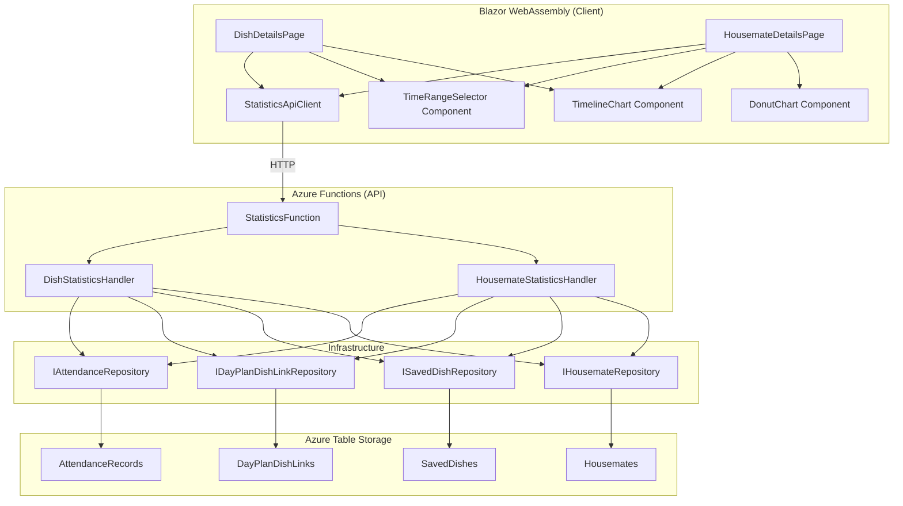

# Design Document: Dish Statistics

## Overview

The Dish Statistics feature adds two detail pages (DishDetailsPage and HousemateDetailsPage) and a supporting Statistics API to provide visual analytics on saved dish usage and cooking attribution within a household. The system computes statistics server-side via a Statistics Engine that joins `DayPlanDishLink` and `AttendanceRecord` data, then exposes results through two new API endpoints. The frontend renders summary statistics, donut charts, and horizontally-scrollable timeline charts with infinite scroll-back.

### Design Decisions

1. **Server-side computation**: Statistics are computed on the API side rather than client-side to avoid transferring raw attendance/dish-link data to the client and to keep the PWA lightweight.
2. **Single endpoint per page**: Each detail page makes one API call with both a summary date range and a timeline date range, returning all data needed for initial render. Timeline scroll-back fetches additional chunks via the same endpoint with adjusted `timelineFrom`/`timelineTo` parameters.
3. **No new Table Storage tables**: The statistics engine queries existing `AttendanceRecords`, `DayPlanDishLinks`, `SavedDishes`, and `Housemates` tables. No materialized views or caches are introduced — the data volumes per household are small enough for real-time aggregation.
4. **Soft-delete filtering at query time**: Deleted dishes are filtered out during statistics computation rather than maintaining a separate "active dish links" table.

## Architecture



### Component Responsibilities

| Layer | Component | Responsibility |
|---|---|---|
| Client | `DishDetailsPage` | Renders dish summary stats + timeline, manages time range selection |
| Client | `HousemateDetailsPage` | Renders housemate summary stats, donut chart, top dishes, timeline |
| Client | `TimeRangeSelector` | Reusable pill selector (30d, 3mo, 1yr, all-time) |
| Client | `TimelineChart` | Horizontally scrollable dot-grid chart with infinite scroll-back |
| Client | `DonutChart` | SVG donut chart with housemate color segments |
| Client | `OverflowMenu` | Three-dot dropdown menu on HousematesPage rows (move up, move down, delete) |
| Client | `StatisticsApiClient` | HTTP client calling `/api/saved-dishes/{id}/statistics` and `/api/housemates/{id}/statistics` |
| API | `StatisticsFunction` | Thin controller — parses routes/query params, delegates to handlers |
| API | `DishStatisticsHandler` | Computes dish statistics: times cooked, last cooked, timeline data |
| API | `HousemateStatisticsHandler` | Computes housemate statistics: times cooked, streak, cook ratio, busiest week, share, top dishes, timeline |
| Infra | Existing repositories | Provide data access to underlying Table Storage tables |

## Components and Interfaces

### API Layer

#### StatisticsFunction

```csharp
namespace Happie.Api.Functions;

public class StatisticsFunction
{
    [Function("GetDishStatistics")]
    // GET /api/saved-dishes/{id}/statistics?from=&to=&timelineFrom=&timelineTo=
    public Task<IActionResult> GetDishStatisticsAsync(...);

    [Function("GetHousemateStatistics")]
    // GET /api/housemates/{id}/statistics?from=&to=&timelineFrom=&timelineTo=
    public Task<IActionResult> GetHousemateStatisticsAsync(...);
}
```

#### IDishStatisticsHandler

```csharp
namespace Happie.Api.Handlers;

public interface IDishStatisticsHandler
{
    Task<DishStatisticsResult> GetStatisticsAsync(
        Guid householdId,
        Guid savedDishId,
        DateOnly from,
        DateOnly to,
        DateOnly timelineFrom,
        DateOnly timelineTo,
        CancellationToken cancellationToken = default);
}
```

#### IHousemateStatisticsHandler

```csharp
namespace Happie.Api.Handlers;

public interface IHousemateStatisticsHandler
{
    Task<HousemateStatisticsResult> GetStatisticsAsync(
        Guid householdId,
        Guid housemateId,
        DateOnly from,
        DateOnly to,
        DateOnly timelineFrom,
        DateOnly timelineTo,
        CancellationToken cancellationToken = default);
}
```

### Handler Result Types

```csharp
namespace Happie.Api.Results;

public record DishStatisticsResult(
    int TimesCooked,
    int AllTimeTimesCooked,
    DateOnly? LastCookedDate,
    IReadOnlyList<DishTimelineEntry> TimelineEntries);

public record DishTimelineEntry(
    Guid HousemateId,
    string HousemateName,
    string HousemateColor,
    int SortOrder,
    IReadOnlyList<DateOnly> CookingDays);

public record HousemateStatisticsResult(
    int TimesCooked,
    int AllTimeTimesCooked,
    int DaysEatingIn,
    int CookRatioDays,
    int CookRatioEatingInDays,
    int LongestStreak,
    int BusiestWeek,
    IReadOnlyList<CookingShareEntry> CookingShares,
    IReadOnlyList<TopDishEntry> TopDishes,
    IReadOnlyList<HousemateTimelineEntry> TimelineEntries);

public record CookingShareEntry(
    Guid HousemateId,
    string HousemateName,
    string HousemateColor,
    int ChefDayCount);

public record TopDishEntry(
    Guid SavedDishId,
    string Description,
    int Count);

public record HousemateTimelineEntry(
    Guid SavedDishId,
    string DishDescription,
    int AllTimeFrequency,
    IReadOnlyList<DateOnly> CookingDays);
```

### Shared Contracts (Wire Format)

```csharp
namespace Happie.Shared.Contracts;

public record DishStatisticsResponse(
    [property: JsonPropertyName("timesCooked")] int TimesCooked,
    [property: JsonPropertyName("allTimeTimesCooked")] int AllTimeTimesCooked,
    [property: JsonPropertyName("lastCookedDate")] string? LastCookedDate,
    [property: JsonPropertyName("timeline")] IReadOnlyList<DishTimelineDto> Timeline);

public record DishTimelineDto(
    [property: JsonPropertyName("housemateId")] Guid HousemateId,
    [property: JsonPropertyName("housemateName")] string HousemateName,
    [property: JsonPropertyName("housemateColor")] string HousemateColor,
    [property: JsonPropertyName("sortOrder")] int SortOrder,
    [property: JsonPropertyName("cookingDays")] IReadOnlyList<string> CookingDays);

public record HousemateStatisticsResponse(
    [property: JsonPropertyName("timesCooked")] int TimesCooked,
    [property: JsonPropertyName("allTimeTimesCooked")] int AllTimeTimesCooked,
    [property: JsonPropertyName("daysEatingIn")] int DaysEatingIn,
    [property: JsonPropertyName("cookRatioDays")] int CookRatioDays,
    [property: JsonPropertyName("cookRatioEatingInDays")] int CookRatioEatingInDays,
    [property: JsonPropertyName("longestStreak")] int LongestStreak,
    [property: JsonPropertyName("busiestWeek")] int BusiestWeek,
    [property: JsonPropertyName("cookingShares")] IReadOnlyList<CookingShareDto> CookingShares,
    [property: JsonPropertyName("topDishes")] IReadOnlyList<TopDishDto> TopDishes,
    [property: JsonPropertyName("timeline")] IReadOnlyList<HousemateTimelineDto> Timeline);

public record CookingShareDto(
    [property: JsonPropertyName("housemateId")] Guid HousemateId,
    [property: JsonPropertyName("housemateName")] string HousemateName,
    [property: JsonPropertyName("housemateColor")] string HousemateColor,
    [property: JsonPropertyName("chefDayCount")] int ChefDayCount);

public record TopDishDto(
    [property: JsonPropertyName("savedDishId")] Guid SavedDishId,
    [property: JsonPropertyName("description")] string Description,
    [property: JsonPropertyName("count")] int Count);

public record HousemateTimelineDto(
    [property: JsonPropertyName("savedDishId")] Guid SavedDishId,
    [property: JsonPropertyName("dishDescription")] string DishDescription,
    [property: JsonPropertyName("allTimeFrequency")] int AllTimeFrequency,
    [property: JsonPropertyName("cookingDays")] IReadOnlyList<string> CookingDays);
```

### Client Components

#### TimeRangeSelector

```razor
@* Reusable component for time range pill selection *@
<div class="time-range-selector">
    @foreach (var range in Ranges)
    {
        <button class="time-range-selector__pill @(range == SelectedRange ? "time-range-selector__pill--active" : "")"
                @onclick="() => OnRangeSelected.InvokeAsync(range)">
            @GetLabel(range)
        </button>
    }
</div>

@code {
    [Parameter] public TimeRange SelectedRange { get; set; }
    [Parameter] public EventCallback<TimeRange> OnRangeSelected { get; set; }
}
```

#### TimelineChart

- Renders an SVG/canvas-based dot grid with housemates (or dishes) on the Y-axis and days on the X-axis.
- Supports horizontal touch-swipe scrolling via CSS `overflow-x: auto` and touch event handling.
- Implements infinite scroll-back: when scroll position reaches the left edge, emits a callback to load more data.
- Pre-loads 3 months on initial render; fetches 1-month chunks on scroll-back.

#### OverflowMenu (HousematesPage)

The HousematesPage action buttons are reorganized to fit mobile screens:

**Always-visible buttons** (left to right): Rename (pencil), Color (palette), Statistics (chart), Overflow (three horizontal dots ⋯).

**Overflow menu items**: Move Up (hidden for the first row), Move Down (hidden for the last row), Delete.

Implementation:
- The overflow button toggles a dropdown positioned relative to the button.
- Clicking outside the dropdown or tapping another action closes it.
- The dropdown uses the same icon+label pattern for each action.
- The three-dot icon uses three horizontal dots (⋯), matching common mobile app conventions.
- The menu dynamically omits "Move Up" for the top housemate and "Move Down" for the bottom housemate.

#### DonutChart

- SVG-based donut chart rendering cooking share percentages.
- Each segment uses the housemate's assigned color.
- The current housemate's segment is visually distinguished (offset or thicker stroke).
- Percentage labels are rounded to the nearest whole number.

## Data Models

### Existing Domain Types (unchanged)

| Type | Key Fields |
|---|---|
| `DayPlanDishLink` | `HouseholdId`, `Date`, `SavedDishId`, `SortOrder` |
| `AttendanceRecord` | `HouseholdId`, `HousemateId`, `Date`, `Status`, `IsChef`, `LastModified` |
| `SavedDish` | `Id`, `HouseholdId`, `Description`, `IsDeleted` |
| `Housemate` | `Id`, `HouseholdId`, `Name`, `Color`, `IsDeleted`, `SortOrder` |

### Statistics Computation Logic

#### Cooking Day (for a dish)

A day qualifies as a "Cooking Day" for a specific dish when:
1. A `DayPlanDishLink` exists for that dish on that date, AND
2. The referenced `SavedDish` has `IsDeleted = false`.

Note: Chef attribution (`IsChef`) is NOT required for a day to count as a Cooking Day. A dish on the plan counts even if no housemate was marked as chef (e.g., leftovers from a previous day).

#### Chef Day (for a housemate)

A day qualifies as a "Chef Day" for a housemate when:
- An `AttendanceRecord` exists for that housemate on that date with `IsChef = true`.

#### Longest Streak

Consecutive calendar days within the selected range where the housemate was chef. Gaps (non-chef days) break the streak.

#### Busiest Week

The maximum number of chef days in any single Monday-to-Sunday week within the selected range. Partial weeks at the boundaries are included.

#### Cook Ratio

`X` = days where housemate was both chef AND had `Status = EatingIn` within the range.
`Y` = days where housemate had `Status = EatingIn` within the range.
Displayed as "Cooked X of Y eating-in days".

#### Cooking Share

For each non-deleted housemate, count their chef days within the range. If multiple housemates are chef on the same day, each is counted independently. Percentage = housemate's count / total across all non-deleted housemates, rounded to nearest whole number.

#### Top Dishes

For the housemate's chef days within the range, find all `DayPlanDishLink` entries on those days (excluding soft-deleted dishes). Group by `SavedDishId`, count occurrences, sort descending by count then alphabetically by description. Return top 10.

### Query Strategy

The handlers load all relevant data for the household and compute in-memory:

1. **DishStatisticsHandler**:
   - Load all `DayPlanDishLink` for the household (filtered to the target dish).
   - Load all `AttendanceRecord` for the household within the widest date range needed (max of summary range and timeline range).
   - Load the `SavedDish` to verify existence and non-deletion.
   - Load non-deleted `Housemate` records for timeline row metadata.

2. **HousemateStatisticsHandler**:
   - Load all `AttendanceRecord` for the household.
   - Load all `DayPlanDishLink` for the household.
   - Load all non-deleted `SavedDish` records for the household.
   - Load all non-deleted `Housemate` records for cooking share computation.

This approach is viable because household data volumes are small (typical household: 3–6 housemates, <1000 days of history).


## Correctness Properties

*A property is a characteristic or behavior that should hold true across all valid executions of a system — essentially, a formal statement about what the system should do. Properties serve as the bridge between human-readable specifications and machine-verifiable correctness guarantees.*

### Property 1: Dish cooking day count

*For any* set of `DayPlanDishLink` records within a date range, the "times cooked" count for a dish SHALL equal the number of distinct dates on which a `DayPlanDishLink` exists for that dish and the referenced `SavedDish` has `IsDeleted = false`. Chef attribution is not required.

**Validates: Requirements 2.1, 2.4**

### Property 2: Last cooked date

*For any* non-empty set of cooking days for a dish, the "last cooked" date SHALL equal the maximum (most recent) date in that set, regardless of the selected time range.

**Validates: Requirements 2.3**

### Property 3: Dish timeline dot correctness

*For any* dish and set of household data, each housemate's cooking days in the dish timeline SHALL be exactly the set of dates where that housemate had `IsChef = true` AND a `DayPlanDishLink` exists for the dish on that date, within the timeline window. Only housemates with at least one such date SHALL appear in the timeline.

**Validates: Requirements 3.2, 3.5**

### Property 4: Dish timeline sort order

*For any* dish timeline result containing multiple housemate rows, the rows SHALL be ordered by ascending `Housemate.SortOrder`.

**Validates: Requirements 3.3**

### Property 5: Color attribution correctness

*For any* statistics result (dish timeline entries, cooking share entries), the color associated with each housemate entry SHALL exactly match that housemate's `Color` field from the `Housemate` record.

**Validates: Requirements 3.4, 6.2**

### Property 6: Housemate chef day count

*For any* set of `AttendanceRecord` records and a date range, the "times cooked" count for a housemate SHALL equal the number of distinct dates on which that housemate had `IsChef = true` within the range.

**Validates: Requirements 5.1**

### Property 7: Days eating in count

*For any* set of `AttendanceRecord` records and a date range, the "days eating in" count for a housemate SHALL equal the number of distinct dates on which that housemate had `Status = EatingIn` within the range.

**Validates: Requirements 5.3**

### Property 8: Cook ratio computation

*For any* set of `AttendanceRecord` records and a date range, the cook ratio X SHALL equal the number of distinct dates where the housemate had both `IsChef = true` AND `Status = EatingIn`, and Y SHALL equal the number of distinct dates where the housemate had `Status = EatingIn`, all within the range.

**Validates: Requirements 5.4**

### Property 9: Longest streak computation

*For any* sequence of dates within a range, the longest cooking streak for a housemate SHALL equal the length of the longest consecutive run of calendar days on which the housemate had `IsChef = true`. A gap of one or more non-chef days breaks the streak.

**Validates: Requirements 5.5**

### Property 10: Busiest week computation

*For any* set of chef days within a range, the busiest week value SHALL equal the maximum count of chef days falling within any single Monday-to-Sunday ISO week that overlaps the selected range.

**Validates: Requirements 5.6**

### Property 11: Cooking share computation

*For any* set of non-deleted housemates and `AttendanceRecord` records within a date range, each housemate's chef-day count in the cooking share SHALL equal the number of distinct dates on which that housemate had `IsChef = true` within the range. If multiple housemates were chef on the same day, each SHALL be counted independently.

**Validates: Requirements 6.1, 6.5, 6.6**

### Property 12: Cooking share percentage

*For any* set of cooking share entries where the total chef-day count is greater than zero, each housemate's percentage SHALL equal `Math.Round(count / total * 100)` where count is that housemate's chef-day count and total is the sum across all non-deleted housemates.

**Validates: Requirements 6.4**

### Property 13: Top dishes computation

*For any* housemate and set of data within a date range, the top dishes list SHALL contain at most 10 entries, include only dishes where the housemate was chef on a day when the dish was linked, be sorted by count descending with alphabetical description as tie-breaker, and each entry SHALL have a non-empty description and count greater than zero.

**Validates: Requirements 7.1, 7.2, 7.3, 7.4**

### Property 14: Housemate timeline dot correctness

*For any* housemate and set of household data, each dish's cooking days in the housemate timeline SHALL be exactly the set of dates where the housemate had `IsChef = true` AND a `DayPlanDishLink` exists for that dish on that date, within the timeline window. Only dishes with at least one such date across all time SHALL appear as rows.

**Validates: Requirements 8.2, 8.4**

### Property 15: Housemate timeline sort order

*For any* housemate timeline result containing multiple dish rows, the rows SHALL be ordered by all-time frequency descending, with alphabetical dish description ascending as tie-breaker.

**Validates: Requirements 8.3**

### Property 16: Soft-delete exclusion

*For any* statistics computation (dish or housemate), all `DayPlanDishLink` records referencing a `SavedDish` with `IsDeleted = true` SHALL be excluded from all counts, timeline dots, top dishes, and cooking share values. No deleted dish SHALL appear in any timeline row.

**Validates: Requirements 9.1, 9.4**

## Error Handling

### API Layer

| Condition | Response |
|---|---|
| Missing or invalid `from`/`to`/`timelineFrom`/`timelineTo` query param | HTTP 400, `BAD_REQUEST` |
| `from` > `to` or `timelineFrom` > `timelineTo` | HTTP 400, `BAD_REQUEST` |
| `{id}` is not a valid GUID | HTTP 404, `NOT_FOUND` |
| Saved dish not found or `IsDeleted = true` | HTTP 404, `NOT_FOUND` |
| Housemate not found | HTTP 404, `NOT_FOUND` |
| Missing/invalid JWT | HTTP 401, `UNAUTHORIZED` (handled by existing `JwtMiddleware`) |
| Missing `X-Housemate-Id` header | HTTP 401, `UNAUTHORIZED` (handled by existing middleware) |

### Client Layer

| Condition | Handling |
|---|---|
| API returns 404 for dish or housemate | Redirect to parent list page (SavedDishesPage / HousematesPage) |
| API returns 400 (should not happen with correct client logic) | Show generic error toast |
| Network failure during initial load | Show `OfflineBanner`, display cached data if available or empty state |
| Network failure during timeline scroll-back | Show inline retry indicator at left edge of timeline |
| API returns 401 (token expired) | Redirect to login page (existing behavior) |

### Computation Edge Cases

| Condition | Behavior |
|---|---|
| Zero cooking days in range | `TimesCooked = 0`, hide summary stats section, show empty state message |
| Zero cooking days all-time | `AllTimeTimesCooked = 0`, hide "last cooked" indicator |
| No eating-in days | `DaysEatingIn = 0`, cook ratio = "Cooked 0 of 0 eating-in days" |
| No chef days for any housemate | Hide donut chart entirely |
| Single-day streak | `LongestStreak = 1` |
| Zero chef days in all weeks | `BusiestWeek = 0` |
| Housemate cooked fewer than 10 unique dishes | Show all (fewer than 10) in top dishes |

## Testing Strategy

### Property-Based Tests (FsCheck)

Property-based testing is applicable to this feature because the Statistics Engine contains pure computational logic (counting, filtering, sorting, streak-finding) with clearly defined input/output behavior and large input spaces.

**Library**: FsCheck 3.1+ with xUnit integration
**Iterations**: Minimum 100 per property
**Tag format**: `// Feature: dish-statistics, Property {N}: {property_text}`

The property tests target the handler layer (`DishStatisticsHandler` and `HousemateStatisticsHandler`) with in-memory data. Repositories are mocked so tests exercise only the computation logic.

**Generator strategy**: Generate random collections of `AttendanceRecord`, `DayPlanDishLink`, `SavedDish`, and `Housemate` domain objects with constrained valid values (valid GUIDs, dates within a reasonable range, valid enum values, non-empty names/descriptions).

### Unit Tests (xUnit)

Unit tests cover:
- **StatisticsFunction**: Route/query parameter validation (invalid GUIDs, missing dates, from > to), 404 for non-existent resources, correct delegation to handlers.
- **DishStatisticsHandler**: Specific examples (zero data, single cooking day, all-time vs range boundary).
- **HousemateStatisticsHandler**: Specific examples (multi-chef days, streak across range boundary, busiest week at edge of range).
- **Client components (bUnit)**: TimeRangeSelector rendering and state, empty state display, navigation guards.

### Integration Tests

Integration tests verify end-to-end flow against Azurite:
- API endpoint returns correct shape with seeded data.
- Soft-deleted dishes are excluded.
- Date range filtering works correctly at storage boundary.

### Test Organization

| Project | Scope |
|---|---|
| `Happie.Api.Tests` | Handler and Function unit tests, FsCheck property tests |
| `Happie.Api.IntegrationTests` | End-to-end API tests with Azurite |
| `Happie.Web.Tests` | bUnit component tests for DishDetailsPage, HousemateDetailsPage, TimeRangeSelector, TimelineChart, DonutChart |
