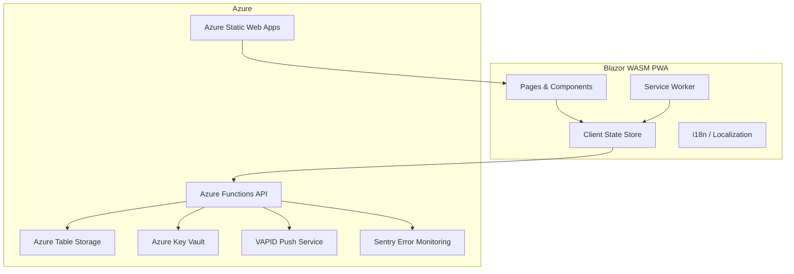

# Design Document: Happie

## Overview

Happie is a Progressive Web App (PWA) for households to coordinate dinner attendance. It is built on:

- **Frontend**: Blazor WebAssembly PWA, hosted on Azure Static Web Apps
- **Backend**: Azure Functions (isolated worker, .NET 10)
- **Database**: Azure Table Storage
- **Secrets**: Azure Key Vault (accessed via `DefaultAzureCredential` / Managed Identity)
- **Error monitoring**: Sentry (integrated as an `ILogger` provider; all `ILogger.Log*` calls and unhandled exceptions are captured automatically)

### Why Azure Table Storage over Cosmos DB

Azure Table Storage was chosen because:
- It has a free tier that covers the expected low traffic of a household app
- The data access patterns are simple and well-suited to key-value lookups
- Cosmos DB's additional capabilities (multi-region replication, complex queries, RU-based billing) are unnecessary for this use case and would add cost
- The schema maps naturally to Table Storage's PartitionKey/RowKey model

### Key Design Decisions

- All data is scoped to a `HouseholdId` (Guid), enabling multi-household support from day one
- Household creation and password management are out of scope for the UI; an administrator inserts records directly in the database
- The CalendarPage is read-only; attendance can only be changed from the DayPlanPage
- Each housemate has exactly one comment slot per day (upsert semantics)
- Nudges are sent for a specific day, targeting housemates with "unknown" status; the sender can customize the recipient list and add a short message
- Housemate colors are chosen from a predefined palette of at most 30 colors

---

## Architecture



### Request Flow

1. The Blazor WASM app is served from Azure Static Web Apps.
2. All API calls go to Azure Functions via the Static Web Apps built-in API proxy (`/api/*`).
3. Azure Functions read/write Azure Table Storage.
4. Push notifications are dispatched from Azure Functions using VAPID Web Push.
5. The Service Worker intercepts fetch requests for offline caching and queues mutations when offline.

### Secrets

All secrets are stored in Azure Key Vault and loaded at startup via `Azure.Extensions.AspNetCore.Configuration.Secrets` using `DefaultAzureCredential`.

| Secret name | Description |
|---|---|
| `JwtSigningKey` | HMAC key used to sign and verify session JWTs |
| `TableStorageConnectionString` | Connection string for Azure Table Storage |
| `VapidPublicKey` | VAPID public key for Web Push |
| `VapidPrivateKey` | VAPID private key for Web Push |
| `SentryDsn` | Sentry Data Source Name (DSN) for error monitoring |

### Authentication Flow

1. User enters the household password on the login page.
2. The client calls `POST /api/auth/login` with the password.
3. The function looks up the matching household and returns a signed JWT scoped to that `HouseholdId`.
4. The JWT is stored in `localStorage` and sent as a `Bearer` token on all subsequent requests.
5. On return visits, the stored JWT is validated; if still valid, the user skips the password screen.
6. The `ActiveHousemateId` (Guid) is stored separately in `localStorage` and sent as a custom header `X-Housemate-Id`.

---

## Components and Interfaces

### Pages

| Page | Route | Description |
|---|---|---|
| LoginPage | `/` | Password entry and housemate selection |
| DayPlanPage | `/day/{date}` | Full day plan: attendance, dish, comments, nudge, history |
| CalendarPage | `/calendar` | Read-only calendar overview with color indicators |
| HousematesPage | `/housemates` | Housemate management (add, rename, remove, color) |

### Key Components

| Component | Description |
|---|---|
| `AttendanceToggle` | Three-state toggle (eating in / not eating in / unknown) per housemate |
| `DishEditor` | Inline editable field for the dish, max 100 chars |
| `CommentEditor` | Inline editable field for a housemate's comment slot, max 200 chars |
| `NudgeDialog` | Modal for selecting recipients and optional message (max 20 chars) |
| `CalendarGrid` | Month grid with color dot indicators per day |
| `DayHistoryLog` | Audit log of changes for a given day, shown in reverse-chronological order |
| `HousemateColorPicker` | Predefined palette of up to 30 colors |
| `OfflineBanner` | Shown when the app detects no network connectivity |

### API Endpoints

All endpoints require `Authorization: Bearer <jwt>` and `X-Housemate-Id: <guid>`.

#### Auth

| Method | Path | Description |
|---|---|---|
| POST | `/api/auth/login` | Validate password, return JWT + household info |
| POST | `/api/auth/logout` | Invalidate session (client-side token removal) |

#### Day Plan

| Method | Path | Description |
|---|---|---|
| GET | `/api/days/{date}` | Get full day plan for a date (attendance, dish, comments, history) |
| GET | `/api/days?from={date}&to={date}` | Get attendance summaries for a date range (used by CalendarPage) |

`GET /api/days/{date}` response shape:
```json
{
  "date": "2025-07-15",
  "dish": { "description": "Pasta", "lastChangedByHousemateId": "guid", "lastChangedAt": "2025-07-15T18:00:00Z" },
  "attendance": [
    { "housemateId": "guid", "housemateName": "Alice", "color": "#E91E63", "status": "EatingIn" }
  ],
  "comments": [
    { "housemateId": "guid", "housemateName": "Alice", "color": "#E91E63", "text": "Home late" }
  ],
  "history": [
    { "changedAt": "2025-07-15T18:00:00Z", "changedByHousemateName": "Alice", "changeType": "Dish", "description": "Set dish to Pasta" }
  ]
}
```

- `attendance` always contains one entry per active (non-deleted) housemate; status defaults to `Unknown` if no record exists.
- `comments` contains only housemates who have a comment; absent means no comment.
- `history` is ordered reverse-chronologically (most recent first).
- Soft-deleted housemates appear in `attendance` and `comments` only when historical data exists; their `housemateName` is rendered as `"Name (deleted)"`.

`GET /api/days?from={date}&to={date}` response shape:
```json
{
  "days": [
    {
      "date": "2025-07-15",
      "eatingInColors": ["#E91E63", "#1E88E5"]
    }
  ]
}
```

- `eatingInColors` contains the `Housemate_Color` values of all active housemates with `EatingIn` status on that day.
- An empty array means no housemate is eating in on that day.

#### Attendance

| Method | Path | Description |
|---|---|---|
| PUT | `/api/days/{date}/attendance/{housemateId}` | Set attendance status for a housemate on a day |

#### Dish

| Method | Path | Description |
|---|---|---|
| PUT | `/api/days/{date}/dish` | Set or update the dish for a day |

#### Comments

| Method | Path | Description |
|---|---|---|
| PUT | `/api/days/{date}/comments/{housemateId}` | Upsert the comment for a housemate on a day |
| DELETE | `/api/days/{date}/comments/{housemateId}` | Delete the comment for a housemate on a day |

#### Nudge

| Method | Path | Description |
|---|---|---|
| POST | `/api/days/{date}/nudge` | Send a nudge for a specific day to selected housemates |

Request body:
```json
{
  "recipientHousemateIds": ["guid1", "guid2"],
  "predefinedMessageKey": "PleaseAddAttendance",
  "message": null
}
```

`predefinedMessageKey` and `message` are mutually exclusive. One must be set. When `predefinedMessageKey` is used, the server resolves the text in the recipient's locale (stored with their push subscription). When `message` is set, the custom text (max 20 chars) is used as-is.

#### Housemates

| Method | Path | Description |
|---|---|---|
| GET | `/api/housemates` | List all active housemates in the household |
| POST | `/api/housemates` | Add a new housemate (name: 1–50 chars, trimmed, not empty; auto-assigns first unused palette color) |
| PATCH | `/api/housemates/{housemateId}` | Rename or change color |
| DELETE | `/api/housemates/{housemateId}` | Remove (hard or soft delete based on history) |

#### Push Subscriptions

| Method | Path | Description |
|---|---|---|
| POST | `/api/push/subscribe` | Register or renew a push subscription for the active housemate |

---

## Data Models

### C# Domain Types

```csharp
// Enums
public enum AttendanceStatus { Unknown, EatingIn, NotEatingIn }

// Predefined color palette — 30 entries, balanced across the spectrum and
// including warm/feminine tones (pinks, roses, lilacs) for easy distinction.
public static class HousemateColors
{
    public static readonly IReadOnlyList<string> Palette = new[]
    {
        // Pinks & roses
        "#F06292", // soft pink
        "#E91E63", // hot pink
        "#AD1457", // deep rose
        "#F48FB1", // light pink
        // Purples & lilacs
        "#CE93D8", // lilac
        "#9C27B0", // purple
        "#6A1B9A", // deep purple
        "#B39DDB", // soft lavender
        // Reds & oranges
        "#EF5350", // red
        "#FF7043", // deep orange
        "#FFA726", // amber orange
        "#FFCA28", // yellow-amber
        // Yellows & greens
        "#D4E157", // lime yellow
        "#8BC34A", // light green
        "#43A047", // green
        "#00897B", // teal green
        // Teals & blues
        "#26C6DA", // cyan
        "#039BE5", // light blue
        "#1E88E5", // blue
        "#3949AB", // indigo
        // Deep blues & navy
        "#283593", // dark indigo
        "#0277BD", // ocean blue
        // Greens (earthy)
        "#558B2F", // olive green
        "#33691E", // dark olive
        // Browns & neutrals
        "#8D6E63", // warm brown
        "#6D4C41", // dark brown
        // Greys & slates
        "#546E7A", // blue-grey
        "#78909C", // steel blue
        "#757575", // medium grey
        "#455A64", // dark slate
    };
}

// Core domain models
public record Household(
    Guid HouseholdId,
    string Name,
    string PasswordHash  // bcrypt hash of the household password
);

public record Housemate(
    Guid HousemateId,
    Guid HouseholdId,
    string Name,
    string Color,        // hex code from predefined palette, e.g. "#E53935"
    bool IsDeleted
);

public record AttendanceRecord(
    Guid HouseholdId,
    Guid HousemateId,
    DateOnly Date,
    AttendanceStatus Status
);

public record DishRecord(
    Guid HouseholdId,
    DateOnly Date,
    string Description   // max 100 chars
);

public record Comment(
    Guid HouseholdId,
    Guid HousemateId,
    DateOnly Date,
    string Text          // max 200 chars
);

// Predefined nudge message keys — resolved to the recipient's locale server-side.
// When Message is null, PredefinedMessageKey must be set, and vice versa.
public enum NudgeMessageKey
{
    PleaseAddAttendance,   // "Please add your attendance for {date}" / "Vul je aanwezigheid in voor {datum}"
    WhatWouldYouLikeToEat, // "What would you like to eat tonight?" / "Wat wil je vanavond eten?"
    DinnerSoonWhatsYourPlan, // "Dinner is coming up — are you joining?" / "Het eten komt eraan — doe je mee?"
}

public record NudgeRequest(
    Guid SenderHousemateId,
    DateOnly Date,
    IReadOnlyList<Guid> RecipientHousemateIds,
    NudgeMessageKey? PredefinedMessageKey, // used when Message is null
    string? Message                        // custom message, max 20 chars; mutually exclusive with PredefinedMessageKey
);

public record PushSubscription(
    Guid HousemateId,
    Guid HouseholdId,
    string Endpoint,     // push service URL
    string P256dhKey,
    string AuthKey,
    string Locale        // "en" or "nl" — used to render predefined nudge messages in the recipient's language
);

public record DayHistoryEntry(
    Guid HouseholdId,
    DateOnly Date,
    DateTimeOffset ChangedAt,
    Guid ChangedByHousemateId,
    string ChangeType,   // "Attendance", "Dish", "Comment"
    string Description   // human-readable summary of the change
);
```

### Azure Table Storage Schema

Each table uses `HouseholdId` (as string) as the PartitionKey so that all records for a household are co-located and can be retrieved in a single query.

#### Table: `Households`

| PartitionKey | RowKey | Fields |
|---|---|---|
| `"households"` | `{HouseholdId}` | `Name`, `PasswordHash` |

#### Table: `Housemates`

| PartitionKey | RowKey | Fields |
|---|---|---|
| `{HouseholdId}` | `{HousemateId}` | `Name`, `Color`, `IsDeleted` |

#### Table: `AttendanceRecords`

| PartitionKey | RowKey | Fields |
|---|---|---|
| `{HouseholdId}` | `{YYYY-MM-DD}#{HousemateId}` | `Status` |

Rationale: Using `HouseholdId` as PartitionKey means the CalendarPage can retrieve all attendance records for a household in a single partition scan, filtered client-side or with a RowKey prefix filter on the date range. The composite RowKey `{date}#{housemateId}` allows efficient prefix queries for a single day (`YYYY-MM-DD#`) or a date range.

#### Table: `DishRecords`

| PartitionKey | RowKey | Fields |
|---|---|---|
| `{HouseholdId}` | `{YYYY-MM-DD}` | `Description`, `LastChangedByHousemateId`, `LastChangedAt` |

#### Table: `Comments`

| PartitionKey | RowKey | Fields |
|---|---|---|
| `{HouseholdId}` | `{YYYY-MM-DD}#{HousemateId}` | `Text` |

Rationale: Same as AttendanceRecords — `HouseholdId` as PartitionKey enables efficient range queries. Each housemate has exactly one comment slot per day (upsert on `PUT`, delete on `DELETE`). There is no concept of "multiple comments per housemate per day"; the slot is simply present or absent.

#### Table: `DayHistory`

| PartitionKey | RowKey | Fields |
|---|---|---|
| `{HouseholdId}` | `{YYYY-MM-DD}#{InvertedTimestamp}` | `ChangedAt`, `ChangedByHousemateId`, `ChangeType`, `Description` |

The inverted timestamp (`DateTimeOffset.MaxValue.Ticks - entry.ChangedAt.Ticks`) ensures entries are returned in reverse-chronological order by default.

#### Table: `PushSubscriptions`

| PartitionKey | RowKey | Fields |
|---|---|---|
| `{HouseholdId}` | `{HousemateId}` | `Endpoint`, `P256dhKey`, `AuthKey`, `Locale` |

---

## Correctness Properties

*A property is a characteristic or behavior that should hold true across all valid executions of a system — essentially, a formal statement about what the system should do. Properties serve as the bridge between human-readable specifications and machine-verifiable correctness guarantees.*


### Property 1: Correct password returns correct household

*For any* household with a known password, calling the login function with that exact password should return the corresponding household ID and its active housemate list.

**Validates: Requirements 1.2**

---

### Property 2: Active housemate selection round-trip

*For any* housemate in a household, storing that housemate as the active selection and then reading it back should return the same housemate ID.

**Validates: Requirements 1.3, 1.4**

---

### Property 3: All actions attributed to the active housemate

*For any* write operation (attendance change, dish update, comment upsert) performed by an active housemate, the resulting history entry should record that housemate's ID as the actor.

**Validates: Requirements 1.5**

---

### Property 4: Wrong password is denied

*For any* string that does not match any known household password, the login function should return an authentication failure and no household data.

**Validates: Requirements 1.6**

---

### Property 5: Logout invalidates session

*For any* valid session token, after logout the token should be rejected by all protected API endpoints.

**Validates: Requirements 1.7**

---

### Property 6: Data isolation between households

*For any* two distinct households A and B, querying housemates, attendance records, dishes, or comments scoped to household A should never return records belonging to household B.

**Validates: Requirements 1.8, 2.2, 2.3**

---

### Property 7: Day plan contains all active housemates' attendance

*For any* household and any date, the day plan response should contain an attendance entry for every active (non-deleted) housemate in that household.

**Validates: Requirements 3.4**

---

### Property 8: Attendance round-trip with overwrite semantics

*For any* housemate, date, and attendance status, setting the attendance and then retrieving the day plan should return that exact status. Setting it a second time with a different status should return the new status, not the old one.

**Validates: Requirements 4.1, 4.3, 4.4**

---

### Property 9: Dish round-trip with overwrite semantics

*For any* household, date, and dish description (of valid length), saving the dish and then retrieving the day plan should return that exact description. Saving a second dish for the same day should return the new description.

**Validates: Requirements 5.1, 5.2, 5.3**

---

### Property 10: Dish length validation

*For any* string of more than 100 characters, the dish save operation should be rejected. *For any* string of 100 characters or fewer, it should be accepted.

**Validates: Requirements 5.4**

---

### Property 11: Comment slot — one per housemate per day

*For any* housemate and date, saving two different comments in sequence should result in exactly one comment being stored, containing the text of the second save. The day plan should never contain more than one comment per housemate per day.

**Validates: Requirements 6.1, 6.2, 6.3**

---

### Property 12: Comment deletion removes the comment

*For any* housemate and date where a comment exists, deleting the comment and then retrieving the day plan should return no comment for that housemate on that day.

**Validates: Requirements 6.4**

---

### Property 13: Comment length validation

*For any* string of more than 200 characters, the comment save operation should be rejected. *For any* string of 200 characters or fewer, it should be accepted.

**Validates: Requirements 6.5**

---

### Property 14: Nudge payload contains sender and date

*For any* nudge request, the constructed push notification payload should contain the sender's name and the date for which attendance is being requested.

**Validates: Requirements 7.2**

---

### Property 15: Nudge default recipients are housemates with unknown status

*For any* set of housemates with mixed attendance statuses on a given day, the NudgeModal should show all housemates (excluding the active one) as recipient chips, with the subset whose status is "unknown" pre-selected by default.

**Validates: Requirements 7.4**

---

### Property 16: Offline mutations are applied after sync

*For any* mutation (attendance, dish, or comment change) queued while offline, after the connection is restored and sync completes, the backend state should reflect that mutation as if it had been applied online.

**Validates: Requirements 9.3, 9.4**

---

### Property 17: Auto-notification recipients exclude the sender

*For any* day plan change on today or tomorrow, the set of housemates who receive an automatic push notification should be exactly all active housemates in the household except the one who made the change.

**Validates: Requirements 10.1, 10.3**

---

### Property 18: Auto-notification payload contains actor, date, and change description

*For any* day plan change event, the constructed automatic notification payload should contain the name of the housemate who made the change, the affected date, and a description of what was changed.

**Validates: Requirements 10.2**

---

### Property 19: Push failure does not interrupt save

*For any* day plan save operation where the push notification dispatch throws an exception, the save operation should still complete successfully and the change should be persisted.

**Validates: Requirements 10.5**

---

### Property 20: All translation keys exist in both locales

*For any* translation key present in the English locale resource file, the same key should also be present in the Dutch locale resource file, and vice versa.

**Validates: Requirements 11.1**

---

### Property 21: Locale persistence round-trip

*For any* locale value ("en" or "nl"), storing it as the user's locale preference and then reading it back should return the same value.

**Validates: Requirements 11.3**

---

### Property 22: Active housemate list contains no deleted housemates

*For any* household, the list of active housemates returned by the API should contain no housemates whose `IsDeleted` flag is true.

**Validates: Requirements 12.1, 12.8**

---

### Property 23: Add housemate round-trip

*For any* valid housemate name, adding a new housemate to a household and then listing active housemates should include a housemate with that name.

**Validates: Requirements 12.3**

---

### Property 24: Hard delete removes housemate with no history

*For any* housemate who has no attendance records or comments, deleting that housemate should result in the housemate not appearing in any listing (active or historical).

**Validates: Requirements 12.5**

---

### Property 25: Soft delete preserves history but removes from active list

*For any* housemate who has at least one attendance record or comment, deleting that housemate should remove them from the active housemate list but their historical records should still be retrievable in day plan responses.

**Validates: Requirements 12.6**

---

### Property 26: Deleted housemate name formatted as "Name (deleted)"

*For any* soft-deleted housemate with name N, wherever their historical data appears in a day plan response, their display name should be the string `N (deleted)`.

**Validates: Requirements 12.7**

---

### Property 27: Color uniqueness invariant within a household

*For any* household, no two active housemates should share the same color. Attempting to assign a color already in use by another housemate in the same household should be rejected.

**Validates: Requirements 12.10, 12.11, 12.12, 12.13**

---

### Property 28: Rename round-trip

*For any* housemate and any new name, renaming the housemate and then retrieving the housemate list should return the updated name for that housemate ID.

**Validates: Requirements 12.14**

---

### Property 29: Calendar color indicators match eating-in housemates

*For any* day and household, the set of colors shown in the calendar cell for that day should be exactly the set of `Housemate_Color` values belonging to housemates whose attendance status is "eating in" on that day — no more, no less. When no housemate has "eating in" status, the color set should be empty.

**Validates: Requirements 13.2, 13.4**

---

### Property 30: Housemate name validation

*For any* string that is empty, composed entirely of whitespace, or exceeds 50 characters after trimming, adding a housemate with that name should be rejected. *For any* trimmed string of 1–50 characters, it should be accepted.

**Validates: Requirements 12.4**

---

## Error Handling

### API Error Responses

All Azure Functions return standard HTTP status codes with a JSON error body:

```json
{ "error": "Human-readable message", "code": "MACHINE_READABLE_CODE" }
```

| Scenario | HTTP Status | Code |
|---|---|---|
| Invalid or missing JWT | 401 | `UNAUTHORIZED` |
| Valid JWT but wrong household scope | 403 | `FORBIDDEN` |
| Resource not found | 404 | `NOT_FOUND` |
| Validation failure (e.g. dish too long) | 422 | `VALIDATION_ERROR` |
| Duplicate color within household | 409 | `COLOR_CONFLICT` |
| Internal server error | 500 | `INTERNAL_ERROR` |

### Client-Side Error Handling

- All API calls are wrapped in try/catch; on failure the UI shows a toast notification with the error message.
- For attendance, dish, and comment saves: the previous value is restored in the UI if the save fails (optimistic UI with rollback).
- For nudge sends: a per-recipient failure list is shown in the NudgeDialog after the call completes.
- For push notification dispatch failures (auto-notifications): the failure is logged server-side via `ILogger` (which flows to Sentry); the save operation is not affected.
- For offline mutations: failed sync items are retried with exponential backoff; persistent failures are surfaced to the user.

### Server-Side Error Monitoring (Sentry)

Sentry is integrated into the Azure Functions app as an `ILogger` provider via the `Sentry.Extensions.Logging` package. This means:

- **Unhandled exceptions** are captured automatically by the Sentry SDK.
- **Manual log calls** (`ILogger.LogWarning`, `ILogger.LogError`, etc.) are forwarded to Sentry automatically — no Sentry-specific API calls are needed in application code.
- The Sentry DSN is loaded from Key Vault secret `SentryDsn` at startup via the Options pattern (`SentryOptions` class in `Happie.Api/Options/`).
- Push delivery failures (both nudge and auto-notifications) are logged via `ILogger.LogWarning` or `ILogger.LogError`, which surfaces them in Sentry for monitoring.

### Validation Rules (enforced on both client and server)

| Field | Rule |
|---|---|
| Dish | Max 100 characters, trimmed |
| Comment | Max 200 characters, trimmed |
| Nudge message | Max 20 characters, trimmed |
| Housemate name | 1–50 characters, trimmed, not empty |
| Housemate color | Must be a value from the predefined palette |

---

## Testing Strategy

### Dual Testing Approach

Both unit tests and property-based tests are required. They are complementary:

- **Unit tests** cover specific examples, integration points, and edge cases
- **Property-based tests** verify universal properties across randomly generated inputs

### Property-Based Testing with FsCheck

FsCheck (F# / C# property-based testing library) is used for all property tests.

Each property test must:
- Run a minimum of **100 iterations**
- Be tagged with a comment referencing the design property it validates
- Use the tag format: `// Feature: happie, Property {N}: {property_text}`

Example:

```csharp
// Feature: happie, Property 8: Attendance round-trip with overwrite semantics
[Property]
public Property AttendanceRoundTrip(Guid housemateId, DateOnly date, AttendanceStatus status)
{
    // Arrange: set attendance
    // Act: retrieve day plan
    // Assert: status matches
    return (retrievedStatus == status).ToProperty();
}
```

### Property Test Coverage

Each of the 30 correctness properties defined above must be implemented as a single FsCheck property test. Custom generators should be written for:

- `Guid` (use `Arb.Default.Guid()`)
- `DateOnly` (generate from a reasonable range, e.g. 2020-01-01 to 2030-12-31)
- `AttendanceStatus` (generate from the three enum values)
- `Housemate` (generate with a random name and a color from the predefined palette)
- `Household` (generate with a random name and bcrypt-hashed password)

### Unit Test Coverage

Unit tests (xUnit) should cover:

- Login with correct password returns expected household
- Login with incorrect password returns 401
- Logout clears session token
- Dish validation rejects strings > 100 chars (boundary: 100, 101)
- Comment validation rejects strings > 200 chars (boundary: 200, 201)
- Nudge message validation rejects strings > 20 chars (boundary: 20, 21)
- Housemate name validation rejects empty, whitespace-only, and strings > 50 chars (boundary: 50, 51)
- Soft delete vs hard delete decision logic
- Deleted housemate name formatting ("Name (deleted)")
- Default locale is "nl" when no locale is set
- Calendar attendance summary returns correct color sets
- DayHistoryLog entries are ordered reverse-chronologically
- Auto-notification is not sent to the housemate who made the change
- Push failure does not cause save to fail (mock push service throws, save succeeds)

### Integration Tests

- End-to-end: add housemate → set attendance → retrieve day plan → verify attendance present
- End-to-end: add comment → update comment → verify only one comment per housemate per day
- End-to-end: soft delete housemate → verify not in active list → verify historical data still in day plan
- End-to-end: two households → verify data isolation (household A cannot see household B's data)

### Offline / Service Worker Tests

- Queue attendance change offline → restore connection → verify backend updated
- Verify offline banner appears when `navigator.onLine` is false
