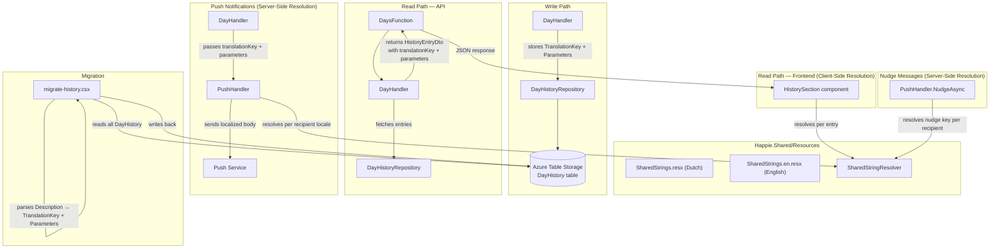

# Design Document: History Translation

## Overview

This feature replaces the pre-rendered English `Description` field in `DayHistoryEntity` with two structured fields — `TranslationKey` (string) and `Parameters` (JSON string) — enabling locale-aware resolution at read time. The key architectural shift is **client-side resolution for UI display** and **server-side resolution only for push notifications**, both using the same shared resolver and `.resx` resource files in `Happie.Shared`.

The `HistoryEntryDto` no longer carries a pre-resolved `description` string. Instead it exposes `translationKey` and `parameters`, which the `HistorySection` component resolves client-side using the user's active locale. Push notifications cannot be resolved client-side, so the `PushHandler` resolves per-recipient using their stored locale via the same shared resolver.

The existing `NudgeMessageResolver` static class (hardcoded switch expressions) is removed. Its 3 predefined nudge message templates migrate into the shared `.resx` files and are resolved through the same `SharedStringResolver`.

A one-time migration script converts all 117 existing records from the old format to the new structured format.

## Architecture



**Key architectural decisions:**

1. **Client-side resolution for UI** — The API returns `translationKey` + `parameters` in the `HistoryEntryDto`. The `HistorySection` component resolves each entry using `SharedStringResolver` with the user's active locale. This means locale switches re-render history instantly without a new API call.

2. **Shared resolver and `.resx` files in `Happie.Shared`** — A `SharedStringResolver` class in `Happie.Shared/Resources/` uses standard .NET `ResourceManager` to load templates from `SharedStrings.resx` (Dutch default) and `SharedStrings.en.resx` (English). Both `Happie.Web` and `Happie.Api` reference the same resolver — no duplication.

3. **NOT a static class with hardcoded dictionaries** — Unlike the old `NudgeMessageResolver`, the new resolver uses `.resx` resource files. Adding or updating translations requires only editing the `.resx` files, not modifying C# code.

4. **Server-side resolution only for push notifications** — Push notification bodies must be pre-rendered because the recipient's browser displays them without running app code. The `PushHandler` resolves using the recipient's stored `Locale` from their `PushSubscription` record.

5. **NudgeMessageResolver migration** — The 3 predefined nudge templates move to `SharedStrings.resx`/`SharedStrings.en.resx` with `nudge_` prefix keys. The static class is deleted. The `PushHandler` calls `SharedStringResolver` instead.

6. **Prevent accidental frontend-only translations** — History keys (`history_` prefix), nudge keys (`nudge_` prefix), and AttendanceStatus display names live exclusively in `Happie.Shared/Resources/SharedStrings.resx`. They must NOT be added to `Happie.Web/Resources/AppStrings.resx`.

7. **No backwards-compatibility detection** — The migration script converts all existing records, so the codebase assumes all records use the new format. The old `Description` field is removed entirely.

## Components and Interfaces

### New Types

| Type | Location | Purpose |
|---|---|---|
| `SharedStringResolver` | `Happie.Shared/Resources/SharedStringResolver.cs` | Non-static class that resolves a translation key + parameters + locale into a localized string using `.resx` resources |
| `SharedStrings.resx` | `Happie.Shared/Resources/SharedStrings.resx` | Dutch (default) translation templates for history, nudge, and AttendanceStatus display names |
| `SharedStrings.en.resx` | `Happie.Shared/Resources/SharedStrings.en.resx` | English translation templates |
| `migrate-history.csx` | `Happie.Api.IntegrationTests/Scripts/` | One-time migration script |

### Modified Types

| Type | Change |
|---|---|
| `DayHistoryEntry` (domain) | Replace `Description` with `TranslationKey` (string) and `Parameters` (string, JSON) |
| `DayHistoryEntity` (entity) | Replace `Description` with `TranslationKey` and `Parameters` properties |
| `DayHistoryEntryMapper` | Map new fields instead of `Description` |
| `HistoryEntryDto` (contract) | Remove `description` field; add `translationKey` (string) and `parameters` (string) fields |
| `DayHandler` | Store structured data on write; return raw key+params on read; pass key+params to push handler |
| `PushHandler` / `IPushHandler` | Accept `translationKey` + `parameters` instead of pre-rendered string for auto-notifications; use `SharedStringResolver` for nudge messages |
| `HistorySection.razor` | Resolve each entry's `translationKey` + `parameters` client-side using `SharedStringResolver` |
| `DaysFunction` | No longer needs to extract `Accept-Language` — resolution happens client-side |

### Removed Types

| Type | Reason |
|---|---|
| `NudgeMessageResolver` (`Happie.Api/Services/`) | Replaced by `SharedStringResolver` with `.resx`-based templates |

### SharedStringResolver Interface

```csharp
namespace Happie.Shared.Resources;

/// <summary>Resolves translation keys to localized strings using shared .resx resource files.</summary>
public class SharedStringResolver
{
    /// <summary>
    /// Resolves a translation key with parameters into a localized string for the given locale.
    /// </summary>
    public string Resolve(string translationKey, string? parameters, Locale locale);

    /// <summary>
    /// Resolves a translation key with a pre-parsed parameters dictionary.
    /// </summary>
    public string Resolve(string translationKey, Dictionary<string, string>? parameters, Locale locale);
}
```

**Resolution algorithm:**
1. Determine the `CultureInfo` from the `Locale` enum (`Locale.Nl` → `"nl-NL"`, `Locale.En` → `"en-US"`).
2. Look up the `translationKey` in the `ResourceManager` for `SharedStrings` using the target culture.
3. If not found, return the raw `translationKey` as fallback.
4. If `parameters` is null or empty, return the template as-is.
5. Deserialize `parameters` JSON string as `Dictionary<string, string>` (or use the pre-parsed overload).
6. For each `{placeholder}` in the template, substitute with the corresponding parameter value.
7. Special case: if the placeholder is `status`, resolve the raw enum value to the localized AttendanceStatus display name (looked up from the same `.resx` files using key `status_{enumValue}`) before substitution.
8. Special case: if the placeholder is `enabled`, resolve the raw string value (`"true"` or `"false"`) to the localized enabled/disabled display name (looked up from the same `.resx` files using key `enabled_{value}`, e.g. `enabled_true` → `"enabled"` in English, `"ingeschakeld"` in Dutch) before substitution.
9. For nudge keys that contain a `{date}` placeholder, format the date according to the target locale (`"d MMMM"` for Dutch, `"MMMM d"` for English).

### Translation Key Naming Convention

- History keys: `history_` prefix (e.g., `history_attendance_set`, `history_dish_set`)
- Nudge keys: `nudge_` prefix (e.g., `nudge_please_add_attendance`)
- AttendanceStatus display names: `status_` prefix (e.g., `status_EatingIn`)

### Translation Keys and Templates

#### History Keys

| Key | English Template | Dutch Template | Parameters |
|---|---|---|---|
| `history_attendance_set` | `{name}'s attendance set to {status}.` | `Aanwezigheid van {name} ingesteld op {status}.` | `name`, `status` |
| `history_dish_set` | `Dish set to "{description}".` | `Gerecht ingesteld op "{description}".` | `description` |
| `history_comment_set` | `{name}'s comment set to "{text}".` | `Opmerking van {name} ingesteld op "{text}".` | `name`, `text` |
| `history_comment_deleted` | `{name}'s comment was deleted.` | `Opmerking van {name} is verwijderd.` | `name` |
| `history_chef_status_changed` | `{name}'s chef status {enabled}.` | `Kookstatus van {name} is {enabled}.` | `name`, `enabled` |

#### Enabled/Disabled Display Names

| Key | English | Dutch |
|---|---|---|
| `enabled_true` | `enabled` | `ingeschakeld` |
| `enabled_false` | `disabled` | `uitgeschakeld` |

#### Nudge Keys

| Key | English Template | Dutch Template | Parameters |
|---|---|---|---|
| `nudge_please_add_attendance` | `Please add your attendance for {date}.` | `Vul je aanwezigheid in voor {date}.` | `date` |
| `nudge_what_would_you_like_to_eat` | `What would you like to eat tonight?` | `Wat wil je vanavond eten?` | (none) |
| `nudge_dinner_soon_whats_your_plan` | `Dinner is coming up — are you joining?` | `Het eten komt eraan — doe je mee?` | (none) |

#### AttendanceStatus Display Names

| Key | English | Dutch |
|---|---|---|
| `status_Unknown` | `Unknown` | `Onbekend` |
| `status_EatingIn` | `Eating in` | `Mee-eten` |
| `status_NotEatingIn` | `Not eating in` | `Niet mee-eten` |

### DayHandler Write Path Changes

Currently:
```csharp
var historyEntry = new DayHistoryEntry(..., $"{housemate.Name}'s attendance set to {status}.");
```

After:
```csharp
var parameters = JsonSerializer.Serialize(new Dictionary<string, string>
{
    ["name"] = housemate.Name,
    ["status"] = status.ToString()
});
var historyEntry = new DayHistoryEntry(..., "history_attendance_set", parameters);
```

Chef status change example:
```csharp
var parameters = JsonSerializer.Serialize(new Dictionary<string, string>
{
    ["name"] = housemate.Name,
    ["enabled"] = isChef ? "true" : "false"
});
var historyEntry = new DayHistoryEntry(..., "history_chef_status_changed", parameters);
```

### DayHandler Read Path Changes

The `GetDayPlanAsync` method no longer resolves history entries. It returns the raw `translationKey` and `parameters` directly in the `HistoryEntryDto`:

```csharp
var historyDtos = historyEntries
    .Select(x =>
    {
        var name = ResolveHousemateName(housemateById, x.ChangedByHousemateId);
        return new HistoryEntryDto(x.ChangedAt, x.ChangedByHousemateId, name, x.ChangeType, x.TranslationKey, x.Parameters);
    })
    .ToList();
```

### HistorySection Client-Side Resolution

The `HistorySection` component injects `SharedStringResolver` and resolves each entry:

```razor
@inject SharedStringResolver SharedResolver

<span class="history-section__description">
    @SharedResolver.Resolve(entry.TranslationKey, entry.Parameters, currentLocale)
</span>
```

The `currentLocale` is derived from `CultureInfo.CurrentUICulture` (already set by the app's locale initialization in `Program.cs`).

### PushHandler Changes

**Auto-notifications:** `SendAutoNotificationsAsync` accepts `translationKey` and `parameters` instead of a pre-rendered `changeDescription` string. It resolves per-recipient:

```csharp
public async Task SendAutoNotificationsAsync(
    Guid householdId, Guid actorHousemateId, DateOnly date,
    string translationKey, string parameters, CancellationToken ct = default)
{
    // ...
    foreach (var subscription in recipients)
    {
        var body = _sharedStringResolver.Resolve(translationKey, parameters, subscription.Locale);
        var payload = BuildAutoNotificationPayload(actorName, date, body, householdId);
        // ...
    }
}
```

**Nudge messages:** The `NudgeAsync` method replaces the `NudgeMessageResolver.Resolve(...)` call with:

```csharp
var dateParameters = JsonSerializer.Serialize(new Dictionary<string, string>
{
    ["date"] = FormatDateForLocale(date, subscription.Locale)
});
var body = _sharedStringResolver.Resolve(nudgeKey, dateParameters, subscription.Locale);
```

Where `nudgeKey` is mapped from the `NudgeMessageKey` enum to the corresponding `nudge_` prefixed key string.

### NudgeMessageKey to Translation Key Mapping

| NudgeMessageKey Enum | Translation Key |
|---|---|
| `PleaseAddAttendance` | `nudge_please_add_attendance` |
| `WhatWouldYouLikeToEat` | `nudge_what_would_you_like_to_eat` |
| `DinnerSoonWhatsYourPlan` | `nudge_dinner_soon_whats_your_plan` |

## Data Models

### DayHistoryEntry (Domain)

```csharp
public record DayHistoryEntry(
    Guid HouseholdId,
    DateOnly Date,
    DateTimeOffset ChangedAt,
    Guid ChangedByHousemateId,
    ChangeType ChangeType,
    string TranslationKey,
    string Parameters
);
```

### DayHistoryEntity (Entity)

```csharp
public class DayHistoryEntity : MyTableEntity
{
    public DayHistoryEntity() { }

    public DayHistoryEntity(Guid householdId, DateOnly date, DateTimeOffset changedAt)
    {
        PartitionKey = householdId.ToString();
        RowKey = $"{date:yyyy-MM-dd}_{DateTimeOffset.MaxValue.Ticks - changedAt.Ticks}";
    }

    public DateTimeOffset ChangedAt { get; set; }
    public Guid ChangedByHousemateId { get; set; }
    public int ChangeType { get; set; }
    public string TranslationKey { get; set; } = string.Empty;
    public string Parameters { get; set; } = string.Empty;
}
```

### HistoryEntryDto (Contract)

```csharp
public record HistoryEntryDto(
    [property: JsonPropertyName("changedAt")] DateTimeOffset ChangedAt,
    [property: JsonPropertyName("changedByHousemateId")] Guid ChangedByHousemateId,
    [property: JsonPropertyName("changedByHousemateName")] string ChangedByHousemateName,
    [property: JsonPropertyName("changeType")] ChangeType ChangeType,
    [property: JsonPropertyName("translationKey")] string TranslationKey,
    [property: JsonPropertyName("parameters")] string Parameters);
```

### SharedStrings.resx Structure

The `.resx` files use standard .NET resource file format. The Dutch file (`SharedStrings.resx`) is the default culture. The English file (`SharedStrings.en.resx`) provides English translations.

```xml
<!-- SharedStrings.resx (Dutch — default) -->
<data name="history_attendance_set" xml:space="preserve">
  <value>Aanwezigheid van {name} ingesteld op {status}.</value>
</data>
<data name="history_dish_set" xml:space="preserve">
  <value>Gerecht ingesteld op "{description}".</value>
</data>
<!-- ... etc -->
```

### Migration Script Data Flow

The migration script parses existing English `Description` strings using regex patterns:

| Pattern | Translation Key | Extracted Parameters |
|---|---|---|
| `{name}'s attendance set to {status}.` | `history_attendance_set` | `name`, `status` |
| `Dish set to "{description}".` | `history_dish_set` | `description` |
| `{name}'s comment set to "{text}".` | `history_comment_set` | `name`, `text` |
| `{name}'s comment was deleted.` | `history_comment_deleted` | `name` |
| `{name}'s chef status enabled.` | `history_chef_status_changed` | `name`, `enabled="true"` |
| `{name}'s chef status disabled.` | `history_chef_status_changed` | `name`, `enabled="false"` |

## Correctness Properties

*A property is a characteristic or behavior that should hold true across all valid executions of a system — essentially, a formal statement about what the system should do. Properties serve as the bridge between human-readable specifications and machine-verifiable correctness guarantees.*

### Property 1: Write path produces valid structured entries

*For any* valid day plan change (attendance with any non-empty housemate name and any AttendanceStatus, dish with any non-empty description up to 100 chars, comment set with any non-empty name and text up to 200 chars, comment deleted with any non-empty name, or chef status change with any non-empty name and any boolean), the stored `DayHistoryEntry` SHALL have a `TranslationKey` that is one of the known history keys (`history_attendance_set`, `history_dish_set`, `history_comment_set`, `history_comment_deleted`, `history_chef_status_changed`) and a `Parameters` JSON string that deserializes to a dictionary containing exactly the placeholder keys expected by that key's template.

**Validates: Requirements 1.3, 1.4, 1.5, 1.6, 1.7, 1.8, 1.9, 1.10**

### Property 2: Resolution produces fully-substituted strings

*For any* known translation key (from the history and nudge key sets), any parameters dictionary containing all required placeholder values (with non-empty string values), and any supported Locale, the `SharedStringResolver.Resolve` method SHALL return a non-empty string that contains no unresolved `{placeholder}` tokens.

**Validates: Requirements 2.3, 2.4**

### Property 3: AttendanceStatus values resolve to localized display names

*For any* `AttendanceStatus` enum value and any supported Locale, resolving a `history_attendance_set` entry with that status value SHALL produce a string that contains the localized display name for that status (not the raw enum member name like `"EatingIn"`).

**Validates: Requirements 2.5, 8.2, 8.3**

### Property 4: Unknown translation keys fall back gracefully

*For any* string that is NOT one of the known translation keys, calling `SharedStringResolver.Resolve` SHALL return the raw key string itself without throwing an exception.

**Validates: Requirements 2.6, 7.5**

### Property 5: Unknown status values pass through unchanged

*For any* string that is NOT a valid `AttendanceStatus` enum member name, resolving a `history_attendance_set` entry with that value as the `status` parameter SHALL include the raw string value in the output unchanged.

**Validates: Requirements 8.4**

### Property 6: Nudge messages resolve with locale-formatted dates

*For any* `NudgeMessageKey` that requires a date parameter, any valid `DateOnly` value, and any supported Locale, resolving the corresponding nudge translation key SHALL produce a string containing the date formatted according to the target locale's convention (`"d MMMM"` for Dutch, `"MMMM d"` for English).

**Validates: Requirements 5.2, 5.3**

### Property 7: Migration parsing round-trip

*For any* housemate name (non-empty, no apostrophe-s edge cases that break the regex), any `AttendanceStatus` value, any dish description (non-empty, no unescaped quotes), any comment text (non-empty, no unescaped quotes), or any chef status boolean, rendering the old-format English description string and then parsing it with the migration regex logic SHALL extract the correct translation key and the original parameter values.

**Validates: Requirements 9.2, 9.3**

## Error Handling

| Scenario | Behavior |
|---|---|
| Unknown `TranslationKey` at resolution time | Return the raw key string as the description (no exception) |
| `Parameters` is null or empty string | Return the message template without substitution |
| `Parameters` JSON is malformed | Return the raw `TranslationKey` as fallback |
| Unknown `status` parameter value | Include the raw value in the output without mapping |
| Missing locale information on frontend | Default to `Locale.Nl` (app default, set by `Program.cs`) |
| Push recipient has no subscription | Skip that recipient silently (existing behavior) |
| Migration encounters unparseable description | Log warning, skip record, continue processing |
| Migration encounters already-migrated record (has TranslationKey, empty Description) | Skip without modification (idempotency) |

## Testing Strategy

### Unit Tests (xUnit)

- `SharedStringResolverTests` — example-based tests for each translation key × locale combination, verifying exact output strings
- `SharedStringResolverTests` — edge cases: null parameters, empty parameters, malformed JSON, unknown keys, unknown status values
- `DayHandlerTests` — verify each handler method stores the correct TranslationKey and Parameters (mock repository captures the stored entry)
- `DayHandlerTests` — verify `GetDayPlanAsync` returns raw `translationKey` and `parameters` in the DTO without resolution
- `PushHandlerTests` — verify auto-notifications resolve per-recipient locale using `SharedStringResolver`
- `PushHandlerTests` — verify nudge messages resolve using `SharedStringResolver` instead of old `NudgeMessageResolver`

### Property-Based Tests (FsCheck)

- **Library**: FsCheck 3.1+ (already in use in the project)
- **Minimum iterations**: 100 per property
- **Tag format**: `// Feature: history-translation, Property {N}: {property_text}`

Each correctness property above maps to a single FsCheck property test:

1. **Property 1** — Generate random non-empty names, AttendanceStatus values, dish descriptions (1–100 chars), comment texts (1–200 chars), and chef status booleans. Call handler write methods with mocked repositories. Verify stored TranslationKey ∈ known history keys and Parameters JSON contains exactly the expected placeholder keys for that key.
2. **Property 2** — Generate random combinations of (known key, matching parameters dict with non-empty values, locale). Call `SharedStringResolver.Resolve`. Assert no `{...}` tokens remain in output and result is non-empty.
3. **Property 3** — Generate random AttendanceStatus values × Locale. Build parameters dict with `name` = random string and `status` = enum value name. Resolve `history_attendance_set`. Assert output contains the expected localized display name (from a reference lookup), not the raw enum name.
4. **Property 4** — Generate random non-empty strings filtered to exclude all known keys (history + nudge + status keys). Call `SharedStringResolver.Resolve`. Assert result equals the input key.
5. **Property 5** — Generate random non-empty strings filtered to exclude `"Unknown"`, `"EatingIn"`, `"NotEatingIn"`. Build parameters for `history_attendance_set` with that string as `status`. Resolve. Assert the raw string appears verbatim in output.
6. **Property 6** — Generate random DateOnly values (within reasonable range) × Locale. Map `PleaseAddAttendance` to `nudge_please_add_attendance`. Build parameters with formatted date. Resolve. Assert output contains the locale-formatted date string.
7. **Property 7** — Generate random names (letters only, no apostrophe), AttendanceStatus values, dish descriptions (no quotes), comment texts (no quotes), and chef status booleans. Render old-format English string. Parse with migration regex. Assert extracted key and parameters match originals.

### Integration Tests

- Migration script tested against Azurite with seeded DayHistory records covering all four description patterns
- Idempotency verified by running the script twice and asserting identical results
- `HistorySection` component rendering test verifying client-side resolution produces expected output for known entries

