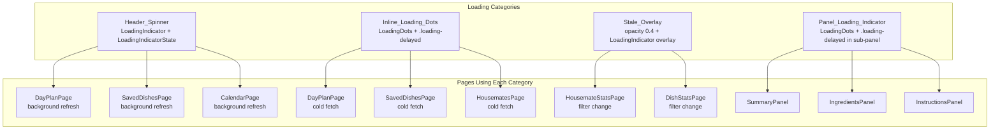
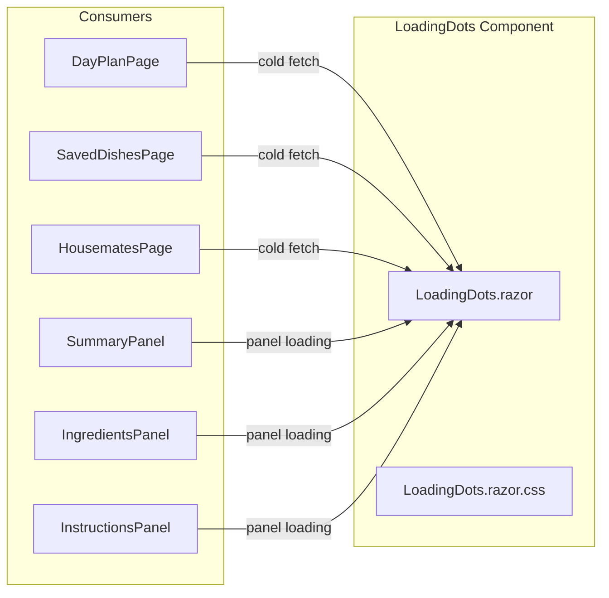
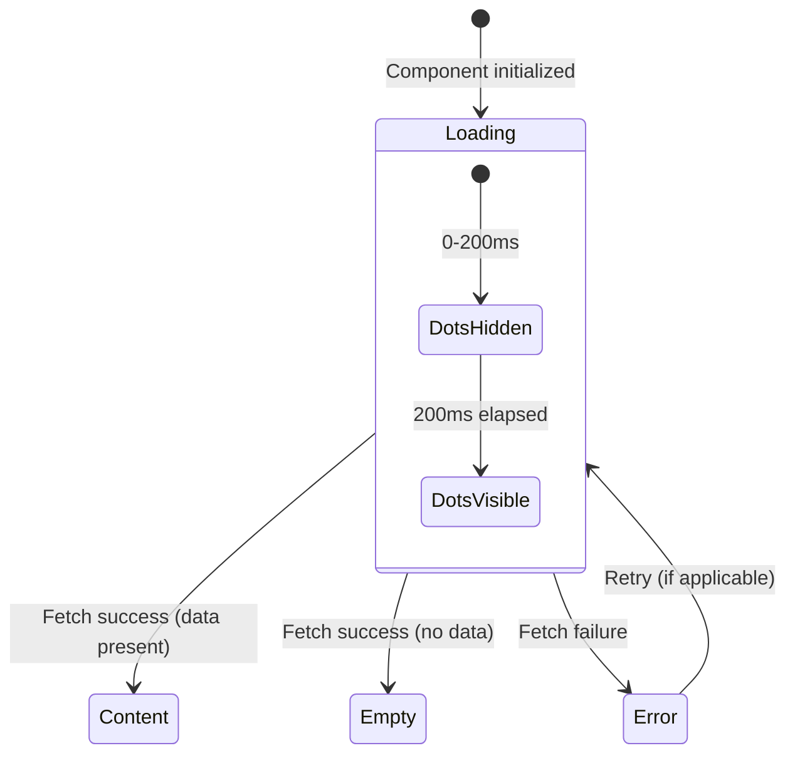

# Design Document: Loading Strategy

## Overview

This feature formalizes the loading indicator strategy for the Happie PWA by defining four mutually exclusive loading categories, fixing inconsistencies in existing pages, creating a reusable `LoadingDots` component, and documenting the rules in a steering file.

Currently, loading states are handled inconsistently:
- DayPlanPage uses `.loading-delayed` text (`"Laden..."`) for cold fetches and `LoadingIndicatorState` for background refreshes — correct.
- SavedDishesPage uses `.loading-delayed` text — correct.
- HousematesPage uses a plain `<p>` without `.loading-delayed` — inconsistent.
- DishDetailsPage sub-panels (SummaryPanel, IngredientsPanel, InstructionsPanel) have no explicit loading state: they show empty-state messages while data is still being fetched — incorrect.
- Stats pages (HousemateStatsPage, DishStatsPage) use `opacity: 0.4; pointer-events: none` overlays for filter changes — correct pattern, to be formalized as Stale_Overlay.

### Key Design Decisions

1. **Single reusable `LoadingDots` component** — All inline loading and panel loading states use the same component, avoiding duplicate animation CSS. The component accepts no parameters beyond optional CSS class overrides; positioning is handled by the parent container.

2. **CSS-only delayed visibility** — The existing `.loading-delayed` class (200ms fade-in delay) is reused unchanged. `LoadingDots` is always wrapped in a container with this class, so cache-fast responses never flash the dots.

3. **Panel loading tracked via `_isLoading` boolean** — Each sub-panel (SummaryPanel, IngredientsPanel, InstructionsPanel) adds a `_isLoading` field that starts `true` and flips to `false` after the fetch completes (success or failure). The edit button is hidden while `_isLoading` is true.

4. **No new services or state management** — The loading strategy is purely presentational. No new injectable services are needed. The header spinner continues using the existing `LoadingIndicatorState` service; all other categories are local component state.

5. **Steering document uses same fileMatch pattern as `ui-conventions.md`** — The loading strategy steering file triggers on Blazor component files so developers automatically see loading rules when editing UI code.

## Architecture





## Components and Interfaces

### New Component

| Component | Location | Responsibility |
|---|---|---|
| `LoadingDots` | `Components/LoadingDots.razor` | Renders three bouncing dots with accessible markup; used for Inline_Loading_Dots and Panel_Loading_Indicator categories |

### Modified Components

| Component | Change |
|---|---|
| `HousematesPage` | Replace plain `<p>` loading text with `<LoadingDots>` wrapped in `.loading-delayed` container |
| `SummaryPanel` | Add `_isLoading` tracking; show `<LoadingDots>` while fetching; hide edit button during loading; show empty state only after fetch completes with empty data |
| `IngredientsPanel` | Add `_isLoading` tracking; show `<LoadingDots>` while fetching; hide edit button during loading; show empty state only after fetch completes with empty data |
| `InstructionsPanel` | Add `_isLoading` tracking; show `<LoadingDots>` while fetching; hide edit button during loading; show empty state only after fetch completes with empty data |

### Unchanged Components

| Component | Reason |
|---|---|
| `LoadingIndicator` | Already correct — used for Header_Spinner in header/sidebar |
| `LoadingIndicatorState` | Already correct — drives Header_Spinner visibility with 500ms minimum duration |
| `DayPlanPage` | Already uses `.loading-delayed` text for cold fetch; will optionally switch to `<LoadingDots>` for visual consistency but existing behavior is functionally correct |
| `SavedDishesPage` | Already uses `.loading-delayed` text; same optional switch to `<LoadingDots>` |

### LoadingDots Component Interface

```razor
@* LoadingDots.razor *@
@inject IStringLocalizer<AppStrings> Localizer

<div class="loading-dots" role="status" aria-label="@Localizer["LoadingIndicator_AriaLabel"]">
    <span class="loading-dots__dot"></span>
    <span class="loading-dots__dot"></span>
    <span class="loading-dots__dot"></span>
</div>
```

No parameters — the component is intentionally simple. Positioning and delayed visibility are controlled by the parent container's CSS classes.

### Usage Patterns

**Inline_Loading_Dots (page-level cold fetch):**
```razor
@if (_isLoading)
{
    <div class="loading-delayed">
        <LoadingDots />
    </div>
}
```

**Panel_Loading_Indicator (sub-panel cold fetch):**
```razor
<div class="summary-panel__body">
    @if (_isLoading)
    {
        <div class="loading-delayed summary-panel__loading">
            <LoadingDots />
        </div>
    }
    else if (IsAllEmpty)
    {
        <p class="summary-panel__empty">@Localizer["DishDetails_SummaryEmpty"]</p>
    }
    else
    {
        @* ... content ... *@
    }
</div>
```

**Stale_Overlay (filter/time range change):**
```razor
<div class="stats-container @(_isRefreshing ? "stats-container--loading" : "")">
    @* existing content shown at reduced opacity *@
</div>
@if (_isRefreshing)
{
    <div class="stats-container__overlay">
        <LoadingIndicator />
    </div>
}
```

## Data Models

No new data models are required. This feature is purely presentational — it changes how existing loading states are displayed, not how data is structured or persisted.

### CSS Classes

| Class | Location | Purpose |
|---|---|---|
| `.loading-delayed` | `app.css` (existing) | 200ms delayed opacity fade-in; prevents flash for cache-fast responses |
| `.loading-dots` | `LoadingDots.razor.css` | Container for the three dots; uses flexbox centering with gap |
| `.loading-dots__dot` | `LoadingDots.razor.css` | Individual 8px dot with bounce animation |
| `--loading` modifier classes | Panel `.razor.css` files | Centers `LoadingDots` within panel body (e.g., `summary-panel__loading`) |
| `.stale-overlay` | `app.css` (new, optional) | `opacity: 0.4; pointer-events: none` — formalizes existing pattern used in stats pages |

### LoadingDots CSS Specification

```css
.loading-dots {
    display: flex;
    align-items: center;
    justify-content: center;
    gap: 6px;
    padding: 16px 0;
}

.loading-dots__dot {
    width: 8px;
    height: 8px;
    border-radius: 50%;
    background-color: rgba(26, 26, 46, 0.5);
    animation: loading-dots-bounce 1.2s ease-in-out infinite;
}

.loading-dots__dot:nth-child(2) {
    animation-delay: 0.15s;
}

.loading-dots__dot:nth-child(3) {
    animation-delay: 0.3s;
}

@keyframes loading-dots-bounce {
    0%, 60%, 100% {
        transform: translateY(0);
    }
    30% {
        transform: translateY(-6px);
    }
}

@media (prefers-reduced-motion: reduce) {
    .loading-dots__dot {
        animation: loading-dots-fade 1.2s ease-in-out infinite;
    }

    @keyframes loading-dots-fade {
        0%, 100% {
            opacity: 1;
        }
        50% {
            opacity: 0.3;
        }
    }
}
```

### Panel Loading State Flow



### Sub-Panel Loading Integration

Each sub-panel (SummaryPanel, IngredientsPanel, InstructionsPanel) follows the same state machine:

```csharp
// Added to each sub-panel's @code block.
private bool _isLoading = true;

protected override async Task OnParametersSetAsync()
{
    await LoadDataAsync();
}

private async Task LoadDataAsync()
{
    _isLoading = true;
    try
    {
        // ... existing fetch logic ...
    }
    catch
    {
        // Leave defaults (empty state) — requirement 2.7.
    }
    finally
    {
        _isLoading = false;
    }
}
```

The edit button is conditionally rendered:
```razor
@if (!_isLoading)
{
    <button class="summary-panel__icon-btn" @onclick="StartEdit" aria-label="...">
        @* pencil icon *@
    </button>
}
```

### Steering Document Structure

The steering file at `.kiro/steering/loading-strategy.md` will have this structure:

```yaml
---
inclusion: fileMatch
fileMatchPattern: "**/*.razor,**/*.razor.css,**/Happie.Web/**"
---
```

Sections:
1. **Header_Spinner** — When to use, code example with `LoadingIndicatorState`
2. **Inline_Loading_Dots** — When to use, code example with `<LoadingDots>` and `.loading-delayed`
3. **Panel_Loading_Indicator** — When to use, code example with panel `_isLoading` pattern
4. **Stale_Overlay** — When to use, code example with `--loading` modifier and overlay
5. **Empty State vs Loading State** — Correct and incorrect usage examples
6. **Component Reference** — `LoadingIndicator`, `LoadingIndicatorState`, `LoadingDots`, `.loading-delayed`

## Correctness Properties

*A property is a characteristic or behavior that should hold true across all valid executions of a system — essentially, a formal statement about what the system should do. Properties serve as the bridge between human-readable specifications and machine-verifiable correctness guarantees.*

### Property 1: Loading Category Mutual Exclusivity

*For any* valid loading scenario (defined by whether cached data exists, whether the fetch is a background refresh, whether it's a sub-panel, and whether it's a filter/time-range change), exactly one loading category (Header_Spinner, Inline_Loading_Dots, Stale_Overlay, or Panel_Loading_Indicator) SHALL be selected, and the sub-panel category SHALL take precedence over Inline_Loading_Dots when a sub-panel performs a cold fetch.

**Validates: Requirements 1.1, 1.2, 1.3, 1.4, 1.5**

### Property 2: Loading State Transition on Fetch Completion

*For any* loading state (across any loading category) and any fetch outcome (success with data, success with empty result, or failure), the loading indicator SHALL transition from visible to hidden when the fetch completes. No loading indicator SHALL remain visible indefinitely after a fetch resolves.

**Validates: Requirements 1.4, 1.5, 1.6, 2.4, 2.5, 2.7**

### Property 3: LoadingDots Accessibility Attributes

*For any* render of the `LoadingDots` component, the root element SHALL have `role="status"` and a non-empty `aria-label` attribute sourced from the `LoadingIndicator_AriaLabel` localization key.

**Validates: Requirements 5.7**


## Error Handling

### Loading State Error Transitions

| Scenario | Loading Category | Behavior |
|---|---|---|
| Sub-panel fetch fails (network error / non-success HTTP) | Panel_Loading_Indicator | Remove loading dots; display empty state message |
| Page cold fetch fails | Inline_Loading_Dots | Remove loading dots; show inline error with retry button (existing pattern) |
| Background refresh fails | Header_Spinner | Hide spinner via `LoadingIndicatorState.DecrementAsync()`; no additional UI — stale cached data remains visible |
| Filter change refresh fails | Stale_Overlay | Remove overlay (restore full opacity, re-enable pointer events); show inline error or toast |

### Design Rationale for Sub-Panel Error → Empty State

When a sub-panel fetch fails, the panel shows the empty state message rather than a dedicated error message. This is a deliberate simplification:
- Sub-panels are non-critical (the parent page is already loaded)
- Users can trigger a retry by navigating away and back
- Adding per-panel error/retry UI would add significant complexity for a rare case
- The empty state communicates "no data available" which is functionally accurate when the fetch failed

## Testing Strategy

### Unit Tests (bUnit)

bUnit component tests verify the correct rendering behavior for each loading state:

**LoadingDots component:**
- Renders three `.loading-dots__dot` elements
- Has `role="status"` on the root element
- Has a non-empty `aria-label` attribute

**SummaryPanel loading state:**
- While fetching: renders `LoadingDots` component, does not render empty state text, does not render edit button
- After fetch success (with data): renders content, does not render `LoadingDots`
- After fetch success (empty): renders empty state message, does not render `LoadingDots`
- After fetch failure: renders empty state message, does not render `LoadingDots`
- Loading container has `.loading-delayed` CSS class

**IngredientsPanel loading state:**
- Same test matrix as SummaryPanel

**InstructionsPanel loading state:**
- Same test matrix as SummaryPanel

**HousematesPage loading state:**
- While fetching: renders `LoadingDots` inside a `.loading-delayed` container
- Does not render the old plain text loading message

### Property-Based Tests (FsCheck)

Property-based tests use FsCheck with minimum 100 iterations per property.

**Property 1: Loading Category Mutual Exclusivity**
- Model the category selection logic as a pure function taking a `LoadingScenario` input (enum/record with fields: `HasCachedData`, `IsBackgroundRefresh`, `IsSubPanel`, `IsFilterChange`)
- Generate random valid `LoadingScenario` values
- Assert exactly one category is returned for each scenario
- Assert Panel_Loading_Indicator is returned when `IsSubPanel` is true (precedence rule)
- Tag: `// Feature: loading-strategy, Property 1: Loading category mutual exclusivity`

**Property 2: Loading State Transition on Fetch Completion**
- Model the loading state machine as a pure function: `(LoadingState, FetchOutcome) → LoadingState`
- Generate random initial states (loading = true) and fetch outcomes (SuccessWithData, SuccessEmpty, Failure)
- Assert that the resulting state always has `IsLoading = false`
- Tag: `// Feature: loading-strategy, Property 2: Loading state transition on fetch completion`

**Property 3: LoadingDots Accessibility Attributes**
- Render the `LoadingDots` component with various localizer configurations
- Assert `role="status"` is always present on the root element
- Assert `aria-label` is always non-null and non-empty
- Tag: `// Feature: loading-strategy, Property 3: LoadingDots accessibility attributes`

### Integration Tests

No integration tests are needed — this feature is purely frontend/presentational with no backend changes or data persistence.

### Manual Testing

- Visual verification of bounce animation timing and appearance
- `prefers-reduced-motion` media query verification (toggle in browser DevTools)
- Verify `.loading-delayed` 200ms delay is perceptible when throttling network
- Verify stale overlay pattern on stats pages with slow network
- Review steering document content for completeness and accuracy
