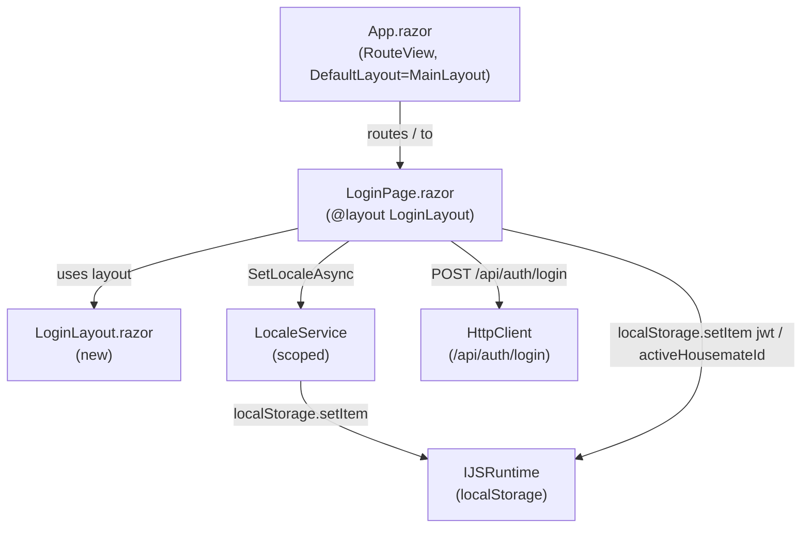

# Design Document — Login Page Redesign

## Overview

This design covers the visual and structural redesign of `LoginPage.razor` for the Happie Blazor WebAssembly PWA. The goal is to replace the bare-bones, sidebar-wrapped login screen with a focused, mobile-first card layout that matches the provided mockups: a centered white card on a light blue-gray background, a green logo, welcome text, a styled password field with a lock icon, a full-width login button, and a housemate selection list with colored avatars.

The redesign introduces one new layout component (`LoginLayout`) and one new scoped CSS file (`LoginPage.razor.css`), updates the existing `LoginPage.razor` markup and code-behind, adds two new localization keys to both resx files, and adapts the locale-switching behavior so it works without a full page reload on the login screen.

No API changes are required. The backend `LoginFunction` and `LoginHandler` are unchanged. The `LoginHandler` already filters deleted housemates server-side before building the `LoginResponse`, so no client-side `IsDeleted` filtering is needed.

### Key Design Decisions

**LoginLayout instead of MainLayout** — The login page must not show the sidebar or top bar. Blazor's `@layout` directive makes this straightforward: a new `LoginLayout.razor` renders only `@Body` inside a full-viewport container, and `LoginPage.razor` declares `@layout LoginLayout`.

**Locale switching without a full page reload** — The existing `LocaleSwitcher` component calls `NavigationManager.NavigateTo(..., forceLoad: true)` after persisting the locale, which causes a full page reload. This is acceptable on authenticated pages (the user is already past the login screen), but Requirement 9.3 explicitly prohibits a page reload on the login screen. The solution is to inline a locale toggle directly in `LoginPage.razor` that calls `LocaleService.SetLocaleAsync` and then calls `StateHasChanged` to re-render the component tree, relying on `IStringLocalizer` re-resolving strings from the already-loaded satellite assemblies. The `LocaleSwitcher` component is left unchanged for use in `MainLayout`.

**Housemate avatar** — A `<span>` with inline `style="background-color: {housemate.Color}"` and a CSS class for the rounded-square shape. The first character of the name is rendered as text inside it. No image or SVG is needed.

**Sorted housemate list** — The existing `LoginPage.razor` renders housemates in the order returned by the API. The redesign sorts them client-side using `StringComparer.OrdinalIgnoreCase` before rendering, satisfying Requirement 8.9 without any API change.

**Error handling for housemate fetch failure** — The current implementation stores the JWT and then assigns `_housemates` from the login response in a single step. The API already returns housemates as part of `LoginResponse`, so there is no separate fetch that can fail after login. Requirement 8.10 refers to the scenario where the login response itself fails to deserialize or the housemate list is empty/null. The design handles this by treating a null or empty housemate list after a successful HTTP response as an error condition, displaying the error message and keeping the password form visible.

---

## Architecture

The redesign is entirely client-side. No new services, handlers, or API endpoints are introduced.

```
LoginPage.razor          — page component, @layout LoginLayout
  └── LoginLayout.razor  — new layout: full-viewport background, no sidebar/top-bar
        └── @Body        — renders LoginPage content

LoginPage.razor.css      — scoped styles: card, password field, button, avatar, locale toggle
LoginLayout.razor.css    — scoped styles: full-viewport background, centering
```

The `LocaleSwitcher` component is **not** used on the login page. Instead, `LoginPage.razor` contains an inline locale toggle that calls `LocaleService.SetLocaleAsync` and re-renders without a page reload.

### Component Interaction Diagram



---

## Components and Interfaces

### LoginLayout.razor (new)

**Location:** `Happie.Web/Layout/LoginLayout.razor`

A minimal layout that renders only `@Body` inside a full-viewport wrapper. It does not inject `SessionService`, `LocaleService`, or any other service — it is purely structural.

```razor
@inherits LayoutComponentBase

<div class="login-page">
    @Body
</div>
```

**LoginLayout.razor.css** applies:
- `min-height: 100vh` and `background-color: #E8EEF4` to `.login-page`
- Flexbox centering (`display: flex; align-items: center; justify-content: center`) for viewports wider than 640px
- No centering constraints on mobile (≤ 640px): the card fills the full width

### LoginPage.razor (updated)

**Location:** `Happie.Web/Pages/LoginPage.razor`

The page declares `@layout LoginLayout` and renders a single `.login-card` container. Inside the card:

1. **Locale toggle** — two buttons (`EN` / `NL`) at the top-right of the card, calling the inline `SwitchLocaleAsync` method
2. **Logo** — a `<div class="login-logo">H</div>`
3. **Heading** — `<h1>@Localizer["Login_WelcomeHeading"]</h1>`
4. **Subtitle** — `<p class="login-subtitle">@Localizer["Login_Subtitle"]</p>`
5. **Conditional content** — either the password form or the housemate selection view, depending on `_housemates`

**Password form view:**
- `<EditForm>` with `OnValidSubmit="SubmitLoginAsync"`
- Password field wrapper `<div class="password-field">` containing a lock icon SVG and `<InputText type="password" />`
- Error message `<p role="alert">` when `_showError` is true
- Submit button with `disabled="@_isSubmitting"`

**Housemate selection view:**
- `<h2>@Localizer["Login_SelectHousemate"]</h2>`
- Empty-state `<p>` when no active housemates exist
- `<ul class="housemate-list">` with one `<li>` per active housemate, each containing:
  - `<button @onclick="() => SelectHousemateAsync(housemate)">`
  - `<span class="housemate-avatar" style="background-color: @housemate.Color">@housemate.Name[0]</span>`
  - `<span class="housemate-name">@housemate.Name</span>`
  - A right-pointing chevron SVG

**Code-behind additions:**
- `[Inject] LocaleService LocaleService` — for the inline locale toggle
- `private Task SwitchLocaleAsync(Locale locale)` — calls `LocaleService.SetLocaleAsync(locale)` then `StateHasChanged()`; does **not** call `NavigationManager.NavigateTo` with `forceLoad: true`
- Housemate list is sorted: `_housemates = loginResponse.Housemates.OrderBy(x => x.Name, StringComparer.OrdinalIgnoreCase).ToList()`

> **Note:** `LoginHandler` already filters deleted housemates server-side — `HousemateDto` has no `IsDeleted` field and no client-side filtering is needed.

### LoginPage.razor.css (new)

**Location:** `Happie.Web/Pages/LoginPage.razor.css`

Scoped styles for:

| Selector | Purpose |
|---|---|
| `.login-card` | White background, 12px border radius, 16px padding, full width on mobile, max-width 400px + centered on desktop |
| `.login-logo` | 56×56px rounded square, `#4CAF50` background, white "H" centered, `font-size: 2rem; font-weight: bold` |
| `.login-locale-toggle` | Flex row, positioned at top-right of card |
| `.locale-btn` | Small text button; `.locale-btn--active` gets `font-weight: bold` and `color: #4CAF50` |
| `.password-field` | Flex row with border, 8px border radius; `border-color: #4CAF50` on `:focus-within` |
| `.password-field svg` | Lock icon, left-aligned, `color: #9CA3AF` |
| `.password-field input` | Flex-grow 1, no border, no outline (border is on the wrapper) |
| `.login-btn` | Full width, `background-color: #4CAF50`, white bold text, 4px border radius; `:disabled` gets `background-color: #A5D6A7; opacity: 0.5; cursor: not-allowed` |
| `.housemate-list` | No list-style, no padding |
| `.housemate-row` | Full-width button, flex row, white background, rounded corners, subtle border, `gap: 12px` |
| `.housemate-row:hover` | Colored outline (`outline: 2px solid var(--housemate-color)`) and box shadow (`box-shadow: 0 0 0 4px color-mix(in srgb, var(--housemate-color) 20%, transparent)`) using the housemate's color; `--housemate-color` is set via inline style on each row |
| `.housemate-avatar` | 36×36px rounded square (8px radius), white text centered, `font-weight: bold` |
| `.housemate-name` | `font-weight: bold`, flex-grow 1 |
| `.housemate-chevron` | Right-aligned chevron SVG |

---

## Data Models

No new data models are introduced. The existing `HousemateDto` contract is used as-is — `LoginHandler` already filters deleted housemates server-side, so `IsDeleted` is not needed on the DTO.

### Localization Keys

Two new keys added to both resx files:

| Key | AppStrings.resx (nl) | AppStrings.en.resx (en) |
|---|---|---|
| `Login_WelcomeHeading` | `Welkom bij Happie` | `Welcome to Happie` |
| `Login_Subtitle` | `Coördineer de maaltijden van je huishouden` | `Coordinate your household meals` |

One existing key updated in both resx files:

| Key | AppStrings.resx (nl) | AppStrings.en.resx (en) |
|---|---|---|
| `Login_PasswordPlaceholder` | `Huishoudwachtwoord` | `Household Password` |

---

## Correctness Properties

*A property is a characteristic or behavior that should hold true across all valid executions of a system — essentially, a formal statement about what the system should do. Properties serve as the bridge between human-readable specifications and machine-verifiable correctness guarantees.*

Most acceptance criteria in this feature are UI rendering and CSS styling checks that are not amenable to property-based testing. However, three criteria involve logic that operates over variable inputs and can be expressed as universal properties:

- **8.5** — avatar rendering (color and first character) for any housemate
- **8.9** — alphabetical sorting of housemate rows
- **10.1/10.2** — hover outline and shadow use the housemate's own color

**Property Reflection:** Properties 1 and 2 (avatar rendering and sorting) both operate on the housemate list but test distinct aspects. Property 3 (hover color) is independent. No redundancy exists among the three.

### Property 1: Avatar reflects housemate color and first character

*For any* `HousemateDto` with a non-empty name and a valid color string, the rendered housemate avatar SHALL have a background color equal to `housemate.Color` and SHALL display the first character of `housemate.Name`.

**Validates: Requirements 8.5**

### Property 2: Housemate rows are sorted alphabetically, case-insensitively

*For any* list of `HousemateDto` values, the rendered housemate rows SHALL appear in the same order as the list sorted by `Name` using `StringComparer.OrdinalIgnoreCase`.

**Validates: Requirements 8.9**

### Property 3: Hover state uses the housemate's own color

*For any* `HousemateDto` with a valid color string, the rendered housemate row SHALL have a `--housemate-color` CSS custom property equal to `housemate.Color`, so that the `:hover` outline and shadow are derived from that housemate's color.

**Validates: Requirements 10.1, 10.2**

---

## Error Handling

| Scenario | Behavior |
|---|---|
| Wrong password (HTTP 401 from `/api/auth/login`) | `_showError = true`; error message rendered via `role="alert"`; password form remains visible |
| Network error during login | Same as wrong password — `_showError = true` |
| Login response has null or empty housemate list | Treated as an error; `_showError = true`; password form remains visible (satisfies Req 8.10) |
| Housemate name is empty string | Avatar falls back to a space character; this is a data integrity issue prevented at the housemate creation level, not the login page |
| `LocaleService.SetLocaleAsync` throws | Exception propagates to Blazor's error boundary; no special handling needed on the login page |

---

## Testing Strategy

This feature is primarily UI rendering and CSS. The testing approach is:

**Unit / component tests (bUnit):**
- Render `LoginLayout` and assert no sidebar or top-bar elements are present (Req 1.1, 1.2)
- Render `LoginPage` in the password form state and assert: logo present, h1 with `Login_WelcomeHeading`, p with `Login_Subtitle`, password input with `type="password"`, lock icon present, submit button with `Login_SubmitButton` label, locale toggle with EN and NL buttons (Req 3, 4, 5, 6, 9)
- Simulate successful login and assert housemate selection view is shown with `Login_SelectHousemate` heading (Req 8.1, 8.2)
- Simulate failed login and assert error message is shown (Req 5 error state)
- Simulate submit while `_isSubmitting` is true and assert button is disabled (Req 6.6)
- Simulate locale toggle click and assert `LocaleService.SetLocaleAsync` is called and no page reload occurs (Req 9.3, 9.4)
- Simulate housemate row tap and assert `localStorage.setItem` is called with the correct housemate ID and navigation occurs (Req 8.8)

**Property-based tests (FsCheck, minimum 100 iterations):**

Each property test is tagged with a comment in the format:
`// Feature: login-page-redesign, Property {N}: {property_text}`

- **Property 1** — Generate random `HousemateDto` values with non-empty names and valid color strings; render the housemate selection view; assert each avatar's `style` attribute contains the housemate's color and the avatar text equals `housemate.Name[0].ToString()`.
- **Property 2** — Generate random `List<HousemateDto>` (varying names); render the housemate selection view; assert the order of rendered names matches `housemates.OrderBy(x => x.Name, StringComparer.OrdinalIgnoreCase)`.
- **Property 3** — Generate random `HousemateDto` values with valid color strings; render the housemate selection view; assert each `.housemate-row` element's inline style contains `--housemate-color: {housemate.Color}`.

**Visual / manual testing:**
- Verify `#E8EEF4` background on full viewport
- Verify card centering on desktop (> 640px) and full-width on mobile (≤ 640px)
- Verify `#4CAF50` focus outline on password field
- Verify button disabled state appearance (opacity ≤ 50%, not-allowed cursor)
- Verify active locale button is visually distinct in the toggle
- Verify locale switch updates all text without a page reload
