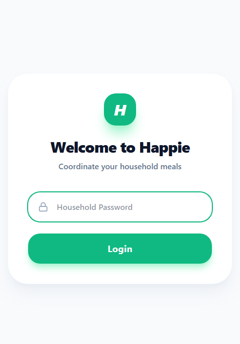
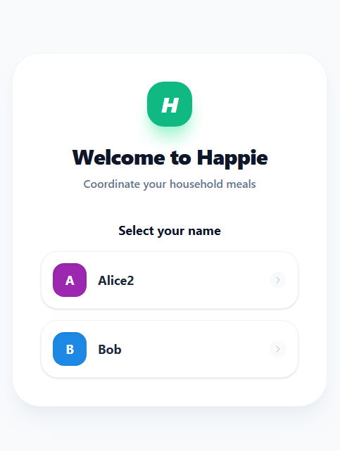
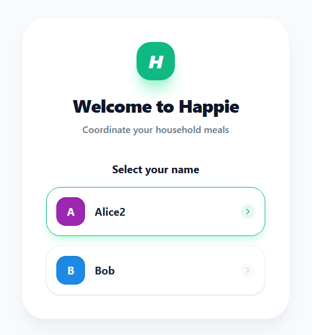

# Requirements Document

## Introduction

This feature redesigns the login page (`LoginPage` at route `/`) of the Happie Blazor WebAssembly PWA. The current login page uses the default Blazor layout including the sidebar navigation menu, which is inappropriate for an unauthenticated entry point. The redesign introduces a clean, branded, mobile-first login screen with a centered card layout, a logo, welcome messaging, and a styled password field and login button — consistent with the Happie brand colors (green and white on a light blue-gray background). The navigation menu is hidden entirely on this page.

## Visual Mockups

The following mockups were provided by the designer and serve as the authoritative visual reference for implementation.

| View | Mockup |
|---|---|
| Password entry (login form) |  |
| Housemate selection |  |
| Housemate selection — hover state |  |

## Glossary

- **Login_Page**: The Blazor page component at route `/` (`LoginPage.razor`) responsible for household password entry and housemate selection.
- **Login_Layout**: A dedicated Blazor layout component used exclusively by the Login_Page that omits the sidebar navigation and top bar.
- **Login_Card**: The white, rounded-corner container element rendered on the Login_Page that holds the logo, welcome text, password field, and login button.
- **Brand_Green**: The primary brand color `#4CAF50` used for the logo background, the login button, and the password field focus outline.
- **Page_Background**: The light blue-gray background color `#E8EEF4` applied to the full viewport on the Login_Page.
- **Lock_Icon**: An SVG or Unicode icon rendered inside the password field on the left side to indicate the field accepts a password.
- **Housemate_Selection_View**: The second step of the login flow, shown after a successful password submission, where the user selects their name from the list of active housemates.
- **Housemate_Avatar**: A colored rounded square element displaying the first character of the housemate's name in white, using the housemate's assigned color as the background, shown in each housemate row of the Housemate_Selection_View.
- **Language_Toggle**: A small UI control rendered on the Login_Card that allows the user to switch between the supported locales (`"en"` and `"nl"`) without a page reload.

## Requirements

### Requirement 1: Dedicated Login Layout Without Navigation

**User Story:** As a user visiting the login page, I want to see a clean page without the sidebar navigation menu or top bar, so that the login experience is focused and uncluttered.

#### Acceptance Criteria

1. THE Login_Layout SHALL render the Login_Page body without a sidebar navigation menu.
2. THE Login_Layout SHALL render the Login_Page body without a top bar (locale switcher and logout button).
3. WHEN the Login_Page is rendered, THE Login_Page SHALL use the Login_Layout instead of the default MainLayout.
4. THE Login_Layout SHALL apply the Page_Background color (`#E8EEF4`) to the full viewport.
5. IF the viewport width exceeds 640px, THEN THE Login_Layout SHALL center the Login_Card both horizontally and vertically within the viewport.
6. IF the viewport width is 640px or narrower, THEN THE Login_Layout SHALL allow the Login_Card to occupy the full viewport width without centering constraints.

### Requirement 2: Login Card Visual Design

**User Story:** As a user on the login page, I want to see a clean white card with rounded corners containing all login elements, so that the interface feels modern and focused.

#### Acceptance Criteria

1. THE Login_Card SHALL have a white background.
2. THE Login_Card SHALL have rounded corners with a border radius of 12px.
3. THE Login_Card SHALL occupy the full viewport width on screens 640px wide or narrower (mobile-first).
4. WHEN the viewport width exceeds 640px, THE Login_Card SHALL have a fixed maximum width of 400px.
5. WHEN the viewport width exceeds 640px, THE Login_Card SHALL be horizontally centered on the page.
6. THE Login_Card SHALL display its child elements in a single vertical column with 16px internal padding.

### Requirement 3: Logo Display

**User Story:** As a user on the login page, I want to see the Happie logo, so that I can identify the application.

#### Acceptance Criteria

1. THE Login_Page SHALL render a logo element consisting of a rounded square background with the white letter "H" centered within it.
2. THE Login_Page SHALL render the logo element using the Brand_Green color as the background of the rounded square.
3. THE Login_Page SHALL render the logo element above the Login_Page heading.

### Requirement 4: Welcome Message and Subtitle

**User Story:** As a user on the login page, I want to see a welcome message and a brief description of the app, so that I understand what Happie is for.

#### Acceptance Criteria

1. THE Login_Page SHALL render an `<h1>` heading with the localized welcome message (key `Login_WelcomeHeading`).
2. THE Login_Page SHALL render a `
` subtitle with the localized app description (key `Login_Subtitle`), immediately below the `<h1>` heading.
3. THE Login_Page SHALL render the `<h1>` heading below the logo element and above the password field.

### Requirement 5: Password Field Design

**User Story:** As a user on the login page, I want a clearly styled password field with a lock icon, so that I can easily identify where to enter the household password.

#### Acceptance Criteria

1. THE Login_Page SHALL render a password input field with `type="password"`.
2. WHEN the password input field is rendered, THE Login_Page SHALL render a Lock_Icon to the left of the password input text area within the field container.
3. THE Login_Page SHALL render the password field container with a border radius of 8px.
4. THE Login_Page SHALL render the password field at the full width of the Login_Card.
5. WHEN the password field receives focus, THE Login_Page SHALL apply an outline in the Brand_Green color to the field container.
6. WHEN the password field loses focus, THE Login_Page SHALL remove the Brand_Green outline and restore the default border style on the field container.
7. THE Login_Page SHALL render the password field with the localized placeholder text (key `Login_PasswordPlaceholder`).

### Requirement 6: Login Button Design

**User Story:** As a user on the login page, I want a prominent, full-width login button, so that I can clearly see how to submit my password.

#### Acceptance Criteria

1. THE Login_Page SHALL render a submit button of `type="submit"` within the login form.
2. THE Login_Page SHALL render the login button at the full width of the Login_Card.
3. THE Login_Page SHALL render the login button with the Brand_Green background color and white bold text.
4. THE Login_Page SHALL render the login button with a border radius of 4px.
5. THE Login_Page SHALL render the login button with the localized label (key `Login_SubmitButton`).
6. WHILE the login form is being submitted, THE Login_Page SHALL set the login button to the disabled state with reduced opacity (≤ 50%), a muted background color (e.g. `#A5D6A7`), and a not-allowed cursor to prevent duplicate submissions.

### Requirement 7: Localization of New Strings

**User Story:** As a user with a Dutch or English locale preference, I want all login page text to appear in my preferred language, so that the app is accessible in my language.

#### Acceptance Criteria

1. THE Login_Page SHALL use the localized string with key `Login_WelcomeHeading` for the welcome heading; the key SHALL be registered in `AppStrings.resx` (neutral/Dutch fallback) with value "Welkom bij Happie" and in `AppStrings.en.resx` with value "Welcome to Happie".
2. THE Login_Page SHALL use the localized string with key `Login_Subtitle` for the subtitle; the key SHALL be registered in `AppStrings.resx` with value "Coördineer de maaltijden van je huishouden" and in `AppStrings.en.resx` with value "Coordinate your household meals".
3. THE Login_Page SHALL use the localized string with key `Login_PasswordPlaceholder` for the password field placeholder; the value in `AppStrings.resx` SHALL be updated to "Huishoudwachtwoord" and in `AppStrings.en.resx` to "Household Password".
4. THE Login_Page SHALL use the existing localized string with key `Login_SubmitButton` for the login button label; existing values in all resx files SHALL remain unchanged.

### Requirement 8: Housemate Selection View

**User Story:** As a user who has successfully entered the household password, I want to see a styled list of housemates to select from, so that I can identify myself within the household quickly and clearly.

#### Acceptance Criteria

1. WHEN a correct household password is submitted, THE Login_Page SHALL replace the password form with the Housemate_Selection_View within the Login_Card, keeping the logo, the `Login_WelcomeHeading` heading, and the `Login_Subtitle` subtitle visible.
2. THE Housemate_Selection_View SHALL render a localized heading using the key `Login_SelectHousemate` immediately below the subtitle, above the list of housemate rows.
3. THE Housemate_Selection_View SHALL render only active (non-deleted) housemates; IF no active housemates exist, THEN THE Housemate_Selection_View SHALL display a localized empty-state message.
4. THE Housemate_Selection_View SHALL render each active housemate as a full-width button row with a white background, rounded corners, and a subtle border.
5. THE Housemate_Selection_View SHALL render a Housemate_Avatar on the left side of each housemate row, consisting of a rounded square using the housemate's assigned color as the background and the first character of the housemate's name in white centered within it.
6. THE Housemate_Selection_View SHALL render the housemate's full name in bold text to the right of the Housemate_Avatar within each row.
7. THE Housemate_Selection_View SHALL render a right-pointing chevron icon on the right side of each housemate row.
8. WHEN a housemate row is tapped, THE Login_Page SHALL persist the selected housemate's ID to `localStorage` and navigate to the day plan page for today's date.
9. THE Housemate_Selection_View SHALL render housemate rows sorted alphabetically by name, case-insensitively.
10. IF fetching the housemate list after a successful password submission fails, THEN THE Login_Page SHALL display an error message and remain on the password entry view so the user can retry.

### Requirement 9: Language Switcher on Login and Housemate Selection Views

**User Story:** As a user on the login page, I want to switch between English and Dutch directly on the login screen, so that I can use the app in my preferred language before and during the login flow.

#### Acceptance Criteria

1. THE Login_Card SHALL render a Language_Toggle that is visible on both the password entry view and the Housemate_Selection_View.
2. THE Language_Toggle SHALL display the two supported locale options: `"en"` (English) and `"nl"` (Dutch).
3. WHEN the user selects a locale via the Language_Toggle, THE Login_Page SHALL update all visible text to the selected language within 300 milliseconds without a page reload.
4. WHEN the user selects a locale via the Language_Toggle, THE Login_Page SHALL persist the selected locale to `localStorage` so that it is applied on subsequent visits without re-selection.
5. THE Language_Toggle SHALL render the active locale option visually distinct from the inactive option.
6. THE Language_Toggle SHALL not overlap or obscure the password input field, the submit button, or the housemate selection list.

### Requirement 10: Housemate Row Hover State

**User Story:** As a user on the housemate selection screen, I want visual feedback when I hover over a housemate row, so that I can clearly see which row I am about to select.

#### Acceptance Criteria

1. WHEN the pointer hovers over a housemate row, THE Housemate_Selection_View SHALL apply a colored outline to the row using the housemate's assigned color.
2. WHEN the pointer hovers over a housemate row, THE Housemate_Selection_View SHALL apply a box shadow to the row using the housemate's assigned color at reduced opacity, consistent with the mockup `mockup-housemate-selection-hover.png`.
3. WHEN the pointer leaves a housemate row, THE Housemate_Selection_View SHALL remove the colored outline and box shadow and restore the default row appearance.
