# Design Document: Multi-Dish Selection

## Overview

The Multi-Dish Selection feature transforms the existing single-dish reference model into a many-to-many relationship between day plans and saved dishes. A new `DayPlanDishLinks` join table in Azure Table Storage replaces the `SavedDishId` field on `DishRecordEntity`, allowing multiple saved dishes to be linked to a single day. The frontend `SavedDishModal` changes from single-select (tap to close) to multi-select (checkmarks + confirm), with a sticky footer showing a live preview of the combined description.

### Key Design Decisions

1. **Separate join table over comma-separated IDs** — A dedicated `DayPlanDishLinks` table keeps the relationship normalized, avoids string parsing, and allows efficient queries by date. The PartitionKey combines household and date so all links for a given day are co-located for a single partition query.

2. **Full replacement on save** — When saving a multi-dish selection, all existing links for that day are deleted and recreated. This is simpler than diffing and matches the "last write wins" pattern used throughout Happie.

3. **SortOrder preserves selection order** — Each link stores a 0-based `SortOrder` so the Combined_Description is deterministic and matches the order the housemate selected the dishes.

4. **DishRecord retains description field** — The `Description` field on `DishRecord` continues to exist for custom-mode saves. When links exist, description is empty and the API resolves text from linked saved dishes at read time.

5. **Auto-Match prevents duplicates** — When saving in custom mode, the API checks for a matching active/soft-deleted saved dish and automatically creates a link instead of storing a custom description. This keeps data normalized without requiring user awareness.

6. **Mode toggle always opens modal** — Whether currently in Saved_Mode or Custom_Mode, the bookmark button always opens the Multi_Select_Modal. The "Custom mode" button in the modal's sticky footer is the only way to switch back to custom input.

7. **Selection limit of 10** — Enforced on both frontend (disabled checkmarks) and backend (HTTP 422). This keeps the Combined_Description readable and bounds the join table writes per save.

8. **Offline support via resolved description caching** — The `CachedApiClient` stores the pre-resolved Combined_Description in the cached `DishDto` so the day plan displays identically offline. The `savedDishIds` array is also cached so the modal can pre-select dishes offline.

## Architecture

```mermaid
flowchart TD
    subgraph Frontend [Blazor WASM Client]
        DishPanel[DishPanel + Mode Toggle]
        MultiSelectModal[Multi_Select_Modal]
        CachedApiClient[CachedApiClient]
        HttpClient[HttpClient]
    end

    subgraph Backend [Azure Functions]
        DaysFunction[DaysFunction]
        DayHandler[DayHandler]
        SavedDishHandler[SavedDishHandler]
        DayPlanDishLinkRepository[DayPlanDishLinkRepository]
    end

    subgraph Storage [Azure Table Storage]
        DayPlanDishLinksTable[DayPlanDishLinks Table]
        DishRecordsTable[DishRecords Table]
        SavedDishesTable[SavedDishes Table]
    end

    DishPanel -->|opens| MultiSelectModal
    DishPanel -->|save dish| CachedApiClient
    MultiSelectModal -->|confirm selection| DishPanel
    MultiSelectModal -->|promote| HttpClient
    CachedApiClient --> HttpClient
    HttpClient --> DaysFunction
    DaysFunction --> DayHandler
    DayHandler --> DayPlanDishLinkRepository
    DayHandler --> DishRecordsTable
    DayHandler --> SavedDishesTable
    DayPlanDishLinkRepository --> DayPlanDishLinksTable
    SavedDishHandler --> DayPlanDishLinkRepository
```



### Backend Dependency Flow

```
DaysFunction → DayHandler → Domain ← Infrastructure
     ↓                         ↑
    Http                   Contracts (shared)
                               ↑
SavedDishesFunction → SavedDishHandler
```

- `DayHandler` gains a dependency on `IDayPlanDishLinkRepository` for reading/writing links
- `SavedDishHandler` gains a dependency on `IDayPlanDishLinkRepository` for retroactive conversion (creating links instead of setting `SavedDishId`)
- The `SavedDishId` field is removed from `DishRecord`, `DishRecordEntity`, and `DishRecordMapper`

## Components and Interfaces

### Backend — New Components

| Component | Location | Responsibility |
|---|---|---|
| `DayPlanDishLink` | `Happie.Api/Domain/` | Domain record: `HouseholdId`, `Date`, `SavedDishId`, `SortOrder` |
| `DayPlanDishLinkEntity` | `Happie.Api/Infrastructure/Entities/` | Table entity: PK=`{HouseholdId}_{YYYY-MM-DD}`, RK=`{SavedDishId}` |
| `IDayPlanDishLinkMapper` / `DayPlanDishLinkMapper` | `Happie.Api/Infrastructure/Mappers/` | Entity ↔ domain mapping |
| `IDayPlanDishLinkRepository` / `DayPlanDishLinkRepository` | `Happie.Api/Infrastructure/Repositories/` | CRUD for DayPlanDishLinks table |

### Backend — Modified Components

| Component | Change |
|---|---|
| `DishRecord` | Remove `SavedDishId` field |
| `DishRecordEntity` | Remove `SavedDishId` property |
| `DishRecordMapper` | Remove `SavedDishId` mapping |
| `DayHandler` | Inject `IDayPlanDishLinkRepository`; rewrite `GetDayPlanAsync` to resolve from links; rewrite `UpsertDishAsync` to accept `List<Guid>?` instead of `Guid?`; add Auto_Match logic |
| `IDayHandler` | Update `UpsertDishAsync` signature: `Guid? savedDishId` → `IReadOnlyList<Guid>? savedDishIds` |
| `SavedDishHandler` | Retroactive conversion creates `DayPlanDishLink` entities instead of setting `DishRecord.SavedDishId` |
| `DishDto` | Replace `savedDishId` with `savedDishIds` (nullable array) |
| `UpdateDishRequest` | Replace `savedDishId` with `savedDishIds` (nullable array) |
| `DaysFunction` | Pass `savedDishIds` list to handler |
| `CachedApiClient` | Extend `SaveDishAsync` to accept `List<Guid>?` + resolved description |

### Frontend — Modified Components

| Component | Change |
|---|---|
| `SavedDishModal` | Convert from single-select to multi-select with checkmarks, sticky footer, confirm button, live preview, "Custom mode" button |
| `DishPanel` | Mode toggle always opens modal; display Combined_Description in read mode; Saved_Mode tracks list of IDs |

### New Interface Definitions

```csharp
// IDayPlanDishLinkRepository.cs
namespace Happie.Api.Infrastructure.Repositories;

public interface IDayPlanDishLinkRepository
{
    /// <summary>Gets all dish links for a specific household and date, ordered by SortOrder.</summary>
    Task<IReadOnlyList<DayPlanDishLink>> GetByDateAsync(Guid householdId, DateOnly date, CancellationToken cancellationToken = default);

    /// <summary>Replaces all dish links for a household+date with the given set.</summary>
    Task ReplaceAllAsync(Guid householdId, DateOnly date, IReadOnlyList<DayPlanDishLink> links, CancellationToken cancellationToken = default);

    /// <summary>Deletes all dish links for a household+date.</summary>
    Task DeleteAllAsync(Guid householdId, DateOnly date, CancellationToken cancellationToken = default);

    /// <summary>Gets all dish links for a household (all dates). Used for retroactive conversion scan.</summary>
    Task<IReadOnlyList<DayPlanDishLink>> GetAllByHouseholdAsync(Guid householdId, CancellationToken cancellationToken = default);

    /// <summary>Creates a single link entity. Used by retroactive conversion.</summary>
    Task CreateAsync(DayPlanDishLink link, CancellationToken cancellationToken = default);
}
```

```csharp
// IDayPlanDishLinkMapper.cs
namespace Happie.Api.Infrastructure.Mappers;

public interface IDayPlanDishLinkMapper
{
    DayPlanDishLink ToModel(DayPlanDishLinkEntity entity);
    DayPlanDishLinkEntity ToEntity(DayPlanDishLink link);
}
```

### Updated Handler Signature

```csharp
// IDayHandler.UpsertDishAsync — updated signature.
Task<DishUpsertResult> UpsertDishAsync(
    Guid householdId,
    DateOnly date,
    string? description,
    IReadOnlyList<Guid>? savedDishIds,
    TimeOnly? dinnerTime,
    int timezoneOffsetMinutes,
    Guid actingHousemateId,
    CancellationToken ct = default);
```

### Multi_Select_Modal — Interaction Design

The modal displays a scrollable alphabetical list of active saved dishes, each with a toggleable checkmark. A sticky footer at the bottom shows:
- Live preview of Combined_Description (descriptions joined with " & " in selection order)
- "Confirm (N)" button (disabled when N = 0)
- "Custom mode" button

**Behavior:**
- Opened when Mode_Toggle is activated (from either Custom_Mode or Saved_Mode)
- Pre-selects currently linked dishes if in Saved_Mode
- Auto-matches and pre-selects if custom description matches an existing saved dish (scrolls to match)
- Shows Promote_Option at top when custom description is non-empty, non-matching, ≤100 chars
- Enforces Selection_Limit of 10 (disables unselected checkmarks at limit)
- Confirm closes modal, sends `savedDishIds` via `CachedApiClient.SaveDishAsync`
- "Custom mode" button closes modal, switches to Custom_Mode with Combined_Description pre-filled
- Dismiss (close/backdrop) preserves previous state
- All text uses `IStringLocalizer<AppStrings>`

### CachedApiClient Extension

```csharp
// Updated SaveDishAsync signature.
public async Task<bool> SaveDishAsync(
    string date,
    string description,
    int? dinnerTimeHour,
    int? dinnerTimeMinute,
    int timezoneOffsetMinutes,
    IReadOnlyList<Guid>? savedDishIds = null,
    string? resolvedDescription = null)
```

- When `savedDishIds` is non-null and non-empty: sends `savedDishIds` with null description
- Optimistic update stores `resolvedDescription` in the cached `DishDto.Description` and the full `savedDishIds` array in `DishDto.SavedDishIds`
- Offline: enqueues the mutation; the cached day plan is immediately updated with resolved text

## Data Models

### New Table: `DayPlanDishLinks`

| Field | Type | Description |
|---|---|---|
| PartitionKey | string | `{HouseholdId}_{YYYY-MM-DD}` |
| RowKey | string | `{SavedDishId}` (Guid as string) |
| SortOrder | int | 0-based index representing selection order |

The composite PartitionKey enables a single partition query to fetch all links for a specific day in a household. The RowKey being the SavedDishId ensures uniqueness (cannot link the same dish twice to the same day).

### Domain Type: `DayPlanDishLink`

```csharp
// Happie.Api/Domain/DayPlanDishLink.cs
namespace Happie.Api.Domain;

/// <summary>Represents the association between a day plan and a saved dish.</summary>
public record DayPlanDishLink(
    Guid HouseholdId,
    DateOnly Date,
    Guid SavedDishId,
    int SortOrder);
```

### Entity: `DayPlanDishLinkEntity`

```csharp
// Happie.Api/Infrastructure/Entities/DayPlanDishLinkEntity.cs
namespace Happie.Api.Infrastructure.Entities;

/// <summary>Azure Table Storage entity representing a link between a day plan and a saved dish.</summary>
public class DayPlanDishLinkEntity : MyTableEntity
{
    /// <summary>Parameterless constructor required for Azure Table Storage deserialization.</summary>
    public DayPlanDishLinkEntity() { }

    /// <summary>Initializes with PK={HouseholdId}_{Date} and RK={SavedDishId}.</summary>
    public DayPlanDishLinkEntity(Guid householdId, DateOnly date, Guid savedDishId)
    {
        PartitionKey = $"{householdId}_{date:yyyy-MM-dd}";
        RowKey = savedDishId.ToString();
    }

    /// <summary>0-based sort order representing the order the dish was selected.</summary>
    public int SortOrder { get; set; }
}
```

### Modified: `DishRecord` — Remove `SavedDishId`

```csharp
// SavedDishId field is removed. All saved dish associations are in DayPlanDishLinks.
namespace Happie.Api.Domain;

public record DishRecord(
    Guid HouseholdId,
    DateOnly Date,
    string Description,
    Guid? LastChangedByHousemateId,
    DateTimeOffset? LastChangedAt,
    TimeOnly? DinnerTime,
    DateTimeOffset? LastModified);
```

### Modified: `DishRecordEntity` — Remove `SavedDishId`

```csharp
// The SavedDishId property is removed from DishRecordEntity.
// All other properties remain unchanged.
```

### Modified: `DishDto` — Replace `savedDishId` with `savedDishIds`

```csharp
// Happie.Shared/Contracts/DishDto.cs
namespace Happie.Shared.Contracts;

public record DishDto(
    [property: JsonPropertyName("description")] string Description,
    [property: JsonPropertyName("lastChangedByHousemateId")] Guid? LastChangedByHousemateId,
    [property: JsonPropertyName("lastChangedAt")] DateTimeOffset? LastChangedAt,
    [property: JsonPropertyName("dinnerTimeHour")] int? DinnerTimeHour,
    [property: JsonPropertyName("dinnerTimeMinute")] int? DinnerTimeMinute,
    [property: JsonPropertyName("savedDishIds")] IReadOnlyList<Guid>? SavedDishIds);
```

### Modified: `UpdateDishRequest` — Replace `savedDishId` with `savedDishIds`

```csharp
// Happie.Shared/Contracts/UpdateDishRequest.cs
namespace Happie.Shared.Contracts;

public record UpdateDishRequest(
    [property: JsonPropertyName("description")]
    [property: MaxLength(100, ErrorMessage = "Dish description must be at most 100 characters.")]
    string? Description,
    [property: JsonPropertyName("dinnerTimeHour")]
    int? DinnerTimeHour,
    [property: JsonPropertyName("dinnerTimeMinute")]
    int? DinnerTimeMinute,
    [property: JsonPropertyName("timezoneOffsetMinutes")]
    int TimezoneOffsetMinutes,
    [property: JsonPropertyName("savedDishIds")]
    IReadOnlyList<Guid>? SavedDishIds);
```

### Mapper: `DayPlanDishLinkMapper`

```csharp
// Happie.Api/Infrastructure/Mappers/DayPlanDishLinkMapper.cs
namespace Happie.Api.Infrastructure.Mappers;

public class DayPlanDishLinkMapper : IDayPlanDishLinkMapper
{
    public DayPlanDishLink ToModel(DayPlanDishLinkEntity entity)
    {
        // PK format: "{HouseholdId}_{YYYY-MM-DD}".
        var parts = entity.PartitionKey.Split('_', 2);
        var householdId = Guid.Parse(parts[0]);
        var date = DateOnly.ParseExact(parts[1], "yyyy-MM-dd");
        var savedDishId = Guid.Parse(entity.RowKey);
        return new DayPlanDishLink(householdId, date, savedDishId, entity.SortOrder);
    }

    public DayPlanDishLinkEntity ToEntity(DayPlanDishLink link)
    {
        var entity = new DayPlanDishLinkEntity(link.HouseholdId, link.Date, link.SavedDishId);
        entity.SortOrder = link.SortOrder;
        return entity;
    }
}
```

### Repository: `DayPlanDishLinkRepository`

```csharp
// Happie.Api/Infrastructure/Repositories/DayPlanDishLinkRepository.cs
namespace Happie.Api.Infrastructure.Repositories;

public class DayPlanDishLinkRepository : BaseRepository<DayPlanDishLinkEntity>, IDayPlanDishLinkRepository
{
    private const string TableName = "DayPlanDishLinks";
    private readonly IDayPlanDishLinkMapper _mapper;

    public DayPlanDishLinkRepository(ITableStorageClient client, IDayPlanDishLinkMapper mapper)
        : base(client, TableName)
    {
        _mapper = mapper;
    }

    public async Task<IReadOnlyList<DayPlanDishLink>> GetByDateAsync(Guid householdId, DateOnly date, CancellationToken cancellationToken = default)
    {
        var partitionKey = $"{householdId}_{date:yyyy-MM-dd}";
        var entities = await QueryByPartitionAsync(partitionKey, cancellationToken);
        return entities.Select(x => _mapper.ToModel(x)).OrderBy(x => x.SortOrder).ToList();
    }

    public async Task ReplaceAllAsync(Guid householdId, DateOnly date, IReadOnlyList<DayPlanDishLink> links, CancellationToken cancellationToken = default)
    {
        // Delete existing links for this day.
        await DeleteAllAsync(householdId, date, cancellationToken);

        // Create new links.
        foreach (var link in links)
            await UpsertAsync(_mapper.ToEntity(link), cancellationToken);
    }

    public async Task DeleteAllAsync(Guid householdId, DateOnly date, CancellationToken cancellationToken = default)
    {
        var partitionKey = $"{householdId}_{date:yyyy-MM-dd}";
        var existing = await QueryByPartitionAsync(partitionKey, cancellationToken);
        foreach (var entity in existing)
            await DeleteAsync(entity.PartitionKey, entity.RowKey, cancellationToken);
    }

    public async Task<IReadOnlyList<DayPlanDishLink>> GetAllByHouseholdAsync(Guid householdId, CancellationToken cancellationToken = default)
    {
        // Query all partitions starting with "{householdId}_".
        // This requires a table scan filtered by PK prefix.
        var prefix = $"{householdId}_";
        var entities = await QueryByPartitionPrefixAsync(prefix, cancellationToken);
        return entities.Select(x => _mapper.ToModel(x)).ToList();
    }

    public Task CreateAsync(DayPlanDishLink link, CancellationToken cancellationToken = default)
        => UpsertAsync(_mapper.ToEntity(link), cancellationToken);
}
```

> **Note:** `QueryByPartitionPrefixAsync` needs to be added to `BaseRepository` or the `ITableStorageClient` to support querying all partitions starting with a given prefix. This is needed for retroactive conversion to find all links for a household across all dates.

### DayHandler — Updated GetDayPlanAsync Logic (Pseudocode)

```csharp
// In GetDayPlanAsync, after fetching the dish record:
var links = await _dayPlanDishLinkRepository.GetByDateAsync(householdId, date, ct);

DishDto? dishDto;
if (links.Count > 0)
{
    // Resolve descriptions from linked saved dishes.
    var savedDishes = await _savedDishRepository.GetAllAsync(householdId, ct);
    var savedDishById = savedDishes.ToDictionary(x => x.Id);

    var resolvedDescriptions = new List<string>();
    var validIds = new List<Guid>();

    foreach (var link in links.OrderBy(x => x.SortOrder))
    {
        if (savedDishById.TryGetValue(link.SavedDishId, out var savedDish))
        {
            resolvedDescriptions.Add(savedDish.Description);
            validIds.Add(link.SavedDishId);
        }
        // If saved dish not found, skip it (Requirement 4.5).
    }

    var combinedDescription = string.Join(" & ", resolvedDescriptions);
    dishDto = dish is null
        ? new DishDto(combinedDescription, null, null, null, null, validIds)
        : new DishDto(combinedDescription, dish.LastChangedByHousemateId, dish.LastChangedAt,
            dish.DinnerTime?.Hour, dish.DinnerTime?.Minute, validIds);
}
else if (dish is not null)
{
    // No links: use custom description (existing behavior).
    dishDto = new DishDto(dish.Description, dish.LastChangedByHousemateId, dish.LastChangedAt,
        dish.DinnerTime?.Hour, dish.DinnerTime?.Minute, null);
}
else
{
    dishDto = null;
}
```

### DayHandler — Updated UpsertDishAsync Logic (Pseudocode)

```csharp
public async Task<DishUpsertResult> UpsertDishAsync(
    Guid householdId, DateOnly date, string? description,
    IReadOnlyList<Guid>? savedDishIds, TimeOnly? dinnerTime,
    int timezoneOffsetMinutes, Guid actingHousemateId, CancellationToken ct)
{
    // Mutual exclusion: both savedDishIds (non-empty) and description (non-empty) → 422.
    if (savedDishIds is { Count: > 0 } && !string.IsNullOrEmpty(description))
        return DishUpsertResult.ValidationError;

    // Both null/empty → delete dish + links.
    if ((savedDishIds is null or { Count: 0 }) && string.IsNullOrEmpty(description))
    {
        await _dayPlanDishLinkRepository.DeleteAllAsync(householdId, date, ct);
        // Check if DishRecord has DinnerTime — if so, preserve record with empty description.
        var existing = await _dishRepository.GetAsync(householdId, date, ct);
        if (existing is not null && existing.DinnerTime is null)
        {
            await _dishRepository.DeleteAsync(householdId, date, ct);
            return DishUpsertResult.Deleted;
        }
        if (existing is not null)
        {
            var cleared = existing with { Description = string.Empty };
            await _dishRepository.UpsertAsync(cleared, ct);
            return DishUpsertResult.Deleted;
        }
        return DishUpsertResult.Deleted;
    }

    if (savedDishIds is { Count: > 0 })
    {
        // Validate: max 10, no duplicates, all exist in household.
        if (savedDishIds.Count > 10)
            return DishUpsertResult.ValidationError;
        if (savedDishIds.Distinct().Count() != savedDishIds.Count)
            return DishUpsertResult.ValidationError;

        var allSavedDishes = await _savedDishRepository.GetAllAsync(householdId, ct);
        var savedDishById = allSavedDishes.ToDictionary(x => x.Id);

        foreach (var id in savedDishIds)
        {
            if (!savedDishById.ContainsKey(id))
                return DishUpsertResult.SavedDishNotFound;
        }

        // Replace links.
        var links = savedDishIds.Select((id, index) =>
            new DayPlanDishLink(householdId, date, id, index)).ToList();
        await _dayPlanDishLinkRepository.ReplaceAllAsync(householdId, date, links, ct);

        // Upsert DishRecord with empty description.
        var record = new DishRecord(householdId, date, string.Empty,
            actingHousemateId, DateTimeOffset.UtcNow, dinnerTime, DateTimeOffset.UtcNow);
        await _dishRepository.UpsertAsync(record, ct);

        return DishUpsertResult.Success;
    }

    // Custom mode: apply Auto_Match logic.
    var trimmedDescription = description!.Trim();
    var allDishes = await _savedDishRepository.GetAllAsync(householdId, ct);
    var match = allDishes.FirstOrDefault(x =>
        string.Equals(x.Description, trimmedDescription, StringComparison.OrdinalIgnoreCase));

    if (match is not null)
    {
        // Auto-Match: reactivate if soft-deleted, create link.
        if (match.IsDeleted)
        {
            var reactivated = match with { IsDeleted = false };
            await _savedDishRepository.UpsertAsync(reactivated, ct);
        }

        var autoLink = new DayPlanDishLink(householdId, date, match.Id, 0);
        await _dayPlanDishLinkRepository.ReplaceAllAsync(householdId, date, new[] { autoLink }, ct);

        var record = new DishRecord(householdId, date, string.Empty,
            actingHousemateId, DateTimeOffset.UtcNow, dinnerTime, DateTimeOffset.UtcNow);
        await _dishRepository.UpsertAsync(record, ct);

        return DishUpsertResult.Success;
    }

    // No Auto_Match: standard custom save, delete existing links.
    await _dayPlanDishLinkRepository.DeleteAllAsync(householdId, date, ct);

    var customRecord = new DishRecord(householdId, date, trimmedDescription,
        actingHousemateId, DateTimeOffset.UtcNow, dinnerTime, DateTimeOffset.UtcNow);
    await _dishRepository.UpsertAsync(customRecord, ct);

    return DishUpsertResult.Success;
}
```

### SavedDishHandler — Updated Retroactive Conversion

```csharp
// ConvertMatchingDishRecordsAsync now creates DayPlanDishLink entities
// instead of setting DishRecord.SavedDishId.
private async Task ConvertMatchingDishRecordsAsync(Guid householdId, SavedDish savedDish, CancellationToken cancellationToken)
{
    var dishRecords = await _dishRepository.GetAllByPartitionAsync(householdId, cancellationToken);

    // Only convert records that have NO existing links.
    // Check which dates already have links.
    var existingLinks = await _dayPlanDishLinkRepository.GetAllByHouseholdAsync(householdId, cancellationToken);
    var datesWithLinks = existingLinks.Select(x => x.Date).ToHashSet();

    var matchingRecords = dishRecords
        .Where(x => !datesWithLinks.Contains(x.Date) &&
                    !string.IsNullOrWhiteSpace(x.Description) &&
                    string.Equals(x.Description.Trim(), savedDish.Description, StringComparison.OrdinalIgnoreCase))
        .ToList();

    foreach (var record in matchingRecords)
    {
        try
        {
            var link = new DayPlanDishLink(householdId, record.Date, savedDish.Id, 0);
            await _dayPlanDishLinkRepository.CreateAsync(link, cancellationToken);

            var cleared = record with { Description = string.Empty };
            await _dishRepository.UpsertAsync(cleared, cancellationToken);
        }
        catch (Exception exception)
        {
            _logger.LogWarning(
                exception,
                "Failed to convert DishRecord {Date} to link SavedDish {SavedDishId} in household {HouseholdId}.",
                record.Date,
                savedDish.Id,
                householdId);
        }
    }
}
```


## Correctness Properties

*A property is a characteristic or behavior that should hold true across all valid executions of a system — essentially, a formal statement about what the system should do. Properties serve as the bridge between human-readable specifications and machine-verifiable correctness guarantees.*

### Property 1: DayPlanDishLink mapper round-trip

*For any* valid `DayPlanDishLink` domain object (with any valid Guid HouseholdId, any valid DateOnly, any valid Guid SavedDishId, and any non-negative SortOrder), mapping to entity via `ToEntity` and back via `ToModel` should produce an equivalent `DayPlanDishLink`.

**Validates: Requirements 1.1, 1.3**

### Property 2: Combined description resolution

*For any* set of `DayPlanDishLink` entities (ordered by SortOrder) and a corresponding set of `SavedDish` records for the household:
- When links exist, the resolved description should equal the descriptions of existing SavedDishes (active or soft-deleted) joined with " & " in SortOrder, excluding links whose SavedDishId does not exist in the household.
- When links exist, any non-empty DishRecord description should be ignored.
- When no links exist, the resolved description should equal the DishRecord's own description.
- The response `savedDishIds` should contain only the IDs of SavedDishes that actually exist, in SortOrder.

**Validates: Requirements 1.5, 4.1, 4.2, 4.3, 4.4, 4.5, 4.6**

### Property 3: Save creates and replaces links correctly

*For any* valid dish save request with a non-empty `savedDishIds` list (1–10 valid IDs, no duplicates, all existing in the household):
- All previously existing DayPlanDishLink entities for that household+date should be deleted.
- New DayPlanDishLink entities should be created with SortOrder matching the list index (0-based).
- The DishRecord description should be set to empty string.

*For any* custom-mode save (null/empty `savedDishIds` with a non-empty description that does not match any saved dish):
- All existing DayPlanDishLink entities for that household+date should be deleted.
- The DishRecord description should be set to the provided description.

*For any* empty save (null/empty `savedDishIds` AND null/empty description):
- All existing DayPlanDishLink entities for that household+date should be deleted.
- If the DishRecord has no DinnerTime, the DishRecord should be deleted entirely.
- If the DishRecord has a DinnerTime, the DishRecord should be preserved with an empty description.

**Validates: Requirements 5.2, 5.3, 5.5, 5.7**

### Property 4: Input validation rejects invalid dish save requests

*For any* dish save request:
- If `savedDishIds` contains more than 10 items, the API should return validation error.
- If `savedDishIds` contains duplicate GUIDs, the API should return validation error.
- If any `savedDishId` in the list does not exist in the household, the API should return validation error.
- If both `savedDishIds` (non-empty) and `description` (non-empty) are provided, the API should return validation error.

**Validates: Requirements 3.4, 5.4, 5.6, 10.5**

### Property 5: Auto_Match links matching saved dish and reactivates if soft-deleted

*For any* custom-mode save where the trimmed description (case-insensitive) matches an existing SavedDish in the household:
- If the matched SavedDish is soft-deleted, it should be reactivated (IsDeleted set to false).
- A DayPlanDishLink should be created with the matched SavedDishId and SortOrder 0.
- The DishRecord description should be set to empty string.
- The subsequent DayPlan response should include the matched SavedDishId in `savedDishIds`.

**Validates: Requirements 16.1, 16.2, 16.3, 16.4**

### Property 6: Retroactive conversion creates links for all matching DishRecords

*For any* household with DishRecords and a newly created (or reactivated) SavedDish:
- Every DishRecord where no DayPlanDishLink entities exist AND the description matches (case-insensitive, trimmed) the SavedDish description should have a new DayPlanDishLink created (SortOrder 0) and its description should be cleared to empty string.
- DishRecords that already have links or whose description does not match should remain unchanged.

**Validates: Requirements 9.1, 9.2**

## Error Handling

| Scenario | HTTP Code | Error Code | Behavior |
|---|---|---|---|
| Dish save: `savedDishIds` count > 10 | 422 | `VALIDATION_ERROR` | Return validation error |
| Dish save: duplicate GUIDs in `savedDishIds` | 422 | `VALIDATION_ERROR` | Return validation error |
| Dish save: `savedDishId` not found in household | 422 | `VALIDATION_ERROR` | Return validation error |
| Dish save: both `savedDishIds` (non-empty) and `description` (non-empty) provided | 422 | `VALIDATION_ERROR` | Return validation error |
| Dish save: both `savedDishIds` empty/null and `description` empty/null, no DinnerTime | — | — | Delete DishRecord and links |
| Dish save: both empty, DinnerTime set | — | — | Clear description, delete links, preserve DishRecord |
| Create SavedDish: matches active dish | 409 | `DISH_ALREADY_EXISTS` | Return conflict |
| Create SavedDish: matches soft-deleted dish | 201 | — | Reactivate + retroactive conversion |
| Retroactive conversion partial failure | — | — | Log warning, do not roll back SavedDish creation |
| Auto_Match reactivation of soft-deleted | — | — | Reactivate silently, create link |
| Promote fails with 409 (match exists) | — | — | Frontend: show localized error, auto-check existing match |
| Promote fails with network error | — | — | Frontend: show localized error, remain in modal |
| Orphaned DayPlanDishLink (SavedDish deleted from DB) | — | — | Exclude from Combined_Description, omit from savedDishIds |

## Testing Strategy

### Unit Tests (xUnit)

Unit tests cover specific examples, edge cases, and integration points:

**DayHandler dish resolution tests:**
- `GetDayPlanAsync_NoLinks_UsesCustomDescription`
- `GetDayPlanAsync_SingleLink_ResolvesFromSavedDish`
- `GetDayPlanAsync_MultipleLinks_JoinsWithAmpersand`
- `GetDayPlanAsync_LinkToSoftDeletedDish_StillResolves`
- `GetDayPlanAsync_OrphanedLink_ExcludedFromDescription`
- `GetDayPlanAsync_LinksOverrideCustomDescription`
- `GetDayPlanAsync_LinksReturnedInSortOrder`

**DayHandler UpsertDish validation tests:**
- `UpsertDishAsync_MoreThan10Ids_ReturnsValidationError`
- `UpsertDishAsync_DuplicateIds_ReturnsValidationError`
- `UpsertDishAsync_NonExistentId_ReturnsSavedDishNotFound`
- `UpsertDishAsync_BothIdsAndDescription_ReturnsValidationError`
- `UpsertDishAsync_BothEmpty_NoDinnerTime_DeletesDishAndLinks`
- `UpsertDishAsync_BothEmpty_WithDinnerTime_ClearsDescriptionDeletesLinks`

**DayHandler UpsertDish save behavior tests:**
- `UpsertDishAsync_ValidIds_CreatesLinksWithCorrectSortOrder`
- `UpsertDishAsync_ValidIds_DeletesExistingLinks`
- `UpsertDishAsync_ValidIds_ClearsDishDescription`
- `UpsertDishAsync_CustomMode_DeletesExistingLinks`
- `UpsertDishAsync_CustomMode_StoresDescription`

**DayHandler Auto_Match tests:**
- `UpsertDishAsync_CustomMatchesActiveDish_CreatesLink`
- `UpsertDishAsync_CustomMatchesSoftDeletedDish_ReactivatesAndCreatesLink`
- `UpsertDishAsync_CustomNoMatch_StoresAsCustom`
- `UpsertDishAsync_AutoMatchClearsDescription`

**SavedDishHandler retroactive conversion tests:**
- `CreateAsync_ConvertsDishRecordsWithNoLinks`
- `CreateAsync_DoesNotConvertRecordsWithExistingLinks`
- `CreateAsync_SetsLinkSortOrderToZero`
- `CreateAsync_ClearsDishRecordDescription`
- `CreateAsync_PartialConversionFailure_DoesNotRollBack`

**DayPlanDishLinkRepository tests:**
- `GetByDateAsync_ReturnsLinksOrderedBySortOrder`
- `ReplaceAllAsync_DeletesExistingAndCreatesNew`
- `DeleteAllAsync_RemovesAllLinksForDate`

**Mapper tests:**
- `DayPlanDishLinkMapper_ToEntity_SetsCorrectPartitionAndRowKey`
- `DayPlanDishLinkMapper_ToModel_ParsesCompositePartitionKey`
- `DayPlanDishLinkMapper_RoundTrip_PreservesAllFields`

**DishRecordMapper (updated):**
- `ToModel_NoSavedDishId_MapsCorrectly`
- `ToEntity_NoSavedDishId_MapsCorrectly`

### Property-Based Tests (FsCheck, minimum 100 iterations)

The feature uses FsCheck for property-based testing. Each property test is tagged with:
`// Feature: multi-dish-selection, Property {N}: {property_text}`

Properties to implement:

- **Property 1**: DayPlanDishLink mapper round-trip — generate random `DayPlanDishLink` values (random GUIDs, random dates, random sort orders), map to entity and back, verify equality.

- **Property 2**: Combined description resolution — generate random sets of `DayPlanDishLink` entries with varying SortOrders and a corresponding set of `SavedDish` records (some active, some soft-deleted, some missing), plus a `DishRecord` with a random description. Verify the resolution logic produces the correct combined description and `savedDishIds` list per the rules (links override description, orphaned links excluded, soft-deleted still resolved, sorted by SortOrder).

- **Property 3**: Save creates/replaces links — generate random existing link sets and new valid `savedDishIds` lists. Call the save logic and verify: old links gone, new links present with correct SortOrder, DishRecord description cleared. Also test custom-mode saves (null/empty IDs) delete links, and empty saves handle DinnerTime presence correctly.

- **Property 4**: Input validation — generate random invalid inputs (>10 IDs, duplicate IDs, non-existent IDs, both fields set) and verify each returns a validation error. Also generate valid inputs and verify they do NOT return validation errors.

- **Property 5**: Auto_Match — generate random descriptions and saved dish collections where some descriptions match (case-insensitive, trimmed). Verify that matching triggers link creation (SortOrder 0), reactivation if soft-deleted, and description clearing. Verify non-matching descriptions are stored as custom.

- **Property 6**: Retroactive conversion — generate random DishRecord sets (some with existing links, some without, some with matching descriptions). Create a new SavedDish and verify only records without existing links and with matching descriptions get converted (link created with SortOrder 0, description cleared).

### Integration Tests

- Full multi-dish save flow: select 3 dishes → save → GET day plan → verify Combined_Description and savedDishIds
- Auto_Match end-to-end: save custom description matching a saved dish → GET day plan → verify link created and savedDishIds returned
- Auto_Match reactivation: create + soft-delete + custom save matching → verify reactivated and linked
- Retroactive conversion with links: create DishRecords (some with existing links) → create matching SavedDish → verify only unlinked records converted
- Full replacement: save 3 dishes → save 2 different dishes → verify only 2 links remain
- Selection limit: attempt to save 11 dishes → verify 422
- Mutual exclusion: send both savedDishIds and description → verify 422
- Empty save with DinnerTime: save empty with DinnerTime set → verify DishRecord preserved
- Empty save without DinnerTime: save empty → verify DishRecord deleted
- Orphaned link resolution: create link, hard-delete the SavedDish record from table, GET day plan → verify excluded

