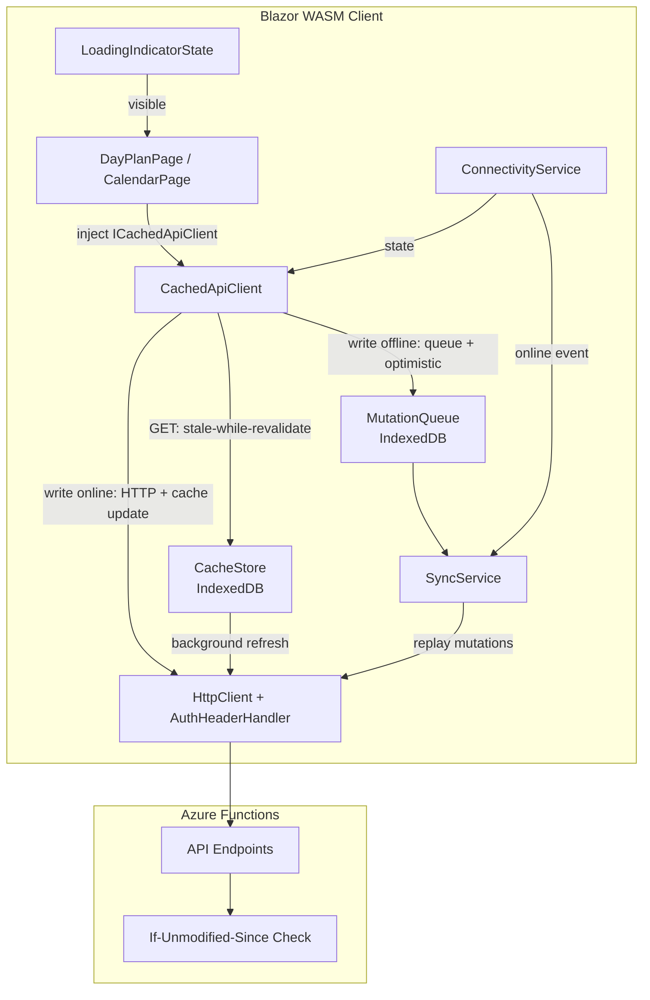

# Design Document: Offline Cache

## Overview

The offline-cache feature adds a stale-while-revalidate caching layer and offline mutation queue to the Happie PWA. The goal is to make navigation between days and the calendar feel instant (no "Loading..." flash), allow offline browsing of previously visited data, and queue mutations for replay when connectivity returns.

The implementation lives entirely in the Blazor WebAssembly client. It introduces a central **CachedApiClient** service that wraps all API data operations, transparently providing cache and offline support. Pages inject `ICachedApiClient` instead of `HttpClient` for data operations, so future features automatically get cache/offline support without each page needing to know about caching or mutation queueing internals.

Under the hood, `CachedApiClient` delegates to:

1. **CacheStore** — persists API responses (DayPlan, Calendar) keyed by request identifier, scoped to the active household.
2. **MutationQueue** — persists offline write operations for sequential replay.
3. **SyncService** — replays queued mutations on reconnect with retry and rollback semantics.

These three services are internal implementation details of `CachedApiClient` and are not injected directly by pages.

A **ConnectivityService** wraps `navigator.onLine` and `online`/`offline` events, exposing reactive state to all consumers. A **LoadingIndicatorState** tracks in-flight background refreshes and sync activity for the shared spinner component.

The design preserves the existing `AuthHeaderHandler` pipeline and optimistic UI pattern. The server-side change is minimal: new `If-Unmodified-Since` conflict detection middleware on mutation endpoints.

## Architecture



### Key Design Decisions

1. **Central CachedApiClient facade** — Pages inject `ICachedApiClient` instead of `HttpClient` for data operations. `CachedApiClient` internally manages `CacheStore` and `MutationQueue`, so future features automatically get stale-while-revalidate caching and offline mutation queueing without each page needing to coordinate these concerns. This keeps the caching/offline logic in one place and makes it easy to add new endpoints to the cache.

2. **IndexedDB via JS interop** — Blazor WASM has no native IndexedDB API. We use a thin JS module (`cacheDb.js`) that exposes CRUD operations, called from C# via `IJSRuntime`. This avoids pulling in a large NuGet package and keeps the IndexedDB schema under our control.

3. **Application-level caching, not Service Worker caching** — The existing service worker handles static asset caching and push notifications. API response caching is managed by C# services in the application layer because it requires household-scoped eviction, optimistic UI integration, and reactive state updates that are impractical in a service worker context.

4. **Sequential mutation replay without deduplication** — Mutations are replayed in strict FIFO order. If two mutations target the same resource, both are sent. The server uses `If-Unmodified-Since` to detect conflicts and returns 409, which the client handles by rolling back. This is simpler and more predictable than client-side deduplication logic.

5. **Minimum 500ms visibility for loading indicator** — Prevents a distracting flash when background refreshes complete quickly. A timer ensures the spinner is visible long enough to be perceived.

## Components and Interfaces

### Client-Side Services

| Service | Responsibility | Lifetime |
|---|---|---|
| `ICachedApiClient` / `CachedApiClient` | Central API facade: stale-while-revalidate for GETs, offline queueing for writes, online write-through with cache update | Scoped |
| `ICacheStore` / `CacheStore` | Read/write/evict IndexedDB cache entries (internal to CachedApiClient) | Scoped |
| `IMutationQueue` / `MutationQueue` | Enqueue/dequeue/peek offline mutations (internal to CachedApiClient) | Scoped |
| `ISyncService` / `SyncService` | Replay mutations on reconnect with retry | Scoped |
| `IConnectivityService` / `ConnectivityService` | Track online/offline state, expose events | Scoped |
| `LoadingIndicatorState` | Track active background operations count | Scoped |

### CachedApiClient Behavior

`CachedApiClient` is the single entry point pages use for data operations. Its behavior depends on the HTTP method and connectivity state:

**GET requests (stale-while-revalidate):**
1. Check CacheStore for an existing entry matching the request key.
2. If cached: return cached data immediately to the caller, then initiate a background refresh via HttpClient.
3. If background refresh returns different data: update CacheStore and notify the UI via a callback/event.
4. If no cache entry: fetch from HttpClient directly (cold cache path).

**Write requests (PUT/DELETE) while online:**
1. Send the request through HttpClient immediately.
2. On success: update the relevant CacheStore entry optimistically (or in-place for calendar).
3. On failure: surface error via existing toast pattern.

**Write requests (PUT/DELETE) while offline:**
1. Detect offline state via ConnectivityService.
2. Enqueue the mutation to MutationQueue (method, URL, headers, body, metadata).
3. Apply the mutation optimistically to the in-memory state and CacheStore.
4. SyncService replays when connectivity returns.

This means pages never directly reference CacheStore or MutationQueue — they call `ICachedApiClient.GetDayPlanAsync(date)`, `ICachedApiClient.SaveAttendanceAsync(...)`, etc.

### UI Components

| Component | Description |
|---|---|
| `LoadingIndicator` | 16px spinning/pulsing animation in header/sidebar |
| `OfflineBanner` | Fixed-position banner at z-index 1050 |
| `SyncToast` | Toast notification for sync failures (auto-dismiss 8s) |

### JS Interop Module

A new `wwwroot/js/cacheDb.js` module exposes:

```javascript
// Database: happie-cache, version 1
// Object stores: dayPlanCache, calendarCache, mutationQueue

window.happieCache = {
    initialize(householdId),
    getDayPlan(householdId, date),
    putDayPlan(householdId, date, responseJson, timestamp),
    deleteDayPlan(householdId, date),
    getDayPlanCount(householdId),
    getOldestDayPlanKey(householdId),
    getCalendar(householdId, cacheKey),
    putCalendar(householdId, cacheKey, responseJson, timestamp),
    deleteCalendar(householdId, cacheKey),
    getCalendarKeys(householdId),
    enqueueMutation(householdId, mutation),
    dequeueMutation(householdId),
    peekAllMutations(householdId),
    clearAll(householdId),
    isAvailable()
};
```

### Server-Side Changes

A new middleware/filter on mutation endpoints (`PUT /api/days/{date}/attendance/{housemateId}`, `PUT /api/days/{date}/dish`, `PUT /api/days/{date}/comments/{housemateId}`, `DELETE /api/days/{date}/comments/{housemateId}`):

- If the request contains an `If-Unmodified-Since` header, the handler reads the `LastModified` timestamp from the target entity.
- If the entity was modified after the `If-Unmodified-Since` value, return HTTP 409 with code `CONFLICT`.
- If the entity has not been modified (or does not exist yet), proceed normally.

This requires adding a `LastModified` (`DateTimeOffset`) property to `AttendanceRecordEntity`, `DishRecordEntity`, and `CommentEntity`.

## Data Models

### IndexedDB Schema

**Database name:** `happie-cache`  
**Version:** 1

#### Object Store: `dayPlanCache`

| Field | Type | Description |
|---|---|---|
| `key` | string (primary) | `{householdId}_{yyyy-MM-dd}` |
| `householdId` | string | Scoping field for queries |
| `date` | string | `yyyy-MM-dd` |
| `responseJson` | string | Serialized `DayPlanResponse` JSON |
| `timestamp` | number | Unix epoch ms of last read or write |

**Index:** `byHousehold` on `householdId` (for count/eviction queries)  
**Eviction:** LRU, max 30 entries per household.

#### Object Store: `calendarCache`

| Field | Type | Description |
|---|---|---|
| `key` | string (primary) | `{householdId}_{yyyy-MM}` |
| `householdId` | string | Scoping field |
| `month` | string | `yyyy-MM` |
| `responseJson` | string | Serialized `CalendarResponse` JSON |
| `timestamp` | number | Unix epoch ms |

**Index:** `byHousehold` on `householdId`  
**Eviction:** Max 2 entries per household (current month + one other).

#### Object Store: `mutationQueue`

| Field | Type | Description |
|---|---|---|
| `id` | number (auto-increment, primary) | Preserves FIFO order |
| `householdId` | string | Scoping field |
| `method` | string | HTTP method (PUT, DELETE) |
| `url` | string | Relative API URL |
| `headers` | object | `{ Authorization, X-Housemate-Id }` |
| `body` | string? | JSON body (null for DELETE) |
| `createdAt` | number | Unix epoch ms when mutation was performed |
| `date` | string | Target day `yyyy-MM-dd` (for cache rollback) |
| `mutationType` | string | `attendance` / `dish` / `comment` (for toast messages) |

**Index:** `byHousehold` on `householdId`

### Server-Side Entity Changes

Add `LastModified` property to existing entities:

```csharp
// AttendanceRecordEntity — new property
public DateTimeOffset LastModified { get; set; }

// DishRecordEntity — new property
public DateTimeOffset LastModified { get; set; }

// CommentEntity — new property
public DateTimeOffset LastModified { get; set; }
```

Handlers set `LastModified = DateTimeOffset.UtcNow` on every successful write.

### CacheEntry C# Model (client-side)

```csharp
public record CachedDayPlan(
    string Date,
    string ResponseJson,
    long Timestamp);

public record CachedCalendar(
    string Month,
    string ResponseJson,
    long Timestamp);

public record QueuedMutation(
    int Id,
    string HouseholdId,
    string Method,
    string Url,
    Dictionary<string, string> Headers,
    string? Body,
    DateTimeOffset CreatedAt,
    DateOnly Date,
    string MutationType);
```

## Correctness Properties

*A property is a characteristic or behavior that should hold true across all valid executions of a system — essentially, a formal statement about what the system should do. Properties serve as the bridge between human-readable specifications and machine-verifiable correctness guarantees.*

### Property 1: Cache round-trip preserves data

*For any* valid `DayPlanResponse` or `CalendarResponse` JSON string and any valid household/date key, storing the response in the CacheStore and then reading it back should return a byte-for-byte identical JSON string.

**Validates: Requirements 1.1, 2.1, 5.1, 5.2**

### Property 2: Background refresh updates cache when response differs

*For any* existing cache entry (DayPlan or Calendar) and any fresh API response whose serialized JSON differs from the stored value, after a successful background refresh the CacheStore should contain the fresh response (not the old one) and the timestamp should be updated.

**Validates: Requirements 1.3, 2.3**

### Property 3: Failed background refresh preserves cache

*For any* existing cache entry (DayPlan or Calendar), if a background refresh results in a network error, timeout, or non-401 HTTP error, the CacheStore entry should remain unchanged (same JSON body and same timestamp).

**Validates: Requirements 1.7, 2.6**

### Property 4: Loading indicator visible when operations active

*For any* positive count of active background operations (refreshes or sync replays), the LoadingIndicatorState should report `IsVisible = true`.

**Validates: Requirements 3.1, 10.1**

### Property 5: Loading indicator minimum visibility duration

*For any* sequence of background operations that complete, the LoadingIndicatorState should remain `IsVisible = true` for at least 500 milliseconds from the moment it first became visible, regardless of how quickly operations complete.

**Validates: Requirements 3.2, 10.2**

### Property 6: DayPlan cache enforces LRU eviction at 30 entries

*For any* sequence of DayPlan cache insertions for a household, the total number of stored entries should never exceed 30. When a 31st entry is inserted, the entry with the oldest `timestamp` should be the one evicted.

**Validates: Requirements 4.1, 4.2**

### Property 7: Calendar cache enforces 2-entry limit preserving current month

*For any* sequence of Calendar cache insertions for a household where the current month's entry exists, the total number of stored calendar entries should never exceed 2. When a new non-current-month entry is stored, the previously stored non-current-month entry should be replaced while the current month entry remains.

**Validates: Requirements 4.3, 4.4**

### Property 8: No background refresh when offline

*For any* navigation event (DayPlan or Calendar) while the ConnectivityService reports `IsOnline = false`, no HTTP request should be initiated for a background refresh.

**Validates: Requirements 5.4**

### Property 9: Mutation queue preserves data and FIFO order

*For any* sequence of mutations enqueued to the MutationQueue, dequeuing them should return mutations in the same order they were enqueued, with all fields (method, URL, headers, body, createdAt, date, mutationType) identical to what was stored.

**Validates: Requirements 6.1, 6.8, 6.9**

### Property 10: Mutations update cached DayPlan optimistically

*For any* mutation (attendance, dish, or comment) performed on a date that has an existing cache entry, the CacheStore's DayPlan entry for that date should immediately reflect the mutation's effect in its stored JSON after the optimistic update.

**Validates: Requirements 6.2, 8.1**

### Property 11: Successful replay removes mutation from queue

*For any* queued mutation that is replayed and receives an HTTP 2xx response, after replay the MutationQueue should no longer contain that mutation.

**Validates: Requirements 6.4**

### Property 12: Exponential backoff delay formula

*For any* retry attempt number N (1 through 5), the computed delay should equal `min(2^N * 1000, 60000)` milliseconds, producing the sequence: 2000, 4000, 8000, 16000, 32000 ms (capped at 60000).

**Validates: Requirements 6.6**

### Property 13: Replayed mutations include If-Unmodified-Since header

*For any* queued mutation with a `createdAt` timestamp, the HTTP request produced during replay should contain an `If-Unmodified-Since` header whose value matches the mutation's `createdAt` timestamp formatted as an HTTP-date.

**Validates: Requirements 6.10**

### Property 14: Server conflict detection

*For any* mutation request containing an `If-Unmodified-Since` header, if the target entity's `LastModified` is strictly after the header value, the server should return HTTP 409. If `LastModified` is at or before the header value (or the entity does not exist), the server should apply the mutation normally and return 2xx.

**Validates: Requirements 6.11, 6.12**

### Property 15: Calendar cache updated in-place on attendance change

*For any* successful attendance mutation for a day that is present in a cached CalendarResponse, the calendar cache entry should be updated to add or remove the housemate's color dot for that day, without invalidating the entire calendar entry.

**Validates: Requirements 8.2**

### Property 16: No cache entry created for uncached dates

*For any* successful mutation targeting a date that has no existing DayPlan cache entry, after the mutation completes the CacheStore should still not contain a cache entry for that date.

**Validates: Requirements 8.5**

### Property 17: Cache and queue isolated by household

*For any* two distinct householdIds, cache entries and queued mutations stored under one householdId should not be readable when querying with the other householdId.

**Validates: Requirements 9.1, 9.3**

### Property 18: Maximum 3 simultaneous toast notifications

*For any* number of sync failure events occurring simultaneously, the number of visible toast notifications should never exceed 3 at any point in time.

**Validates: Requirements 10.3**

## Error Handling

| Scenario | Behavior |
|---|---|
| Background refresh network error / timeout | Retain cached data, hide loading indicator after min-visibility, log to console |
| Background refresh HTTP 401 | Clear session (jwt, activeHousemateId, etc. from localStorage), clear CacheStore and MutationQueue, redirect to login page via `forceLoad: true` |
| Cold cache fetch failure | Show localized error message with retry button; no cache entry stored |
| IndexedDB unavailable | All CacheStore/MutationQueue operations return gracefully (nulls for reads, no-ops for writes); app functions without caching |
| Mutation replay 4xx | Discard mutation, roll back optimistic change in cache, show localized toast with mutation type and date |
| Mutation replay 5xx / network error | Retain mutation, retry with exponential backoff (2s, 4s, 8s, 16s, 32s) |
| Mutation exhausts retries (5 attempts) | Discard mutation, roll back optimistic change, show localized toast |
| Mutation replay 409 Conflict | Discard mutation, roll back optimistic change, show specific conflict toast explaining another housemate made a more recent change |
| HouseholdId mismatch on login | Clear all cache and queue for previous household silently |

### Rollback Mechanism

When a mutation is discarded (4xx, 409, exhausted retries), the rollback procedure:
1. Read the current cached DayPlan for the target date.
2. Remove the optimistic change from the cached JSON (revert attendance status, remove dish change, or restore/remove comment).
3. Write the reverted JSON back to the CacheStore.
4. If the DayPlan page for that date is currently visible, trigger a UI re-render with the reverted data.

If the cache entry has already been evicted or overwritten by a subsequent background refresh, no rollback is needed (the cache already has server-authoritative data).

## Testing Strategy

### Unit Tests (xUnit)

Unit tests cover specific examples, edge cases, and integration points:

- **CacheStore**: cold cache path, IndexedDB unavailable graceful degradation, 401 handling
- **MutationQueue**: enqueue when online (should go to HTTP directly), dequeue from empty queue
- **SyncService**: 4xx rollback flow, 409 conflict toast message, exhausted retries terminal state
- **ConnectivityService**: initial state from `navigator.onLine`, event subscription/unsubscription
- **LoadingIndicatorState**: zero-to-one transition, multiple concurrent operations
- **Server conflict detection**: edge cases (entity doesn't exist, timestamps exactly equal)
- **OfflineBanner**: not shown on login page, shown/hidden on connectivity change

### Property-Based Tests (FsCheck, minimum 100 iterations)

The feature uses FsCheck for property-based testing. Each property test is tagged with:
`// Feature: offline-cache, Property {N}: {property_text}`

Properties to implement:
- Property 1: Cache round-trip (generate random JSON strings, store and read back)
- Property 6: DayPlan LRU eviction (generate random sequences of date insertions, verify count ≤ 30 and correct eviction)
- Property 7: Calendar 2-entry limit (generate random month sequences, verify invariant)
- Property 9: Mutation queue FIFO (generate random mutation sequences, verify order)
- Property 12: Exponential backoff formula (generate retry numbers 1–5, verify delay)
- Property 14: Server conflict detection (generate random LastModified and If-Unmodified-Since pairs, verify correct accept/reject)
- Property 17: Household isolation (generate two random householdIds + entries, verify cross-isolation)

### Integration Tests

- End-to-end flow: navigate DayPlan with cache → background refresh → UI update
- Offline mutation → reconnect → replay → server accepts
- Offline mutation → reconnect → replay → server rejects with 409
- Calendar in-place update after attendance change
- Full session clear on logout

## Post-Implementation: Steering Document Updates

After implementation is complete, the workspace steering documents (`.kiro/steering/`) should be updated to document:

1. **How to add new API endpoints to the cache** — what to configure in `CachedApiClient` (e.g., registering a new cache key pattern, specifying the response type, setting eviction rules).
2. **How to add new mutation types to the offline queue** — what metadata to supply when calling write methods on `ICachedApiClient`, how to implement optimistic rollback for the new mutation type.

This ensures future sessions know how to expand the offline support without re-reading this design document.

