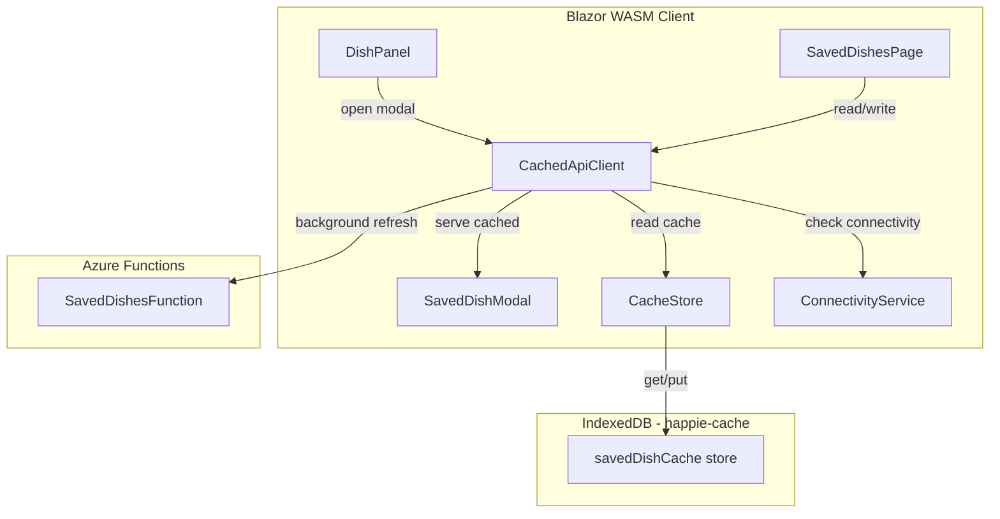

# Design Document: Saved Dishes Cache

## Overview

The Saved Dishes Cache feature extends the existing IndexedDB-backed offline cache to include the household's saved dishes list. This follows the exact same patterns established by the DayPlan and Calendar cache: a new `savedDishCache` object store in `cacheDb.js`, matching C# methods in `ICacheStore`/`CacheStore`, and a new `GetSavedDishesAsync` method on `ICachedApiClient` that implements stale-while-revalidate. The `DishPanel` and `SavedDishesPage` switch from direct `HttpClient` calls to the cached facade, enabling offline access.

### Key Design Decisions

1. **Single entry per household** — Unlike DayPlan (up to 30 entries) or Calendar (up to 6 entries), saved dishes has exactly 1 entry per household. The list is small (just IDs + descriptions) and changes infrequently, so storing the full list as a single JSON blob is optimal.

2. **No offline mutation queueing for saved dish CRUD** — Create, rename, and delete operations on saved dishes are NOT added to the offline mutation queue. These operations are complex (duplicate detection, retroactive conversion, soft-delete reactivation) and conflict-prone. Instead, they require connectivity — consistent with how housemate management works. Only the Saved_Dishes_Cache read path gets offline support.

3. **Refetch-and-replace on mutation success** — When a saved dish is created/renamed/deleted successfully (online), the system refetches the full list from the API and replaces the cache entry. This avoids replicating server-side sorting/deduplication logic on the client and ensures the cache always reflects the true server state (including side effects like retroactive conversion).

4. **Background refresh does not interrupt open modal** — When the modal is already open and a background refresh returns new data, the modal is NOT re-rendered mid-interaction. The fresh data is stored in cache for the next open. This prevents the list from shifting under the user's finger.

5. **Pre-population on first DayPlan load** — The cache is populated eagerly after login by firing a background fetch during the first `GetDayPlanAsync` call. This ensures the modal is instant on first use without adding latency to login or navigation.

6. **Promote action disabled offline** — The "save as saved dish" promote action in the modal requires connectivity because it creates a new saved dish (complex server-side logic). Disabling it offline is simpler and safer than queueing it.

## Architecture



## Data Models

### IndexedDB Object Store: `savedDishCache`

| Field | Type | Description |
|---|---|---|
| `key` | string | `{householdId}` (primary key) |
| `householdId` | string | Partition scope |
| `responseJson` | string | Serialized `SavedDishDto[]` JSON |
| `timestamp` | number | Unix timestamp (ms) of last write |

The store uses `keyPath: "key"` with an index `byHousehold` on `householdId` (same pattern as existing stores). Since there is only 1 entry per household, the key IS the householdId, making the index somewhat redundant but keeping it consistent with the existing pattern for `clearAll`.

### DB Version Upgrade

The IndexedDB database version must be bumped from 1 to 2 to add the new object store. The `onupgradeneeded` handler in `cacheDb.js` must handle both fresh installs (create all stores) and upgrades from v1 (create only the new store).

## Components and Interfaces

### `cacheDb.js`

Add the `savedDishCache` object store in the `onupgradeneeded` handler:

```javascript
if (!db.objectStoreNames.contains("savedDishCache")) {
    var savedDishStore = db.createObjectStore("savedDishCache", { keyPath: "key" });
    savedDishStore.createIndex("byHousehold", "householdId", { unique: false });
}
```

Add JS functions:
- `getSavedDishes(householdId)` — returns the cached entry or null
- `putSavedDishes(householdId, responseJson, timestamp)` — upserts the entry
- `deleteSavedDishes(householdId)` — deletes the entry

Update `clearAll` to also clear `savedDishCache` entries.

### `ICacheStore` / `CacheStore`

Add methods:
- `Task<CachedSavedDishes?> GetSavedDishesAsync(string householdId)`
- `Task PutSavedDishesAsync(string householdId, string responseJson)`
- `Task DeleteSavedDishesAsync(string householdId)`

New record: `CachedSavedDishes(string ResponseJson, long Timestamp)`

### `ICachedApiClient` / `CachedApiClient`

Add methods:
- `Task<SavedDishesFetchResult> GetSavedDishesAsync()` — stale-while-revalidate
- `Task RefreshSavedDishesCacheAsync()` — refetches from API and replaces cache (called after successful mutations)
- `event Action<IReadOnlyList<SavedDishDto>>? OnSavedDishesUpdated` — notifies subscribers of background refresh changes

New record: `SavedDishesFetchResult(IReadOnlyList<SavedDishDto>? Dishes, bool IsColdCache, bool HasError)`

### `DishPanel.razor`

Change `OpenSavedDishModalAsync` to use `CachedApi.GetSavedDishesAsync()` instead of `Http.GetAsync("saved-dishes")`. On cold cache + error, show the existing error message. On offline + no cache, show a localized "not available offline" message.

### `SavedDishModal.razor`

Disable the promote button when offline (check `IConnectivityService.IsOnline`). Show a tooltip or note that the feature requires internet.

### `SavedDishesPage.razor`

Replace `Http.GetAsync("saved-dishes")` with `CachedApi.GetSavedDishesAsync()`. Subscribe to `OnSavedDishesUpdated` for background refresh updates. After successful create/rename/delete calls, call `CachedApi.RefreshSavedDishesCacheAsync()` to refetch and replace the cache. Disable mutation actions when offline.

### Pre-population

In `CachedApiClient.GetDayPlanAsync`, after successfully fetching or serving a day plan, check if `savedDishCache` has an entry. If not, fire-and-forget a background fetch of `GET /api/saved-dishes` and cache it. This runs once per session (the check prevents repeated fetches).

## Correctness Properties

*A property is a characteristic or behavior that should hold true across all valid executions of a system — essentially, a formal statement about what the system should do. Properties serve as the bridge between human-readable specifications and machine-verifiable correctness guarantees.*

### Property 1: Cache read round-trip

*For any* valid `SavedDishDto[]` list stored in the cache for a given household, calling `GetSavedDishesAsync` SHALL return a `SavedDishesFetchResult` whose `Dishes` collection is equivalent to the stored list, and the cached entry SHALL include the correct `householdId` and a non-zero timestamp.

**Validates: Requirements 1.1, 2.1, 4.1, 5.4**

### Property 2: Background refresh replaces cache when data differs

*For any* initial cached `SavedDishDto[]` list and any different fresh `SavedDishDto[]` list returned by the API, after a background refresh completes the cache SHALL contain the fresh list (not the initial list).

**Validates: Requirements 1.3, 4.2**

### Property 3: Cold cache fetch stores and returns data

*For any* valid `SavedDishDto[]` list returned by the API when no cache entry exists, `GetSavedDishesAsync` SHALL both return that list and store it in the cache such that a subsequent cache read returns the same list.

**Validates: Requirements 1.5, 4.3**

### Property 4: Network failure preserves cache

*For any* existing cached `SavedDishDto[]` list, if a background refresh fails due to a network error, the cache entry SHALL remain unchanged (same data, same timestamp).

**Validates: Requirements 1.7**

### Property 5: Refetch-and-replace after successful mutation

*For any* successful saved dish mutation (create, rename, or delete) followed by a refetch that returns a valid `SavedDishDto[]` list, the cache SHALL contain exactly the refetched list, replacing any previous entry.

**Validates: Requirements 3.1, 4.4**

### Property 6: Cache invalidation on refetch failure

*For any* existing cached `SavedDishDto[]` list, if a mutation succeeds but the subsequent refetch fails, the cache entry SHALL be deleted (not retain stale data).

**Validates: Requirements 3.2**

### Property 7: Single entry per household invariant

*For any* sequence of `PutSavedDishesAsync` operations on the same household, the cache SHALL contain at most 1 entry for that household at any point in time.

**Validates: Requirements 5.1**

## Error Handling

| Scenario | Behavior |
|---|---|
| IndexedDB unavailable | All saved dish cache methods no-op (return null for reads). Falls back to direct API calls. |
| Background refresh fails (network) | Keep existing cache, no UI change. |
| Background refresh returns 401 | Clear session + cache, redirect to login. |
| Cold cache + offline | Show "not available offline" in modal / show cached list if available on page. |
| Promote offline | Button disabled, tooltip explains requirement. |

## Migration / Compatibility

- The DB version bump from 1 → 2 is handled transparently by IndexedDB's upgrade mechanism. Existing `dayPlanCache`, `calendarCache`, and `mutationQueue` stores are preserved.
- No server-side changes are needed — the existing `GET /api/saved-dishes` endpoint is reused as-is.
- The `clearAll` function must be updated to also clear the new store, ensuring session cleanup remains complete.

## Testing Strategy

### Property-Based Tests (FsCheck)

Property-based tests validate the correctness properties above using FsCheck with minimum 100 iterations per property. Each test generates random `SavedDishDto[]` lists and exercises the cache logic.

- **Library**: FsCheck 3.1+ (async property support)
- **Minimum iterations**: 100 per property
- **Tag format**: `// Feature: saved-dishes-cache, Property {N}: {property_text}`

Key generators:
- `SavedDishDto` generator: random GUIDs for IDs, random non-empty strings for descriptions, random boolean for IsActive
- `SavedDishDto[]` generator: lists of 0–50 generated SavedDishDto items
- Pair generator for "differs" properties: two distinct lists guaranteed to not be equal

Each correctness property (1–7) maps to a single property-based test method.

### Unit Tests (xUnit)

Unit tests cover specific scenarios and edge cases not suited for property-based testing:

- Cold cache + offline shows "not available offline" message (Requirement 2.2)
- Background refresh is not attempted when offline (Requirement 2.3)
- Promote button disabled when offline (Requirement 2.4)
- 401 response triggers session clear and redirect (Requirement 1.8)
- Identical response only updates timestamp, not data (Requirement 1.4)
- Cache cleared on logout/clearAll (Requirement 3.3)
- Cache cleared on household ID change (Requirement 3.4)
- Pre-population triggered on first DayPlan load (Requirement 6.1)
- Pre-population failure does not show error (Requirement 6.2)
- Pre-population does not block DayPlan render (Requirement 6.3)
- IndexedDB unavailability falls back to direct API calls (Requirement 5.3)
- SavedDishesPage disables mutations when offline (Requirement 4.5)

### Integration Tests

Not applicable — no server-side changes are introduced. The existing `GET /api/saved-dishes` endpoint is reused unchanged. Integration testing of the IndexedDB layer is covered by the Blazor WASM test host with mocked JS interop.
