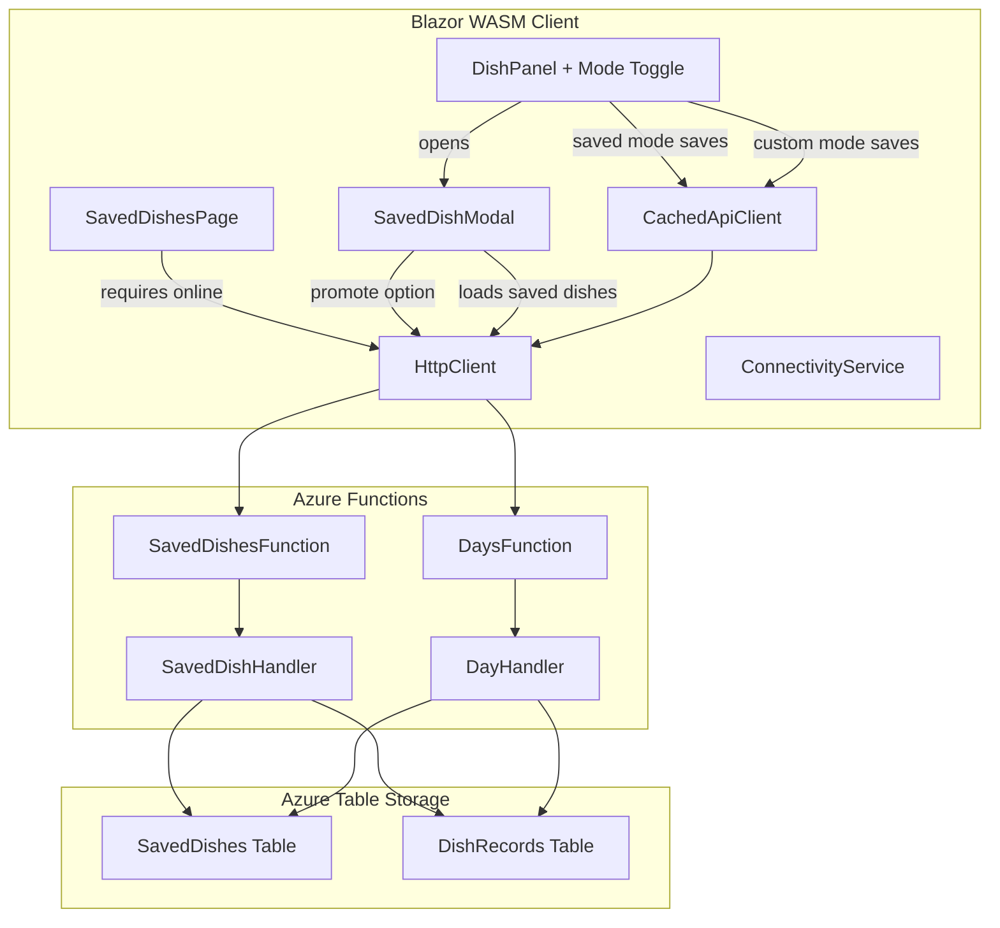
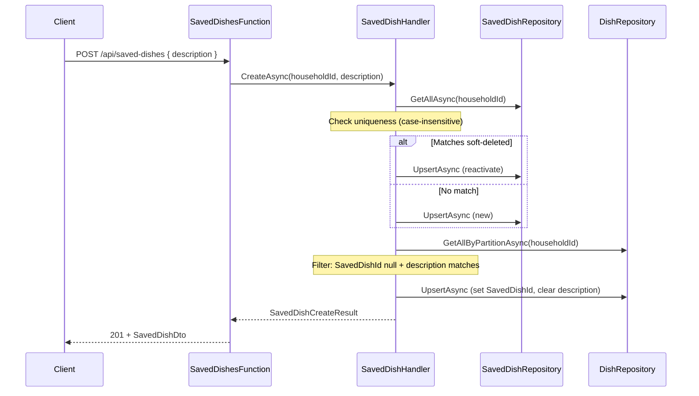

# Design Document: Saved Dishes

## Overview

The Saved Dishes feature introduces a household-level collection of reusable dishes that can be referenced from day plans. Instead of typing a dish description every time, housemates can select from a curated list of saved dishes. When a saved dish description is updated, all day plans referencing it automatically reflect the change — no batch writes needed.

The feature spans both backend (new Azure Table Storage entity, new API endpoints, modifications to the existing DayPlan flow) and frontend (new SavedDishesPage, Mode Toggle on DishPanel, offline support integration).

### Key Design Decisions

1. **Reference-based resolution at read time** — DishRecords store a `SavedDishId` reference. The DayPlan GET handler resolves the description from the referenced SavedDish at read time, so renaming a saved dish propagates instantly without touching DishRecords.

2. **Soft-delete preserves references** — Deleting a saved dish sets `IsDeleted = true`. Existing DishRecord references remain valid and continue resolving the description. This avoids orphaning historical data.

3. **Reactivation over duplication** — When a housemate adds a dish whose description matches a soft-deleted record (case-insensitive), the system reactivates the existing record rather than creating a new one. This prevents duplicate IDs for the same logical dish and preserves historical DishRecord references.

4. **Retroactive conversion on creation** — When a saved dish is created, existing DishRecords with matching descriptions are converted to reference the new saved dish. This links historical data automatically without requiring manual migration.

5. **Saved Dishes page requires connectivity** — Unlike the DayPlan (which supports offline reads/writes via CachedApiClient), the SavedDishesPage is a management page that requires connectivity for all operations. Dish saves in saved-mode on the DayPlan still go through CachedApiClient for offline support.

6. **Description uniqueness across active + soft-deleted** — Uniqueness is enforced case-insensitively across all records (active and soft-deleted) to prevent ambiguity when reactivating and to ensure retroactive conversion targets are unambiguous.

## Architecture



### Dependency Flow (Backend)

```
SavedDishesFunction → SavedDishHandler → Domain ← Infrastructure
       ↓                                    ↑
      Http                             Contracts (shared)
```

- `SavedDishesFunction` is a thin controller (route parsing, validation, delegation)
- `SavedDishHandler` contains all business logic (uniqueness checks, reactivation, retroactive conversion)
- `SavedDishRepository` handles Table Storage CRUD for SavedDish entities
- `DishRepository` is extended with a method to query all DishRecords by partition (for retroactive conversion)

## Components and Interfaces

### Backend — New Components

| Component | Location | Responsibility |
|---|---|---|
| `SavedDish` | `Happie.Api/Domain/` | Domain record: `Id`, `HouseholdId`, `Description`, `IsDeleted` |
| `SavedDishEntity` | `Happie.Api/Infrastructure/Entities/` | Table Storage entity with PK=`{HouseholdId}`, RK=`{SavedDishId}` |
| `ISavedDishMapper` / `SavedDishMapper` | `Happie.Api/Infrastructure/Mappers/` | Entity ↔ domain mapping |
| `ISavedDishRepository` / `SavedDishRepository` | `Happie.Api/Infrastructure/Repositories/` | CRUD for SavedDishes table |
| `ISavedDishHandler` / `SavedDishHandler` | `Happie.Api/Handlers/` | Business logic: add, update, delete, list, suggestions, retroactive conversion |
| `SavedDishesFunction` | `Happie.Api/Functions/` | HTTP endpoints for saved dish CRUD + suggestions |

### Backend — Modified Components

| Component | Change |
|---|---|
| `DishRecord` | Add optional `SavedDishId` (nullable Guid) |
| `DishRecordEntity` | Add `SavedDishId` property (Guid, default = `Guid.Empty` as sentinel for null) |
| `DishRecordMapper` | Map `SavedDishId` (Empty ↔ null) |
| `IDishRepository` / `DishRepository` | Add `GetAllByPartitionAsync` for retroactive conversion scan |
| `DayHandler.GetDayPlanAsync` | Resolve dish description from SavedDish when `SavedDishId` is set |
| `DayHandler.UpsertDishAsync` | Accept optional `SavedDishId`; clear description when saving by reference |
| `DishDto` | Add `SavedDishId` (nullable Guid) field |
| `UpdateDishRequest` | Add optional `SavedDishId` field |
| `ApiErrorCodes` | Add `DishAlreadyExists` constant |

### Frontend — New Components

| Component | Location | Responsibility |
|---|---|---|
| `SavedDishesPage` | `Happie.Web/Pages/` | Full CRUD page with add, edit, delete, suggestions, explanation |
| `SavedDishModal` | `Happie.Web/Components/` | Modal overlay for selecting a saved dish or promoting a custom dish; displayed when Mode Toggle is activated from the DishPanel |
| `SavedDishDto` | `Happie.Shared/Contracts/` | Wire format for saved dish: `Id`, `Description` |
| `SavedDishesResponse` | `Happie.Shared/Contracts/` | Response envelope for GET /api/saved-dishes |
| `SavedDishSuggestionsResponse` | `Happie.Shared/Contracts/` | Response envelope for GET /api/saved-dishes/suggestions |
| `CreateSavedDishRequest` | `Happie.Shared/Contracts/` | Request body for POST /api/saved-dishes |
| `UpdateSavedDishRequest` | `Happie.Shared/Contracts/` | Request body for PUT /api/saved-dishes/{id} |

### Frontend — Modified Components

| Component | Change |
|---|---|
| `DishPanel` | Add Mode Toggle button, saved-mode display; opens `SavedDishModal` on toggle activation |
| `NavMenu` | Add "Saved Dishes" entry between Calendar and Housemates |
| `CachedApiClient` | Extend `SaveDishAsync` to accept optional `SavedDishId`; update optimistic update to include resolved description |

### SavedDishModal — Interaction Design

The saved dish list and promote option are presented in a modal overlay (consistent with NudgeDialog and HousemateColorPicker patterns) rather than inline in the DishPanel. This avoids layout disruption on mobile where the DishPanel is compact.

**Modal behavior:**
- Opened when the housemate activates the Mode Toggle button from Custom_Mode
- Displays the alphabetically sorted list of active saved dishes as tappable items
- If a custom description is currently entered (non-empty, ≤100 chars after trimming), a context-aware action appears at the top of the list:
  - **Match found:** If the trimmed description matches (case-insensitive) an existing active saved dish, show a "Use existing saved dish: {matched description}" option (localized via `IStringLocalizer<AppStrings>` with key `SavedDish_UseExisting`). Selecting it switches to Saved_Mode with the matched saved dish selected — no POST needed.
  - **No match:** Show a Promote_Option "Add {description} to saved dishes" (localized with key `SavedDish_Promote`). Selecting it triggers the `POST /api/saved-dishes`, then closes the modal and switches to Saved_Mode on success.
- Selecting a saved dish from the list closes the modal and switches DishPanel to Saved_Mode
- A dismiss button or backdrop tap closes the modal without changing mode
- Uses `z-index: 1100` (overlay) and `1101` (dialog) per the modal z-index conventions
- The modal element has `role="dialog"` and is included in the swipe-guard selector in `index.html`

**Switching from Saved_Mode back to Custom_Mode:**
- When already in Saved_Mode, the Mode Toggle button switches directly back to Custom_Mode (no modal needed — the input field is re-enabled with the saved dish description pre-filled)

### Interface Definitions

```csharp
// ISavedDishHandler.cs
public interface ISavedDishHandler
{
    Task<IReadOnlyList<SavedDish>> GetAllActiveAsync(Guid householdId, CancellationToken ct = default);
    Task<SavedDishCreateResult> CreateAsync(Guid householdId, string description, CancellationToken ct = default);
    Task<SavedDishUpdateResult> UpdateAsync(Guid householdId, Guid savedDishId, string description, CancellationToken ct = default);
    Task<SavedDishDeleteResult> DeleteAsync(Guid householdId, Guid savedDishId, CancellationToken ct = default);
    Task<IReadOnlyList<string>> GetSuggestionsAsync(Guid householdId, CancellationToken ct = default);
}

// ISavedDishRepository.cs
public interface ISavedDishRepository
{
    Task<IReadOnlyList<SavedDish>> GetAllAsync(Guid householdId, CancellationToken ct = default);
    Task<SavedDish?> GetAsync(Guid householdId, Guid savedDishId, CancellationToken ct = default);
    Task UpsertAsync(SavedDish savedDish, CancellationToken ct = default);
}
```

## Data Models

### New Table: `SavedDishes`

| Field | Type | Description |
|---|---|---|
| PartitionKey | string | `{HouseholdId}` (Guid as string) |
| RowKey | string | `{SavedDishId}` (Guid as string) |
| Description | string | Dish description, 1–100 chars after trimming |
| IsDeleted | bool | Soft-delete flag, defaults to false |

### Domain Type: `SavedDish`

```csharp
// Happie.Api/Domain/SavedDish.cs
namespace Happie.Api.Domain;

public record SavedDish(
    Guid Id,
    Guid HouseholdId,
    string Description,
    bool IsDeleted);
```

### Entity: `SavedDishEntity`

```csharp
// Happie.Api/Infrastructure/Entities/SavedDishEntity.cs
namespace Happie.Api.Infrastructure.Entities;

public class SavedDishEntity : MyTableEntity
{
    public SavedDishEntity() { }

    public SavedDishEntity(Guid householdId, Guid savedDishId)
    {
        PartitionKey = householdId.ToString();
        RowKey = savedDishId.ToString();
    }

    public string Description { get; set; } = string.Empty;
    public bool IsDeleted { get; set; }
}
```

### Modified: `DishRecordEntity` — Add `SavedDishId`

```csharp
// New property on DishRecordEntity.
// Guid.Empty is the sentinel for "not set" (same pattern as LastChangedByHousemateId).
public Guid SavedDishId { get; set; }
```

### Modified: `DishRecord` Domain Type

```csharp
// Add SavedDishId as nullable Guid.
public record DishRecord(
    Guid HouseholdId,
    DateOnly Date,
    string Description,
    Guid? LastChangedByHousemateId,
    DateTimeOffset? LastChangedAt,
    TimeOnly? DinnerTime,
    DateTimeOffset? LastModified,
    Guid? SavedDishId);
```

### Modified: `DishDto` Contract

```csharp
// Add SavedDishId field.
public record DishDto(
    [property: JsonPropertyName("description")] string Description,
    [property: JsonPropertyName("lastChangedByHousemateId")] Guid? LastChangedByHousemateId,
    [property: JsonPropertyName("lastChangedAt")] DateTimeOffset? LastChangedAt,
    [property: JsonPropertyName("dinnerTimeHour")] int? DinnerTimeHour,
    [property: JsonPropertyName("dinnerTimeMinute")] int? DinnerTimeMinute,
    [property: JsonPropertyName("savedDishId")] Guid? SavedDishId);
```

### Modified: `UpdateDishRequest` Contract

```csharp
// Add optional SavedDishId field.
public record UpdateDishRequest(
    [property: JsonPropertyName("description")]
    [property: MaxLength(100, ErrorMessage = "Dish description must be at most 100 characters.")]
    string? Description,
    [property: JsonPropertyName("dinnerTimeHour")]
    int? DinnerTimeHour,
    [property: JsonPropertyName("dinnerTimeMinute")]
    int? DinnerTimeMinute,
    [property: JsonPropertyName("timezoneOffsetMinutes")]
    int TimezoneOffsetMinutes,
    [property: JsonPropertyName("savedDishId")]
    Guid? SavedDishId);
```

### New Contracts

```csharp
// SavedDishDto.cs
public record SavedDishDto(
    [property: JsonPropertyName("id")] Guid Id,
    [property: JsonPropertyName("description")] string Description);

// CreateSavedDishRequest.cs
public record CreateSavedDishRequest(
    [property: JsonPropertyName("description")]
    [property: Required(ErrorMessage = "Description is required.")]
    [property: MaxLength(100, ErrorMessage = "Description must be at most 100 characters.")]
    string Description);

// UpdateSavedDishRequest.cs
public record UpdateSavedDishRequest(
    [property: JsonPropertyName("description")]
    [property: Required(ErrorMessage = "Description is required.")]
    [property: MaxLength(100, ErrorMessage = "Description must be at most 100 characters.")]
    string Description);

// SavedDishSuggestionDto.cs
public record SavedDishSuggestionDto(
    [property: JsonPropertyName("description")] string Description);
```

### Handler Result Types

```csharp
// SavedDishCreateResult.cs
namespace Happie.Api.Results;

public record SavedDishCreateResult(SavedDishCreateOutcome Outcome, SavedDish? SavedDish);

// SavedDishCreateOutcome.cs
public enum SavedDishCreateOutcome
{
    Created,
    Reactivated,
    AlreadyExists,
    ValidationError
}

// SavedDishUpdateResult.cs
public record SavedDishUpdateResult(SavedDishUpdateOutcome Outcome, SavedDish? SavedDish);

// SavedDishUpdateOutcome.cs
public enum SavedDishUpdateOutcome
{
    Updated,
    AlreadyExists,
    NotFound,
    ValidationError
}

// SavedDishDeleteResult.cs
public enum SavedDishDeleteResult
{
    Deleted,
    NotFound
}
```

### API Endpoints Summary

| Method | Route | Request | Response | Codes |
|---|---|---|---|---|
| GET | `/api/saved-dishes` | — | `SavedDishDto[]` | 200 |
| POST | `/api/saved-dishes` | `CreateSavedDishRequest` | `SavedDishDto` | 201, 409, 422 |
| PUT | `/api/saved-dishes/{id}` | `UpdateSavedDishRequest` | `SavedDishDto` | 200, 400, 404, 409, 422 |
| DELETE | `/api/saved-dishes/{id}` | — | — | 204, 400, 404 |
| GET | `/api/saved-dishes/suggestions` | — | `SavedDishSuggestionDto[]` | 200 |

### New Error Code

```csharp
// Add to ApiErrorCodes.cs
public const string DishAlreadyExists = "DISH_ALREADY_EXISTS";
```

### DayPlan Response — Description Resolution Logic

When building the `DishDto` in `DayHandler.GetDayPlanAsync`:

1. If `DishRecord.SavedDishId` is null → use `DishRecord.Description` (existing behavior)
2. If `DishRecord.SavedDishId` is non-null:
   a. Look up the SavedDish by ID in the household
   b. If found (active or soft-deleted) → use `SavedDish.Description`, include `SavedDishId` in response
   c. If not found → fall back to `DishRecord.Description`, return null `SavedDishId`

### Retroactive Conversion Flow



### Suggestions Computation

The suggestions endpoint computes recent custom dishes by:
1. Query all DishRecords for the household (`GetAllByPartitionAsync`)
2. Filter: `SavedDishId` is null AND `Description` is not empty
3. Get all SavedDishes for the household (active + soft-deleted)
4. Exclude DishRecords whose description matches any SavedDish (case-insensitive, trimmed)
5. Order by date descending (most recent first)
6. Take distinct descriptions (case-insensitive), limit to 5

### SavedDishesPage — Suggestion Tap Uses Promotion Flow

When a housemate taps a suggestion on the SavedDishesPage, the page calls `POST /api/saved-dishes` with the suggestion description — the same endpoint used by the DishPanel Promote_Option. This means:
- The backend handles uniqueness checking and reactivation of soft-deleted records identically
- Retroactive conversion is triggered, linking existing DishRecords to the new saved dish
- On success (201), the suggestion is removed from the suggestions list and the new dish appears at its alphabetical position in the saved dishes list (with Highlight_Animation)
- On 409 conflict (race condition where another housemate saved it first), the page shows a localized error and removes the suggestion (since it's now saved)
- On network/server error, the suggestion remains visible with a localized error message

This reuse avoids duplicating creation logic on the frontend and ensures all saved dish creation — whether from the SavedDishesPage suggestions, the SavedDishesPage add button, or the DayPlan promote option — flows through the same backend path with consistent behavior.

### SavedDishesPage — Edit Confirm Button Behavior

The confirm button (✓) on the inline edit field is disabled when the current input value (trimmed) equals the saved dish's current description (case-sensitive comparison). This prevents no-op API calls and matches the existing DishPanel pattern in edit mode. The button becomes enabled as soon as the trimmed input differs from the stored value.


## Correctness Properties

*A property is a characteristic or behavior that should hold true across all valid executions of a system — essentially, a formal statement about what the system should do. Properties serve as the bridge between human-readable specifications and machine-verifiable correctness guarantees.*

### Property 1: SavedDish entity mapper round-trip

*For any* valid `SavedDish` domain object (with any valid Guid ID, Guid HouseholdId, non-empty description, and boolean IsDeleted), mapping to entity via `ToEntity` and back via `ToModel` should produce an equivalent `SavedDish`.

**Validates: Requirements 1.1, 1.2**

### Property 2: Description resolution correctness

*For any* DishRecord with a `SavedDishId` and a corresponding set of SavedDish records for the household, the resolved description should equal the SavedDish's description when the referenced SavedDish exists (active or soft-deleted), and should fall back to the DishRecord's own description when the referenced SavedDish does not exist. When `SavedDishId` is null, the DishRecord's own description is always used.

**Validates: Requirements 2.2, 2.3, 2.5, 2.6**

### Property 3: Create enforces uniqueness and reactivates soft-deleted

*For any* household with a set of existing SavedDishes (active and soft-deleted), creating a new SavedDish with a description that matches (case-insensitive, trimmed) an active dish should return `AlreadyExists`, matching a soft-deleted dish should reactivate that record (preserving its ID and setting IsDeleted to false), and matching no existing dish should create a new record.

**Validates: Requirements 1.3, 1.4, 1.5, 6.5**

### Property 4: Active list excludes soft-deleted and is sorted alphabetically

*For any* household with a mix of active and soft-deleted SavedDishes, the list returned by `GetAllActiveAsync` should contain only dishes where `IsDeleted` is false, and should be sorted alphabetically by description (case-insensitive, ascending).

**Validates: Requirements 3.2, 6.2, 6.3**

### Property 5: Suggestions are distinct, unmatched, recent, and limited to 5

*For any* household with a set of DishRecords (some with SavedDishId, some without) and a set of SavedDishes (active and soft-deleted), the suggestions computation should return at most 5 distinct descriptions from DishRecords where SavedDishId is null, description is non-empty, and the description does not match any SavedDish (case-insensitive, trimmed), ordered by most recent date first.

**Validates: Requirements 5.2, 5.3**

### Property 6: Retroactive conversion links all matching DishRecords

*For any* household with DishRecords and a newly created SavedDish, after retroactive conversion, every DishRecord where `SavedDishId` was null and the description matched the new SavedDish (case-insensitive, trimmed) should now have `SavedDishId` set to the new SavedDish's ID and description set to empty string. DishRecords that did not match should remain unchanged.

**Validates: Requirements 7.1, 7.2**

### Property 7: Update rejected when description unchanged

*For any* household with a SavedDish, attempting to update the SavedDish's description to a value that equals (case-sensitive, trimmed) its current description should be rejected at the UI level (confirm button disabled). At the API level, updating to a value that matches (case-insensitive, trimmed) a *different* SavedDish's description (active or soft-deleted) should return `AlreadyExists`. Updating to a different value that does not conflict should succeed.

**Validates: Requirements 11.1, 11.2**

### Property 8: Dish save mutual exclusion

*For any* dish save request, if both `SavedDishId` is non-null and `Description` is non-null and non-empty, the request should be rejected with a validation error. If both are null/empty, the DishRecord should be deleted.

**Validates: Requirements 9.6, 9.7**

## Error Handling

| Scenario | HTTP Code | Error Code | Behavior |
|---|---|---|---|
| Create: description matches active dish | 409 | `DISH_ALREADY_EXISTS` | Return conflict, do not create |
| Create: description empty/whitespace/too long | 422 | `VALIDATION_ERROR` | Return validation error |
| Create: description matches soft-deleted dish | 201 | — | Reactivate existing record |
| Update: description matches another dish | 409 | `DISH_ALREADY_EXISTS` | Return conflict, do not update |
| Update: description empty/whitespace/too long | 422 | `VALIDATION_ERROR` | Return validation error |
| Update: target dish not found or soft-deleted | 404 | `NOT_FOUND` | Return not found |
| Delete: target dish not found or already soft-deleted | 404 | `NOT_FOUND` | Return not found |
| PUT/DELETE: invalid GUID in route | 400 | `BAD_REQUEST` | Return bad request |
| Dish save: both SavedDishId and description set | 422 | `VALIDATION_ERROR` | Return validation error |
| Dish save: SavedDishId references non-existent/other-household dish | 422 | `VALIDATION_ERROR` | Return validation error |
| Retroactive conversion partial failure | — | — | Log failure, do not roll back SavedDish creation |
| SavedDishesPage: operation while offline | — | — | Block operation, show `Error_RequiresInternet` message |
| SavedDishesPage: network/server error on add/edit/delete | — | — | Show localized error, preserve user input |
| DayPlan: promote fails with 409 | — | — | Show localized message, switch to saved mode with existing match |
| DayPlan: promote fails with network error | — | — | Show localized error, remain in custom mode |

## Testing Strategy

### Unit Tests (xUnit)

Unit tests cover specific examples, edge cases, and integration points:

**Handler tests (`SavedDishHandlerTests`):**
- `CreateAsync_EmptyDescription_ReturnsValidationError`
- `CreateAsync_WhitespaceOnlyDescription_ReturnsValidationError`
- `CreateAsync_DescriptionExceeds100Chars_ReturnsValidationError`
- `CreateAsync_MatchesActiveDish_ReturnsAlreadyExists`
- `CreateAsync_MatchesSoftDeletedDish_ReactivatesRecord`
- `CreateAsync_NewDescription_CreatesNewDish`
- `CreateAsync_TrimsDescription_PreservesCallerCasing`
- `UpdateAsync_UnchangedDescription_RejectedByUI`
- `UpdateAsync_SameDescriptionDifferentCasing_Succeeds`
- `UpdateAsync_MatchesOtherDish_ReturnsAlreadyExists`
- `UpdateAsync_DishNotFound_ReturnsNotFound`
- `UpdateAsync_DishSoftDeleted_ReturnsNotFound`
- `DeleteAsync_ActiveDish_SetsIsDeletedTrue`
- `DeleteAsync_DishNotFound_ReturnsNotFound`
- `DeleteAsync_AlreadySoftDeleted_ReturnsNotFound`
- `GetSuggestionsAsync_ExcludesSavedDishMatches`
- `GetSuggestionsAsync_ExcludesDishesWithSavedDishId`
- `GetSuggestionsAsync_LimitsToFive`
- `GetSuggestionsAsync_OrdersByMostRecent`

**DayHandler description resolution tests:**
- `GetDayPlanAsync_DishWithSavedDishId_ResolvesFromSavedDish`
- `GetDayPlanAsync_DishWithNullSavedDishId_UsesOwnDescription`
- `GetDayPlanAsync_DishWithOrphanedSavedDishId_FallsBackToOwnDescription`
- `GetDayPlanAsync_DishWithSoftDeletedSavedDishId_ResolvesFromSoftDeleted`

**Function tests (`SavedDishesFunctionTests`):**
- `PostSavedDish_InvalidBody_ReturnsBadRequest`
- `PutSavedDish_InvalidGuid_ReturnsBadRequest`
- `DeleteSavedDish_InvalidGuid_ReturnsBadRequest`

**Mapper tests (`SavedDishMapperTests`):**
- `ToEntity_SetsCorrectPartitionAndRowKey`
- `ToModel_ParsesKeysCorrectly`

**DishRecordMapper extension tests:**
- `ToModel_SavedDishIdEmpty_MapsToNull`
- `ToModel_SavedDishIdNonEmpty_MapsToGuid`
- `ToEntity_NullSavedDishId_SetsEmptyGuid`

**Validation tests (UpdateDishRequest):**
- `PutDish_BothSavedDishIdAndDescription_Returns422`
- `PutDish_BothNull_DeletesDishRecord`
- `PutDish_SavedDishIdNonExistent_Returns422`

### Property-Based Tests (FsCheck, minimum 100 iterations)

The feature uses FsCheck for property-based testing. Each property test is tagged with:
`// Feature: saved-dishes, Property {N}: {property_text}`

Properties to implement:

- **Property 1**: SavedDish mapper round-trip — generate random SavedDish values, map to entity and back, verify equality
- **Property 2**: Description resolution — generate random DishRecords with/without SavedDishId and random SavedDish collections, verify resolution logic
- **Property 3**: Create uniqueness + reactivation — generate random existing dish collections and new descriptions, verify correct outcome (created/reactivated/conflict)
- **Property 4**: Active list filtering and sorting — generate random dish collections with mixed IsDeleted flags, verify output is filtered and sorted
- **Property 5**: Suggestions computation — generate random DishRecords and SavedDishes, verify suggestions are correct
- **Property 6**: Retroactive conversion — generate random DishRecords and a new SavedDish, verify all matching records are converted
- **Property 7**: Update unchanged rejection + uniqueness excludes self — generate a set of dishes, verify that updating to the exact same description (case-sensitive) is a no-op (UI-level rejection), updating to a different casing of self succeeds at API level, and updating to match a different dish returns AlreadyExists
- **Property 8**: Mutual exclusion — generate random combinations of SavedDishId and Description, verify validation

### Integration Tests

- Full API flow: create saved dish → verify in list → update description → verify updated → soft-delete → verify hidden
- Retroactive conversion end-to-end: create DishRecords → create matching SavedDish → verify DishRecords converted
- DayPlan resolution end-to-end: create DishRecord with SavedDishId → GET day plan → verify resolved description
- Suggestions end-to-end: create DishRecords and SavedDishes → GET suggestions → verify correct results
- Reactivation end-to-end: create → soft-delete → create with same description → verify reactivated with same ID

