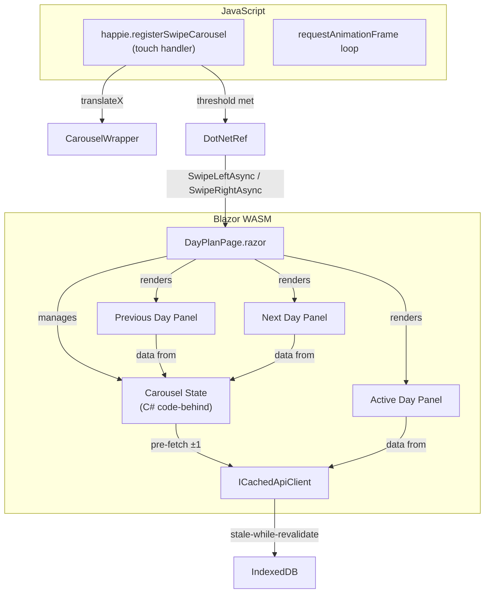
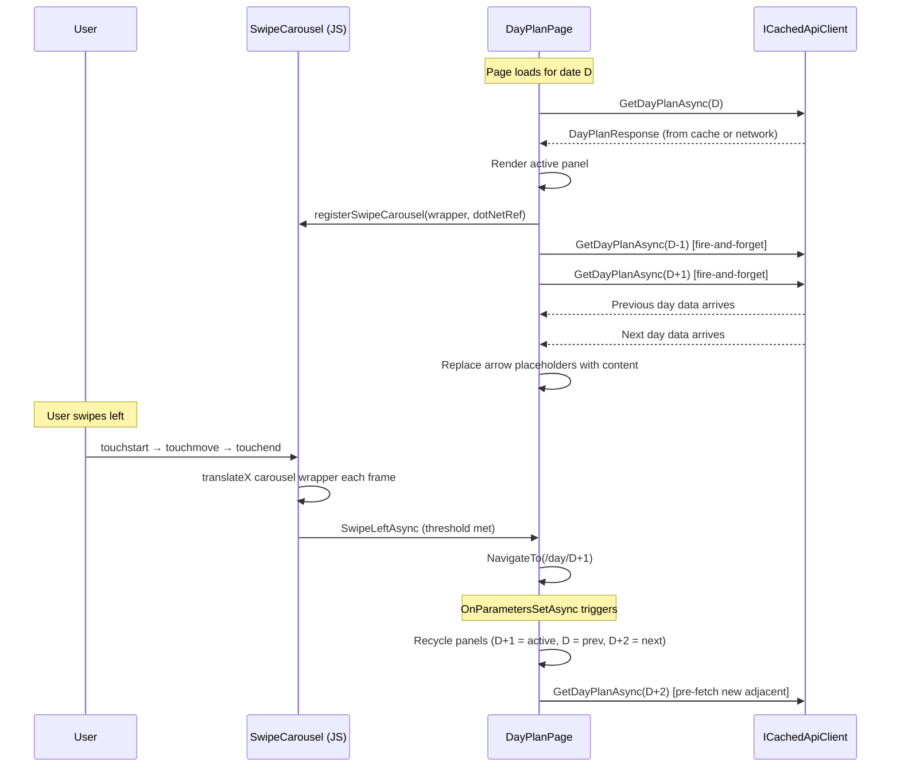

# Design Document: Swipe Preview

## Overview

The swipe-preview feature replaces the current single-panel swipe-to-navigate pattern on `DayPlanPage` with a three-panel carousel that shows live content of the adjacent day sliding in from the side during the swipe gesture. This gives users spatial context about where they're navigating to, making the gesture feel more natural and discoverable.

The implementation is entirely client-side (Blazor WASM + JS interop). It introduces:

1. **A carousel container** rendered by `DayPlanPage.razor` that holds three full-width panels (previous day, current day, next day).
2. **An updated JS swipe handler** (`happie.registerSwipeCarousel`) that translates all three panels in unison during drag, rather than only the active panel.
3. **Prioritized pre-fetching** — the active day loads first; adjacent days are fetched asynchronously after the first render completes, using the existing `ICachedApiClient.GetDayPlanAsync` stale-while-revalidate mechanism.
4. **Arrow placeholders** — when adjacent data hasn't arrived yet, the panel shows a directional arrow indicator (reusing the existing arrow SVG style).
5. **Panel recycling** — after navigation, panel roles are reassigned so only one new adjacent day needs fetching.

No server-side changes are required. The existing `ICachedApiClient.GetDayPlanAsync` writes to IndexedDB on first call, so pre-fetching ±1 days simply warms the cache.

### Key Design Decisions

1. **JS-driven carousel translation** — Keeping the touch handling and per-frame translation in JavaScript (not Blazor) is critical for 60fps performance. The Blazor component manages state and data; JS handles gesture physics.

2. **Full DayPlanPage content in adjacent panels** — Adjacent panels render the same component tree as the active panel (DateNavigationPanel, DishPanel, AttendanceSection, etc.). This means the user sees real content sliding in, not a skeleton or simplified view. The tradeoff is more DOM nodes, mitigated by deferred rendering (see Performance section).

3. **Reuse existing `ICachedApiClient`** — No new caching APIs are needed. Calling `GetDayPlanAsync` for ±1 days triggers the stale-while-revalidate flow and warms IndexedDB. This keeps the feature lightweight and avoids duplicating cache logic.

4. **CSS `transform` on a wrapper, not individual panels** — The carousel wrapper translates as a single unit. Panels are positioned with CSS `left: -100%`, `left: 0`, `left: 100%`. This simplifies the JS: one `translateX` on the wrapper moves all three panels in sync.

5. **Direction lock threshold at 10px** — The requirements specify 10px for direction detection (the current implementation uses 8px). The new carousel adopts 10px to provide a slightly larger dead zone, reducing false horizontal locks during vertical scrolling.

6. **Navigation via route change** — After a successful swipe, the page navigates to `/day/{newDate}` the same way it does today. `OnParametersSetAsync` re-triggers the data load. Panel recycling is an optimization within the same page lifecycle, not a navigation replacement.

## Architecture



### Component Interaction Flow



## Components and Interfaces

### Modified: DayPlanPage.razor

The page gains:
- A `<div class="swipe-carousel">` wrapper around three panel divs.
- State fields for adjacent day data: `_prevDayPlan`, `_nextDayPlan`, `_prevLoaded`, `_nextLoaded`.
- A `PreFetchAdjacentDaysAsync()` method called after first render.
- Updated `OnParametersSetAsync` to handle panel recycling on navigation.

### New: DayPlanPanel Component (RenderFragment approach)

Rather than creating a separate component, the page uses a private `RenderDayPlanContent(DayPlanResponse? dayPlan, DateOnly date, bool showArrow, string arrowDirection)` method that returns the panel markup. This avoids the overhead of a new component lifecycle for what is essentially repeated rendering of the same template.

### Modified: JS Interop — `happie.registerSwipeCarousel`

Replaces `happie.registerSwipe` on the DayPlanPage. Key differences from the current handler:

| Aspect | Current (`registerSwipe`) | New (`registerSwipeCarousel`) |
|---|---|---|
| Target element | `.day-plan-page` | `.swipe-carousel` wrapper |
| Translation | Single element slides + opacity fade | Wrapper translates; all 3 panels move |
| Arrow indicators | Separate fixed-position divs on `document.body` | Arrow is rendered inside the adjacent panel DOM |
| Rubber-band | Beyond `MAX_DRAG` (120px) | Beyond viewport width, diminishing to max 1.2× |
| Direction lock | 8px dead zone | 10px dead zone |
| Completion animation | Slide off 40% + opacity → navigate | Slide full viewport width → navigate |
| During animation | Blocks new touches | Blocks new touches |
| Snap-back interruption | Not supported | New touch cancels snap-back, resumes from current position |

### Unchanged Services

- `ICachedApiClient` — used as-is for pre-fetching.
- `ISyncService`, `IConnectivityService`, `LoadingIndicatorState` — unaffected.
- `NavigationManager` — used for route navigation after swipe completion.

## Data Models

No new data models are introduced. The feature uses existing types:

- `DayPlanResponse` — the full day plan data rendered in each panel.
- `DateOnly` — for date arithmetic (±1 day).

### Carousel State (in DayPlanPage code-behind)

```csharp
// Existing fields.
private DayPlanResponse? _dayPlan;
private DateOnly _parsedDate;

// New fields for adjacent panels.
private DayPlanResponse? _prevDayPlan;
private DayPlanResponse? _nextDayPlan;
private bool _prevLoaded;
private bool _nextLoaded;
private CancellationTokenSource? _prefetchCts;
```

### JS State Object (in `registerSwipeCarousel`)

```javascript
const state = {
    startX: 0,
    startY: 0,
    currentX: 0,
    tracking: false,
    directionLocked: false,   // true once direction is determined
    isHorizontal: false,      // true if locked as horizontal
    animating: false,
    snapBackAnimationId: null  // for cancelling snap-back on re-touch
};
```

## Correctness Properties

*A property is a characteristic or behavior that should hold true across all valid executions of a system — essentially, a formal statement about what the system should do. Properties serve as the bridge between human-readable specifications and machine-verifiable correctness guarantees.*

### Property 1: Linear translation matches drag distance

*For any* horizontal drag distance D where 0 ≤ D ≤ viewport width, the carousel wrapper's translateX value SHALL equal D (positive for right-drag, negative for left-drag).

**Validates: Requirements 2.1**

### Property 2: Rubber-band never exceeds 1.2× viewport width

*For any* horizontal drag distance D (including values far exceeding viewport width) and any viewport width W > 0, the rubber-band function output SHALL satisfy |rubberBand(D, W)| ≤ 1.2 × W.

**Validates: Requirements 2.4**

### Property 3: Direction lock decision is consistent with first axis to exceed 10px

*For any* touch movement where the first axis (horizontal or vertical) to reach a magnitude of 10px determines the lock direction: if |deltaX| ≥ 10 before |deltaY| ≥ 10, the gesture SHALL be locked as horizontal; if |deltaY| ≥ 10 before |deltaX| ≥ 10, the gesture SHALL NOT be tracked as horizontal.

**Validates: Requirements 2.5, 2.6**

### Property 4: Swipe outcome determined by threshold comparison

*For any* completed swipe gesture with final drag distance D, if |D| ≥ 60px the outcome SHALL be navigation to the adjacent day, and if |D| < 60px the outcome SHALL be a snap-back to the starting position.

**Validates: Requirements 3.1, 4.1**

### Property 5: Pre-fetch results discarded on navigation away

*For any* sequence of date navigations where a pre-fetch for date A is still in flight when the user navigates to date B, the pre-fetch result for date A SHALL NOT be applied to the panel state; only pre-fetch results matching the currently viewed date's adjacent days SHALL be applied.

**Validates: Requirements 5.4**

### Property 6: Edge exclusion rejects touches within 20px of viewport edges

*For any* touch start event with clientX and any viewport width W, if clientX ≤ 20 or clientX ≥ W − 20, the swipe tracker SHALL reject the touch; otherwise (20 < clientX < W − 20), the touch SHALL be eligible for tracking.

**Validates: Requirements 9.1**


## Error Handling

| Scenario | Behavior |
|---|---|
| Adjacent day pre-fetch returns null (network error / offline with no cache) | Adjacent panel continues showing Arrow_Placeholder; swipe navigation still works via route navigation |
| Adjacent day pre-fetch returns HTTP error | Same as above — arrow placeholder remains, navigation still functions |
| Pre-fetch CancellationToken cancelled (user navigated away) | Task is abandoned; no state update, no error surfaced |
| JS interop fails on `registerSwipeCarousel` | Page functions normally without swipe (buttons and DateNavigationPanel arrows still work) |
| `StateHasChanged` called during swipe animation | Deferred by the `_isSwiping` flag — panel content updates wait until gesture completes |
| DayPlanPage navigates to invalid date | Existing fallback to today (`DateOnly.FromDateTime(DateTime.Today)`) applies; carousel resets |
| Adjacent panel data arrives but panel has already been recycled | Data is ignored (cancellation token prevents stale assignment) |

### Degradation Strategy

The carousel is a progressive enhancement. If JS interop fails or the browser does not support touch events:
- The page still renders the active panel with full content.
- Navigation via the DateNavigationPanel arrows (prev/next buttons) continues to work.
- No error is shown to the user — the feature simply isn't active.

## Testing Strategy

### Unit Tests (xUnit)

Unit tests cover specific examples, edge cases, and integration points:

- **Panel state management**: Verify that `_prevLoaded` and `_nextLoaded` flags transition correctly as data arrives.
- **Pre-fetch ordering**: Mock `ICachedApiClient`, verify `GetDayPlanAsync` is called for current date before ±1 dates.
- **Pre-fetch cancellation**: Navigate to a new date while pre-fetches are pending, verify old results are not applied.
- **Panel recycling logic**: After navigating right, verify the old active panel becomes the left adjacent and the far-left panel is cleared.
- **Arrow placeholder direction**: Left panel shows left arrow, right panel shows right arrow.
- **Fallback navigation**: When adjacent data is not loaded, swipe still triggers `NavigationManager.NavigateTo`.
- **Deferred state updates**: When `_isSwiping` is true, incoming pre-fetch data is queued until swipe completes.
- **LoadingIndicator not triggered**: Pre-fetch operations do not increment `LoadingIndicatorState`.

### Property-Based Tests (FsCheck, minimum 100 iterations)

The feature uses FsCheck for property-based testing. Each property test is tagged with:
`// Feature: swipe-preview, Property {N}: {property_text}`

Properties to implement:

- **Property 1: Linear translation** — Generate random drag distances D in [0, viewportWidth], verify computed translateX equals D.
- **Property 2: Rubber-band cap** — Generate random drag distances D (including values up to 10× viewport width) and viewport widths W in [320, 1920], verify |rubberBand(D, W)| ≤ 1.2 × W.
- **Property 3: Direction lock** — Generate random (deltaX, deltaY) movement sequences, verify the lock decision matches which axis exceeds 10px first.
- **Property 4: Threshold decision** — Generate random final drag distances D in [0, 300], verify distances ≥ 60 produce "navigate" outcome and < 60 produce "snap-back" outcome.
- **Property 5: Pre-fetch cancellation** — Generate random sequences of (date, prefetchDelay) pairs, simulate rapid navigations, verify only the final date's adjacent data is applied.
- **Property 6: Edge exclusion** — Generate random (clientX, viewportWidth) pairs with viewportWidth in [320, 1920] and clientX in [0, viewportWidth], verify accept/reject matches the 20px edge rule.

### Integration Tests

- End-to-end swipe gesture: touch start → move beyond threshold → release → verify navigation occurs.
- Pre-fetch warming: navigate to a day, verify ±1 day cache entries appear in IndexedDB.
- Panel recycling continuity: swipe through 3 days in sequence, verify each day renders correctly.
- Performance: active panel input responsiveness during adjacent panel rendering (manual profiling).

### Implementation Notes for Property Tests

Properties 1–4 and 6 test pure functions (rubber-band math, direction lock logic, threshold comparison, edge zone check). These can be extracted as standalone C# methods (or as exported JS functions tested via a thin JS test harness). Property 5 tests async cancellation logic in the Blazor component's state management.

For JS-heavy properties (1, 2, 3, 4, 6), the recommendation is to extract the pure logic into testable C# utility methods that mirror the JS implementation. This allows FsCheck to test the decision logic without requiring a browser. The JS implementation is then validated to match via a small number of integration tests.

```csharp
// Example: SwipeCarouselMath.cs — pure functions testable by FsCheck.
public static class SwipeCarouselMath
{
    public const double SwipeThreshold = 60;
    public const double MaxOvershootFactor = 1.2;

    /// <summary>Applies rubber-band resistance when drag exceeds viewport width.</summary>
    public static double RubberBand(double dragDistance, double viewportWidth)
    {
        var abs = Math.Abs(dragDistance);
        if (abs <= viewportWidth)
            return dragDistance;

        var over = abs - viewportWidth;
        var maxOvershoot = viewportWidth * (MaxOvershootFactor - 1.0);
        var dampened = viewportWidth + maxOvershoot * (1 - Math.Exp(-over / viewportWidth));
        return dragDistance > 0 ? dampened : -dampened;
    }

    /// <summary>Determines if a touch start is in an edge exclusion zone.</summary>
    public static bool IsInEdgeExclusionZone(double clientX, double viewportWidth)
    {
        return clientX <= 20 || clientX >= viewportWidth - 20;
    }

    /// <summary>Determines the direction lock based on first axis to exceed 10px.</summary>
    public static bool? DetermineDirectionLock(double deltaX, double deltaY)
    {
        if (Math.Abs(deltaX) < 10 && Math.Abs(deltaY) < 10)
            return null; // Not yet determined.

        return Math.Abs(deltaX) >= Math.Abs(deltaY);
    }

    /// <summary>Determines swipe outcome: true = navigate, false = snap-back.</summary>
    public static bool ShouldNavigate(double dragDistance)
    {
        return Math.Abs(dragDistance) >= SwipeThreshold;
    }
}
```
