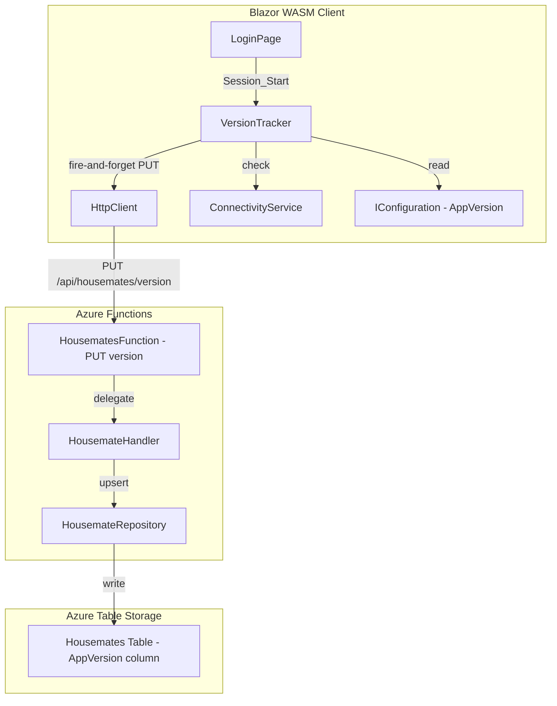

# Design Document: Version Tracking

## Overview

The version-tracking feature records which Happie app version each housemate is running by persisting the version string at session start. The implementation adds a new `AppVersion` nullable string field to the existing housemate domain model and entity, a `PUT /api/housemates/version` endpoint to receive version reports, and a client-side `VersionTracker` service that fires a single background HTTP call on the first session start per app lifecycle.

### Key Design Decisions

1. **Extend existing entity, not a separate table** — The `AppVersion` field is added directly to `HousemateEntity` and the `Housemate` domain record. This avoids a new table, mapper, and repository for a single string column. The existing `HousemateRepository.UpsertAsync` handles persistence.

2. **Dedicated endpoint, not piggyback on existing calls** — A separate `PUT /api/housemates/version` endpoint keeps the version update decoupled from login and other housemate operations. This avoids breaking existing contracts and allows the fire-and-forget pattern on the client.

3. **In-memory flag with "set on initiation" semantics** — The `VersionTracker` sets its "already reported" flag immediately when initiating the HTTP call (not on success). This guarantees at-most-once reporting per app lifecycle without needing persistence or retry logic.

4. **Backend also guards against "1.0.0"** — While the client skips reporting for local dev versions, the backend independently rejects "1.0.0" to provide defense in depth. This means a manually crafted request cannot pollute production data with local-dev markers.

5. **No offline queuing** — Version reporting is strictly best-effort. If the device is offline or the call fails, the report is silently dropped. This matches the requirement that reporting should never interfere with the user experience.

## Architecture



## Components and Interfaces

### Client-Side

#### `VersionTracker` (new service in `Happie.Web/Services/`)

Scoped service responsible for reporting the app version at most once per app lifecycle.

```csharp
public class VersionTracker
{
    private bool _hasReported;

    public void ReportVersionAsync();
}
```

- **`ReportVersionAsync()`** — Checks the in-memory flag, connectivity, and app version. If all conditions pass, sets the flag immediately and fires a background HTTP PUT. Returns synchronously (fire-and-forget via `_ = Task.Run(...)`-style pattern without awaiting).
- Injected dependencies: `HttpClient`, `IConnectivityService`, `IConfiguration` (for `AppVersion`).
- The 10-second timeout is enforced via a `CancellationTokenSource` on the HTTP call.

#### Integration Points

- **LoginPage** — Calls `VersionTracker.ReportVersionAsync()` in `SelectHousemateAsync` (fresh login) after setting the active housemate.
- **LoginPage** — Calls `VersionTracker.ReportVersionAsync()` in `OnInitializedAsync` when auto-redirecting (returning visit with valid JWT + activeHousemateId).
- **HousematesPage** — Does NOT call `VersionTracker` on housemate switch (the flag would suppress it anyway, but the call is simply not added).

### Backend

#### `ReportVersionRequest` (new contract in `Happie.Shared/Contracts/`)

```csharp
public record ReportVersionRequest(
    [property: JsonPropertyName("version")]
    [property: Required(ErrorMessage = "Version is required.")]
    [property: MaxLength(20, ErrorMessage = "Version must be at most 20 characters.")]
    string? Version);
```

Uses `DataAnnotations` for validation via `RequestValidator.ReadAndValidateAsync`. The `Required` attribute rejects null and empty. Whitespace-only validation is handled in the handler's trim-and-check logic.

#### `HousematesFunction` (extend existing)

Add a new function method:

```csharp
[Function("ReportVersion")]
public async Task<IActionResult> ReportVersionAsync(
    [HttpTrigger(AuthorizationLevel.Anonymous, "put", Route = "housemates/version")] HttpRequest request,
    FunctionContext context,
    CancellationToken cancellationToken)
```

Delegates to `IHousemateHandler.ReportVersionAsync(householdId, housemateId, version, ct)`.

#### `IHousemateHandler` / `HousemateHandler` (extend existing)

Add method:

```csharp
Task<ReportVersionOutcome> ReportVersionAsync(Guid householdId, Guid housemateId, string version, CancellationToken ct = default);
```

Logic:
1. Trim the version string.
2. If trimmed version is whitespace-only → return `ValidationError`.
3. If trimmed version equals "1.0.0" → return `Skipped` (no persistence).
4. Fetch housemate from repository.
5. If not found or soft-deleted → return `NotFound`.
6. Update `AppVersion` on the housemate record via `housemate with { AppVersion = trimmedVersion }`.
7. Upsert and return `Success`.

#### `ReportVersionOutcome` (new enum in `Happie.Api/Results/`)

```csharp
public enum ReportVersionOutcome
{
    Success,
    Skipped,
    NotFound,
    ValidationError
}
```

### Data Model Changes

#### `Housemate` domain record (extend)

```csharp
public record Housemate(
    Guid Id,
    Guid HouseholdId,
    string Name,
    string Color,
    bool IsDeleted,
    int SortOrder = 0,
    string? AppVersion = null
);
```

#### `HousemateEntity` (extend)

```csharp
// The last reported app version, or null if never reported.
public string? AppVersion { get; set; }
```

Nullable string — Azure Table Storage omits null columns from the row, so never-reported housemates have no column overhead.

#### `HousemateMapper` (extend)

`ToModel`: map `entity.AppVersion` → `housemate.AppVersion`.
`ToEntity`: map `housemate.AppVersion` → `entity.AppVersion`.

## Data Models

### Request/Response

| Endpoint | Method | Request Body | Success Response |
|---|---|---|---|
| `/api/housemates/version` | PUT | `{ "version": "2.13.4.47" }` | 204 No Content (no body) |

### Error Responses

| Condition | Status | Code |
|---|---|---|
| Missing/invalid body, null/empty/whitespace/too-long version | 422 | `VALIDATION_ERROR` |
| Housemate not found or soft-deleted | 404 | `NOT_FOUND` |
| Missing/invalid JWT or X-Housemate-Id | 401 | `UNAUTHORIZED` |

### Entity Schema Change

| Column | Type | Nullable | Default |
|---|---|---|---|
| `AppVersion` | string | Yes | null (column absent from row) |

## Correctness Properties

*A property is a characteristic or behavior that should hold true across all valid executions of a system — essentially, a formal statement about what the system should do. Properties serve as the bridge between human-readable specifications and machine-verifiable correctness guarantees.*

### Property 1: Version persistence overwrites any previous value

*For any* valid production version string (1–20 characters, not "1.0.0") and any existing housemate record (with or without a previously stored AppVersion), calling `ReportVersionAsync` SHALL update the housemate's `AppVersion` to the new trimmed value, overwriting whatever was there before.

**Validates: Requirements 1.2, 3.2**

### Property 2: Local development version is never persisted

*For any* housemate record with any existing `AppVersion` value (including null), when the handler receives a version string equal to "1.0.0", the housemate's record SHALL remain unchanged — the `AppVersion` field SHALL retain its original value.

**Validates: Requirements 3.3**

### Property 3: Invalid version strings are rejected

*For any* string that is null, empty, consists entirely of whitespace, or exceeds 20 characters, the handler SHALL return a `ValidationError` outcome and SHALL NOT modify the housemate's record.

**Validates: Requirements 3.4**

### Property 4: Mapper round-trip preserves AppVersion

*For any* valid `Housemate` domain record (with `AppVersion` set to null or any string of 1–20 characters), mapping to `HousemateEntity` and back via the mapper SHALL produce a `Housemate` record with an identical `AppVersion` value.

**Validates: Requirements 4.4**

### Property 5: At-most-once reporting per app lifecycle

*For any* sequence of `ReportVersionAsync` invocations on a `VersionTracker` instance, at most one HTTP request SHALL be initiated regardless of the number of calls, version values, or outcomes. The flag SHALL be set upon the first initiation (not upon success).

**Validates: Requirements 2.3**

## Error Handling

| Scenario | Behavior |
|---|---|
| Client offline at session start | `VersionTracker` checks `IConnectivityService.IsOnline`, skips entirely |
| HTTP request timeout (>10s) | `CancellationTokenSource` cancels the request, exception caught and discarded |
| HTTP request network error | Exception caught in the fire-and-forget task, silently discarded |
| HTTP 4xx/5xx response | Response discarded, no retry, no user notification |
| Version "1.0.0" on client | `VersionTracker` skips the HTTP call entirely |
| Version "1.0.0" on backend | Handler returns `Skipped`, function returns 204 without persisting |
| Housemate not found | Handler returns `NotFound`, function returns 404 |
| Invalid request body | `RequestValidator` returns 422 via DataAnnotations |

## Testing Strategy

### Property-Based Tests (FsCheck)

Property-based tests validate correctness properties 1–5 using FsCheck with minimum 100 iterations per property.

- **Library**: FsCheck 3.1+ (async property support)
- **Minimum iterations**: 100 per property
- **Tag format**: `// Feature: version-tracking, Property {N}: {property_text}`

Key generators:
- **Valid production version**: random strings of 1–20 chars from `[a-zA-Z0-9.]`, excluding "1.0.0"
- **Invalid version**: choose from null, empty string, whitespace-only (1–5 spaces/tabs), or strings of 21–50 characters
- **Housemate record**: random Guid IDs, random name/color, random existing AppVersion (null or 1–20 char string)
- **Report call sequence**: list of 1–10 version strings to invoke on the same VersionTracker instance

Properties 1–3 test the backend handler logic with mocked `IHousemateRepository`.
Property 4 tests the mapper conversion directly.
Property 5 tests the client-side `VersionTracker` with mocked `HttpClient` and `IConnectivityService`.

### Unit Tests (xUnit)

Unit tests cover specific scenarios and edge cases not suited for property-based testing:

- `ReportVersionAsync` on `LoginPage.SelectHousemateAsync` path fires exactly one request (Requirement 1.1)
- `ReportVersionAsync` on auto-redirect path fires exactly one request (Requirement 1.1)
- Version "1.0.0" skipped on client side — no HTTP call made (Requirement 1.3)
- Fire-and-forget does not block navigation (Requirement 1.4)
- Housemate switch on HousematesPage does not trigger report (Requirement 2.1)
- Logout + re-login in same session does not trigger second report (Requirement 2.2)
- Endpoint returns 404 for non-existent housemate (Requirement 3.5)
- Endpoint returns 404 for soft-deleted housemate (Requirement 3.5)
- Endpoint requires authentication (Requirement 3.6)
- New housemate has null AppVersion by default (Requirement 4.2)
- HousemateDto does not expose AppVersion field (Requirement 4.3)
- HTTP failure silently discarded, no retry (Requirement 5.1)
- Offline detection skips version report entirely (Requirement 5.3)
- 10-second timeout applied to HTTP request (Requirement 5.4)

### Integration Tests

- Round-trip test: call `PUT /api/housemates/version` with a valid version, then retrieve the housemate from Table Storage and verify `AppVersion` is set.
- Verify 422 for malformed bodies against the real endpoint.
